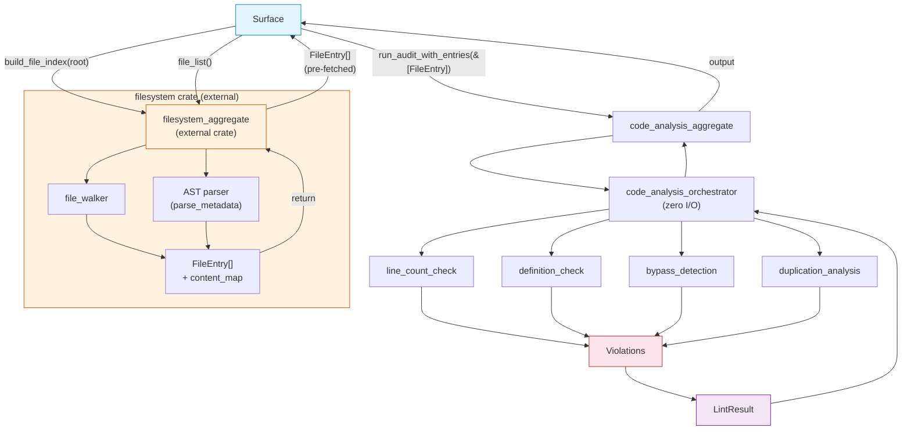

# FRD — quality-rules (v1.1.0)

---

## System Overview

The quality-rules crate enforces general code quality, formatting limits, and clean-coding policies. It protects the codebase from bloated files, empty structures, duplicate blocks, and bypass annotations while guaranteeing zero tolerance for warning/error suppressions.

File discovery, raw content reads, and AST parsing are handled by the external `filesystem` aggregate (`IFilesystemAggregate`). The Surface calls `filesystem.build_file_index(root)` to populate caches, then passes pre-fetched `&[FileEntry]` to the quality-rules orchestrator via `run_audit_with_entries`. The quality-rules crate does zero I/O — it only performs business logic analysis on pre-fetched data.

### Architecture & Data Flow



---

## Functional Requirements

### FR-001: Maximum File Line Count (AES301)

- **Description**: Source files must not exceed the maximum allowed line count to prevent bloated, unmaintainable files.
- **Input**: File data from filesystem crate (path + content), architecture configuration.
- **Output**: AES301 diagnostic if line count exceeds maximum.
- **Business Rules**:

  - Max line count is read from the rule's YAML configuration (`max_lines`).
  - Default max: 1000 lines.
  - Applies to: Rust, Python, TypeScript, JavaScript source files with AES-compliant naming (layer prefix detected by `detect_layer_from_prefix`). Files without a recognized layer prefix are silently skipped.
  - Barrel files (`mod.rs`, `lib.rs`, `__init__.py`, `index.ts`, `index.js`) are skipped.
  - Files in the rule's `exceptions` list are skipped.
  - All lines are counted, including blank lines, comments, and docstrings.
  - Files at exactly `max_lines` → passes (comparison is strict `>`).
- **Edge Cases**:

  - Files with long comments or docstrings → all lines counted uniformly.
  - Generated code → no special exclusion; the rule applies uniformly.
  - Empty files → 0 lines, passes.
- **Error Handling**: Emit AES301 with actual line count and the configured maximum. Files that could not be read by the filesystem crate are excluded from the file list and not checked.

---

### FR-002: Minimum File Line Count (AES302)

- **Description**: Source files must have minimum length to avoid empty placeholders and stub files.
- **Input**: File data from filesystem crate (path + content), architecture configuration.
- **Output**: AES302 diagnostic if line count is below minimum.
- **Business Rules**:

  - Min line count is read from the rule's YAML configuration (`min_lines`).
  - Default min: 10 lines.
  - Applies to: Rust, Python, TypeScript, JavaScript source files with AES-compliant naming (layer prefix detected by `detect_layer_from_prefix`). Files without a recognized layer prefix are silently skipped.
  - Barrel files and exception files are skipped.
  - Files at exactly `min_lines` → passes (comparison is strict `<`).
- **Edge Cases**:

  - Config files or entry points → skipped via exception list.
  - Files with only comments and no code → still counted by line number.
- **Error Handling**: Emit AES302 with actual line count and the configured minimum.

---

### FR-003: Mandatory Definitions & Dead Inheritance (AES303)

- **Description**: Source files must declare at least one primary symbol (struct, enum, trait, class, interface, type) to prevent empty placeholder files. Additionally, declarations that exist but contain no real implementation (dead inheritance) are flagged.
- **Input**: File data from filesystem crate (path + content), architecture configuration.
- **Output**: AES303 diagnostic if no definition found, or if dead inheritance detected.
- **Business Rules**:

  - **Mandatory definition check**:

    - Rust: `struct`, `enum`, `trait`, `type` declarations (including visibility modifiers `pub`, `pub(crate)`, etc.).
    - Python: `class` declarations.
    - TypeScript/JavaScript: `class`, `interface`, `type` declarations (including `export`, `export default`, `abstract`, `declare` prefixes).
    - Detection via token matching on file content (no AST parsing in this crate).
    - If no primary symbol is found → AES303 (`MissingDefinition`).
  - Applies to files with AES-compliant naming (layer prefix detected by `detect_layer_from_prefix`). Files without a recognized layer prefix are silently skipped.
  - **Dead inheritance check**:

    - Unit structs (`struct Foo;`) without a following `impl` block in the same file → AES303 (`DeadInheritance`).
    - Empty Python classes (`class Foo: pass` or `class Foo: ...`) → AES303 (`DeadInheritance`).
    - Empty JS/TS classes (`class Foo {}`) → AES303 (`DeadInheritance`).
    - `#[cfg(test)]` blocks are skipped during dead inheritance scanning.
  - **Skipped files**: `__init__.py`, `main.py`, `py.typed`, `mod.rs`, `lib.rs`, `main.rs`, `*_constant.rs`, `*_constant.py`.
  - If `mandatory_class_definition` is disabled in the rule config, skip entirely.
  - Files in the rule's `exceptions` list are skipped.
- **Edge Cases**:

  - Empty `impl` blocks → not a primary symbol, does not satisfy the mandatory definition requirement.
  - Unit structs followed by `impl` block in the same file → not flagged (intentional placeholder with implementation).
  - Tuple structs (`struct Foo(i32)`) → not flagged as unit struct (has fields).
  - `#[cfg(test)]` modules → skipped for dead inheritance scanning.
- **Error Handling**: Emit AES303 with the expected symbol types for the language and the violation kind (`MissingDefinition` or `DeadInheritance`).

---

### FR-004: Bypass Detection (AES304)

- **Description**: Detects and flags any attempt to suppress warnings/errors, panic, or use unsafe fallbacks in production code. All patterns are flagged regardless of whether they appear in code or comments. Patterns inside string literals are NOT flagged.
- **Input**: File data from filesystem crate (path + content), architecture configuration with forbidden bypass patterns.
- **Output**: AES304 diagnostic for each bypass found (may emit multiple per file).
- **Business Rules**:

  - **Forbidden patterns** (configurable via YAML, defaults below):

    | Category                    | Patterns                                                                                                                             | Language   |
    | --------------------------- | ------------------------------------------------------------------------------------------------------------------------------------ | ---------- |
    | Rust forbidden tokens       | `unwrap()`, `expect()`, `panic!`, `todo!`, `unimplemented!`, `unreachable!`                                              | Rust       |
    | Rust attribute bypasses     | `#[allow(`, `#[warn(`, `#[deny(`                                                                                               | Rust       |
    | Python bypasses             | `raise NotImplementedError`, `assert false`                                                                                      | Python     |
    | Comment/annotation bypasses | `type: ignore`, `noqa`, `@ts-ignore`, `@ts-expect-error`, `eslint-disable`, `lint-disable`, `FIXME`, `HACK`, `XXX` | All        |
    | Cargo.toml bypass           | `level = "allow"` under `[workspace.lints.clippy]` or `[lints.clippy]`                                                         | Cargo.toml |
  - **Matching rules**:

    - All patterns are matched as **substrings** against each line.
    - All patterns are flagged in **both code and comments**. No word/non-word distinction.
    - Patterns inside **string literals** (`"..."`, `'...'`, `` `...` ``) are **NOT flagged** (byte-level position check to exclude string interior).
    - Patterns inside **char literals** (`'x'`) are **NOT flagged**.
  - **Safe variants NOT flagged**: `unwrap_or(`, `unwrap_or_else(`, `unwrap_or_default(` — verified by byte-level suffix parsing. If `unwrap()` is detected but immediately followed by `_or`, `_or_else`, or `_or_default`, it is a safe variant and NOT flagged.
  - **`#[cfg(test)]` blocks**: Fully skipped. Bypass tokens inside `#[cfg(test)]` modules are not flagged (unwrap/panic is normal in tests).
  - **`static Lazy<Regex>` multiline initializations**: Skipped (regex patterns may contain bypass-like tokens as match targets).
  - **Configuration**: Patterns are read from the architecture configuration's forbidden bypass settings (YAML-configurable). Fallback default pattern list applied if config is empty.
- **Edge Cases**:

  - `unwrap()` inside a string literal (`let s = "unwrap()"`) → NOT flagged.
  - `FIXME` inside a comment (`// FIXME: refactor`) → FLAGGED.
  - `noqa` inside a string (`print("noqa")`) → NOT flagged.
  - `#[allow(unused)]` inside `#[cfg(test)]` module → NOT flagged.
  - `unwrap_or_default()` → NOT flagged (safe variant).
  - `panic!("unreachable")` → FLAGGED (both `panic!` and `unreachable!` may trigger, one violation per line).
- **Error Handling**: Emit AES304 with the matched pattern, line number, and the violation category.

---

### FR-005: Duplicate Code Detection (AES305)

- **Description**: Compares code blocks across all workspace files and flags files with excessive content overlap.
- **Input**: File data from filesystem crate (path + content), architecture configuration.
- **Output**: AES305 diagnostic for files exceeding duplication threshold.
- **Business Rules**:

  - **Pre-processing** (before window comparison):

    1. Normalize each line: trim whitespace, keep only alphanumeric and whitespace characters (strip punctuation, operators, etc.).
  - **Algorithm**: Sliding window hash-based comparison on normalized lines.

    - Window size (`min_lines`): read from AES305 rule config, default 10 lines.
    - Threshold: read from AES305 rule config `duplication_threshold`, default 50%.
    - A file's shared-window percentage is calculated against all other files.
    - One violation per file that exceeds the threshold (not per duplicate block).
  - Ignored paths from config are excluded from scanning.
  - Pre-read entries avoid double I/O (file content provided by filesystem crate).
- **Edge Cases**:

  - Files shorter than `min_lines` → skipped (no windows to compare).
  - All files identical → each file gets one violation.
  - Generated code or boilerplate → no special exclusion.
  - Single file in workspace → no violations (no other files to compare).
- **Error Handling**: Emit AES305 with the shared percentage, total windows, and list of similar files (up to 5).

---

## API Contract

| Operation                        | Input                                   | Output                   | Purpose                                                   |
| -------------------------------- | --------------------------------------- | ------------------------ | --------------------------------------------------------- |
| Line count check (AES301/AES302) | File data from filesystem crate         | AES301/AES302 violations | Check max/min file line counts                            |
| Definition check (AES303)        | File data from filesystem crate         | AES303 violations        | Verify file declares at least one primary symbol          |
| Dead inheritance check (AES303)  | File data from filesystem crate         | AES303 violations        | Detect empty unit structs and empty classes               |
| Bypass detection (AES304)        | File data from filesystem crate         | AES304 violations        | Detect forbidden tokens, attributes, and comment bypasses |
| Cargo.toml bypass check (AES304) | File content, configuration             | AES304 violations        | Detect Cargo.toml clippy allow bypass                     |
| Duplication analysis (AES305)    | File data from filesystem crate         | Similarity violations    | File-level similarity analysis with sliding window        |
| Full code analysis               | File data from filesystem crate, config | Lint results             | Run all code quality checks (AES301–AES305)              |

---

## Integration Points

- **Internal** (quality-rules crate):

  - The configuration system in the shared crate — reads architecture configuration YAML for per-rule thresholds, forbidden bypass patterns, ignored paths.
  - The taxonomy definitions in the shared crate — layer definition for min/max lines, mandatory class toggle, exception lists.
  - The bypass detection utility in this crate (`utility_bypass_detector`) — substring matching, string/char position checks, `cfg(test)` skip logic.
  - The language mapping utility in this crate (`utility_language_mapper`) — detects source language from file extension.
  - The code duplication detection utility in this crate (`utility_code_duplication_detector`) — line normalization, window hashing, hash-based dedup.
  - The column index utility in this crate (`utility_column_index`) — column position computation.
  - The mandatory checker utility in this crate (`utility_mandatory_checker`) — symbol detection helpers.
  - The compliance score utility in the shared crate — compliance score calculation.
- **External**:

  - **`filesystem` crate** — provides `filesystem_aggregate` which handles:
    - File walking and directory traversal (`file_walker`).
    - File reading with content loading.
    - File filtering by extension (`rs`, `py`, `js`, `ts`, `jsx`, `tsx`).
    - Ignore rules (config-level, default skip directories, hidden directories, symlink safety).
    - Returns file data (path + content) to the caller.
    - Files that cannot be read are excluded from the returned list.
  - No network calls. No filesystem writes. Pure static analysis.

---

## Non-functional Requirements

- **Performance**: Analyze 1,000 source files in < 3 seconds (single-pass checks, hash-based duplication). Line normalization for AES305 is O(n) per file.
- **Memory**: O(n) where n = total file content across workspace. Pre-read entries from filesystem crate avoid re-reading. Duplication analyzer stores window hashes, not full content.
- **Accuracy**: Zero false positives for valid code. Bypass detection uses string-literal position awareness to avoid false matches inside strings. Duplication detection uses line normalization to reduce false positives from punctuation and formatting differences.

---

## Test Scenarios / QA Checklist

### AES301 — Maximum File Line Count

| # | Scenario                                            | Expected                              | Rule   |
| - | --------------------------------------------------- | ------------------------------------- | ------ |
| 1 | File with 1500 lines, max = 1000                    | AES301 violation                      | AES301 |
| 2 | File with exactly 1000 lines, max = 1000            | No violation (strict`>`)            | pass   |
| 3 | File with 999 lines, max = 1000                     | No violation                          | pass   |
| 4 | Barrel file (`mod.rs`) with 2000 lines            | No violation — exception             | excl   |
| 5 | File in exceptions list with 2000 lines             | No violation — exception             | excl   |
| 6 | File with 500 lines of comments + 500 lines of code | No violation (1000 total, not > 1000) | pass   |

### AES302 — Minimum File Line Count

| # | Scenario                             | Expected                          | Rule   |
| - | ------------------------------------ | --------------------------------- | ------ |
| 1 | File with 3 lines, min = 10          | AES302 violation                  | AES302 |
| 2 | File with exactly 10 lines, min = 10 | No violation (strict`<`)        | pass   |
| 3 | File with 15 lines, min = 10         | No violation                      | pass   |
| 4 | `__init__.py` with 1 line          | No violation — exception         | excl   |
| 5 | File with only comments (5 lines)    | AES302 violation (comments count) | AES302 |

### AES303 — Mandatory Definitions & Dead Inheritance

| #  | Scenario                                                         | Expected                          | Rule   |
| -- | ---------------------------------------------------------------- | --------------------------------- | ------ |
| 1  | Rust file with`pub struct Foo { ... }`                         | No violation                      | pass   |
| 2  | Rust file with only`use` statements, no struct/enum/trait/type | AES303 — MissingDefinition       | AES303 |
| 3  | Python file with`class Foo:`                                   | No violation                      | pass   |
| 4  | Python file with only imports                                    | AES303 — MissingDefinition       | AES303 |
| 5  | TS file with`export interface IFoo { ... }`                    | No violation                      | pass   |
| 6  | Rust file with`struct Foo;` and no `impl` block              | AES303 — DeadInheritance         | AES303 |
| 7  | Rust file with`struct Foo;` followed by `impl Foo { ... }`   | No violation (has implementation) | pass   |
| 8  | Rust file with`struct Foo(i32)` (tuple struct)                 | No violation (not unit struct)    | pass   |
| 9  | Python file with`class Foo: pass`                              | AES303 — DeadInheritance         | AES303 |
| 10 | TS file with`class Foo {}`                                     | AES303 — DeadInheritance         | AES303 |
| 11 | `*_constant.rs` file with no definitions                       | No violation — skipped           | excl   |
| 12 | `#[cfg(test)]` module with `struct TestFoo;` and no impl     | No violation — cfg(test) skipped | pass   |
| 13 | File in exceptions list                                          | No violation — exception         | excl   |

### AES304 — Bypass Detection

| #  | Scenario                                                    | Expected                                | Rule   |
| -- | ----------------------------------------------------------- | --------------------------------------- | ------ |
| 1  | Rust file with`foo.unwrap()`                              | AES304 violation                        | AES304 |
| 2  | Rust file with`foo.expect("msg")`                         | AES304 violation                        | AES304 |
| 3  | Rust file with`panic!("error")`                           | AES304 violation                        | AES304 |
| 4  | Rust file with`todo!()`                                   | AES304 violation                        | AES304 |
| 5  | Rust file with`#[allow(unused)]`                          | AES304 violation                        | AES304 |
| 6  | Rust file with`foo.unwrap_or_default()`                   | No violation (safe variant)             | pass   |
| 7  | Rust file with`foo.unwrap_or(42)`                         | No violation (safe variant)             | pass   |
| 8  | Rust file with`let s = "unwrap()"` (string literal)       | No violation (inside string)            | pass   |
| 9  | Python file with`# type: ignore`                          | AES304 violation                        | AES304 |
| 10 | Python file with`# noqa`                                  | AES304 violation                        | AES304 |
| 11 | Python file with`raise NotImplementedError`               | AES304 violation                        | AES304 |
| 12 | TS file with`// @ts-ignore`                               | AES304 violation                        | AES304 |
| 13 | TS file with`// @ts-expect-error`                         | AES304 violation                        | AES304 |
| 14 | Any file with`// FIXME: refactor this`                    | AES304 violation                        | AES304 |
| 15 | Any file with`// HACK: temporary workaround`              | AES304 violation                        | AES304 |
| 16 | Any file with`// TODO: implement later`                   | No violation (TODO not in pattern list) | pass   |
| 17 | Rust file with`unwrap()` inside `#[cfg(test)]` module   | No violation — cfg(test) skipped       | pass   |
| 18 | Cargo.toml with`level = "allow"` under `[lints.clippy]` | AES304 violation                        | AES304 |
| 19 | Rust file with`print!("unwrap()")` (string literal)       | No violation (inside string)            | pass   |
| 20 | File in exceptions list                                     | No violation — exception               | excl   |

### AES305 — Duplicate Code Detection

| # | Scenario                                                         | Expected                           | Rule   |
| - | ---------------------------------------------------------------- | ---------------------------------- | ------ |
| 1 | Two files with 80% identical code blocks                         | AES305 violation (both files)      | AES305 |
| 2 | Two files with 30% overlap, threshold = 50%                      | No violation                       | pass   |
| 3 | File shorter than`min_lines`                                   | No violation — skipped            | pass   |
| 4 | Single file in workspace                                         | No violation (nothing to compare)  | pass   |
| 5 | Three files all identical                                        | AES305 violation (all three files) | AES305 |
| 6 | File with only whitespace lines (very short after normalization) | No violation — skipped            | pass   |

### Configuration

| # | Scenario                            | Expected                        | Rule   |
| - | ----------------------------------- | ------------------------------- | ------ |
| 1 | Rule AES301 disabled in config      | No AES301 violations            | config |
| 2 | Rule AES304 disabled in config      | No AES304 violations            | config |
| 3 | File in exceptions list             | No violation for that file      | config |
| 4 | Custom`max_lines = 500` in config | AES301 uses 500 instead of 1000 | config |
| 5 | Custom bypass patterns in config    | AES304 uses custom patterns     | config |

---

## Assumptions & Constraints

- Rules are configurable via YAML (the architecture configuration); default thresholds apply when config values are absent.
- The crate receives pre-read file data (path + content) from the external filesystem crate. No file I/O or AST parsing is performed internally.
- Files that cannot be read by the filesystem crate are excluded from the returned list and not checked.
- Duplicate detection uses hash-based window comparison on normalized lines (not AST-level). Lines are normalized by trimming whitespace and keeping only alphanumeric and whitespace characters.
- Bypass detection is language-aware (Rust, Python, JavaScript, TypeScript each have language-specific patterns). All patterns are flagged in both code and comments. Patterns inside string literals are not flagged.
- `#[cfg(test)]` blocks are universally skipped for bypass detection and dead inheritance scanning (unwrap/panic/stubs are normal in tests).
- Line count includes all lines (blank, comments, docstrings). No exclusion for AES301/AES302.

---

## Glossary

| Term                       | Definition                                                                                                                  |
| -------------------------- | --------------------------------------------------------------------------------------------------------------------------- |
| **AES**              | Agentic Engineering System — the 7-layer architecture framework                                                            |
| **Bypass**           | Any attempt to suppress, ignore, or work around warnings/errors (e.g.,`unwrap()`, `#[allow(...)]`, `noqa`, `FIXME`) |
| **Diagnostic**       | Violation report with file location, rule code, severity, and message                                                       |
| **Dead inheritance** | Empty or stub definitions (unit structs without impl, empty classes) that provide no real implementation                    |
| **Primary symbol**   | A meaningful type declaration (struct, enum, trait, class, interface, type alias)                                           |
| **Window**           | A contiguous block of N normalized lines used for duplication comparison                                                    |
| **Safe variant**     | `unwrap_or()`, `unwrap_or_else()`, `unwrap_or_default()` — not flagged as bypass                                     |
| **Severity levels**  | CRITICAL (bypasses), HIGH (line count), MEDIUM (dead inheritance, duplication)                                              |
| **Filesystem crate** | External crate that handles file walking, reading, and filtering. Returns file data to quality-rules.                       |

---

## Appendix A: YAML Configuration Schema

### Top-Level Structure

```yaml
architecture:
  enabled: true
  rules:
    AES301: { ... }
    AES302: { ... }
    AES303: { ... }
    AES304: { ... }
    AES305: { ... }
```

```###

```yaml
AES3XX:
  enabled: true | false              # Enable/disable this rule
  exceptions: ["<filename>", ...]    # Filenames to skip (basename match)
  # Rule-specific fields:
  max_lines: <integer>               # AES301 only
  min_lines: <integer>               # AES302, AES305
  mandatory_class_definition: <bool> # AES303 only
  skip_patterns: ["<glob>", ...]     # AES303 only
  patterns: { ... }                  # AES304 only
  safe_variants: ["<string>", ...]   # AES304 only
  duplication_threshold: <integer>   # AES305 only (percentage)
```

---

## Reference

- PRD: [PRD.md](../../PRD.md)
- Architecture: [ARCHITECTURE.md](../../ARCHITECTURE.md)
- **Filesystem crate** (external): filesystem aggregate and file walker
- `utility_bypass_detector` (this crate): bypass pattern matching helpers
- `utility_code_duplication_detector` (this crate): duplication analysis functions
- `utility_language_mapper` (this crate): language detection from file extension
- `utility_column_index` (this crate): column position computation
- `utility_mandatory_checker` (this crate): symbol detection helpers
- Shared compliance score utility
