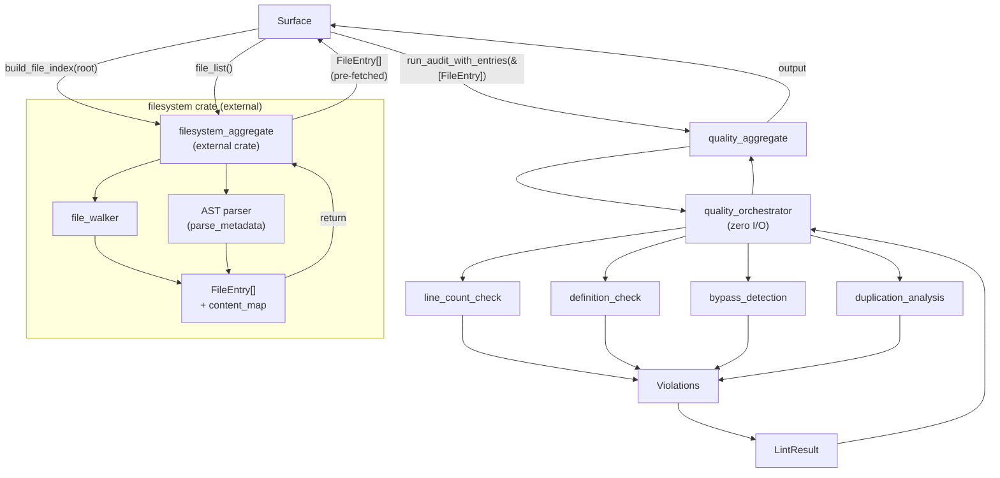

# FRD — quality-rules (v2.0.0)

---

## Reference

- Backlog: [BACKLOG.md](BACKLOG.md) — real condition for this feature; this file is specification only.
- PRD: [PRD.md](../../PRD.md)
- Architecture: [ARCHITECTURE.md](../../ARCHITECTURE.md)
- **Filesystem crate** (external): filesystem aggregate and file walker
- `utility_bypass_detector` (this crate): bypass pattern matching helpers
- `utility_code_duplication_detector` (this crate): duplication analysis functions
- `utility_language_mapper` (this crate): language detection from file extension
- `utility_column_index` (this crate): column position computation
- `utility_mandatory_checker` (this crate): symbol detection helpers
- Shared compliance score utility

## System Overview

The quality-rules crate enforces general code quality, formatting limits, and clean-coding policies. It protects the codebase from bloated files, empty structures, duplicate blocks, and bypass annotations while guaranteeing zero tolerance for warning/error suppressions.

File discovery, raw content reads, and AST parsing are handled by the external `filesystem` aggregate (`IFilesystemAggregate`). The Surface calls `filesystem.build_file_index(root)` to populate caches, then passes pre-fetched `&[FileEntry]` to the quality-rules orchestrator via `run_audit_with_entries`. The quality-rules crate does zero I/O — it only performs business logic analysis on pre-fetched data.

### Architecture & Data Flow


```mermaid
flowchart TD
    A["Surface"] -->|"build_file_index(root)"| D["filesystem_aggregate\n(external crate)"]
    A -->|"file_list()"| D

    subgraph FS ["filesystem crate (external)"]
        D --> E1["file_walker"]
        D --> E2["AST parser\n(parse_metadata)"]
        E1 --> G1["FileEntry[]\n+ content_map"]
        E2 --> G1
    end

    G1 -->|"return"| D
    D -->|"FileEntry[]\n(pre-fetched)"| A

    A -->|"run_audit_with_entries(&[FileEntry])"| B["quality_aggregate"]
    B --> C["quality_orchestrator\n(zero I/O)"]

    C --> H1["line_count_check"]
    C --> H2["definition_check"]
    C --> H3["bypass_detection"]
    C --> H4["duplication_analysis"]

    H1 --> I["Violations"]
    H2 --> I
    H3 --> I
    H4 --> I
    I --> J["LintResult"]
    J --> C
    C --> B
    B -->|output| A

```

---

## Functional Requirements

### FR-QUALITYRULES-001: Maximum File Line Count (AES301)

- **Description**: Source files must not exceed the maximum allowed line count to prevent bloated, unmaintainable files.
- **Input**: File data from filesystem crate (path + content), architecture configuration.
- **Output**: AES301 diagnostic if line count exceeds maximum.
- **Business Rules**:

  - Max line count is read from the rule's YAML configuration (`max_lines`).
  - Default max: 1000 lines.
  - Applies to: Rust, Python, TypeScript, JavaScript source files with AES-compliant naming (layer prefix detected by `detect_layer_from_prefix`). Files without a recognized layer prefix are silently skipped.
  - Barrel files and entry points (the module entry point, the library entry point, the package entry point, the barrel file) are skipped.
  - Files in the rule's `exceptions` list are skipped.
  - All lines are counted, including blank lines, comments, and docstrings.
  - Files at exactly `max_lines` → passes (comparison is strict `>`).
- **Edge Cases**:

  - Files with long comments or docstrings → all lines counted uniformly.
  - Generated code → no special exclusion; the rule applies uniformly.
  - Empty files → 0 lines, passes.
- **Error Handling**: Emit AES301 with actual line count and the configured maximum. Files that could not be read by the filesystem crate are excluded from the file list and not checked.

---

### FR-QUALITYRULES-002: Minimum File Line Count (AES302)

- **Description**: Source files must have minimum length to avoid empty placeholders and stub files.
- **Input**: File data from filesystem crate (path + content), architecture configuration.
- **Output**: AES302 diagnostic if line count is below minimum.
- **Business Rules**:

  - Min line count is read from the rule's YAML configuration (`min_lines`).
  - Default min: 10 lines.
  - Applies to: Rust, Python, TypeScript, JavaScript source files with AES-compliant naming (layer prefix detected by `detect_layer_from_prefix`). Files without a recognized layer prefix are silently skipped.
  - Barrel files and exception files are skipped.
  - Files at exactly `min_lines` → passes (comparison is strict `<`).
- **Edge Cases**:

  - Config files or entry points → skipped via exception list.
  - Files with only comments and no code → still counted by line number.
- **Error Handling**: Emit AES302 with actual line count and the configured minimum.

---

### FR-QUALITYRULES-003: Mandatory Definitions & Dead Inheritance (AES303)

- **Description**: Source files must declare at least one primary symbol (struct, enum, trait, class, interface, type) to prevent empty placeholder files. Additionally, declarations that exist but contain no real implementation (dead inheritance) are flagged.
- **Input**: File data from filesystem crate (path + content), architecture configuration.
- **Output**: AES303 diagnostic if no definition found, or if dead inheritance detected.
- **Business Rules**:

  - **Mandatory definition check**:

    - Rust: `struct`, `enum`, `trait`, `type` declarations (including visibility modifiers `pub`, `pub(crate)`, etc.).
    - Python: `class` declarations.
    - TypeScript/JavaScript: `class`, `interface`, `type` declarations (including `export`, `export default`, `abstract`, `declare` prefixes).
    - Detection via token matching on file content (no AST parsing in this crate).
    - If no primary symbol is found → AES303 (`MissingDefinition`).
  - Applies to files with AES-compliant naming (layer prefix detected by `detect_layer_from_prefix`). Files without a recognized layer prefix are silently skipped.
  - **Dead inheritance check**:

    - Unit structs (`struct Foo;`) without a following `impl` block in the same file → AES303 (`DeadInheritance`).
    - Empty Python classes (`class Foo: pass` or `class Foo: ...`) → AES303 (`DeadInheritance`).
    - Empty JS/TS classes (`class Foo {}`) → AES303 (`DeadInheritance`).
    - `#[cfg(test)]` blocks are skipped during dead inheritance scanning.
  - **Skipped files**: the package entry point, the binary entry point, `py.typed`, the module entry point, the library entry point, and the typed constant source.
  - If `mandatory_class_definition` is disabled in the rule config, skip entirely.
  - Files in the rule's `exceptions` list are skipped.
- **Edge Cases**:

  - Empty `impl` blocks → not a primary symbol, does not satisfy the mandatory definition requirement.
  - Unit structs followed by `impl` block in the same file → not flagged (intentional placeholder with implementation).
  - Tuple structs (`struct Foo(i32)`) → not flagged as unit struct (has fields).
  - `#[cfg(test)]` modules → skipped for dead inheritance scanning.
- **Error Handling**: Emit AES303 with the expected symbol types for the language and the violation kind (`MissingDefinition` or `DeadInheritance`).

---

### FR-QUALITYRULES-004: Bypass Detection (AES304)

- **Description**: Detects and flags any attempt to suppress warnings/errors, panic, or use unsafe fallbacks in production code. All patterns are flagged regardless of whether they appear in code or comments. Patterns inside string literals are NOT flagged.
- **Input**: File data from filesystem crate (path + content), architecture configuration with forbidden bypass patterns.
- **Output**: AES304 diagnostic for each bypass found (may emit multiple per file).
- **Business Rules**:

  - **Forbidden patterns** (configurable via YAML, defaults below):

    | Category                    | Patterns                                                                                                                             | Language   |
    | --------------------------- | ------------------------------------------------------------------------------------------------------------------------------------ | ---------- |
    | Rust forbidden tokens       | `unwrap()`, `expect()`, `panic!`, `todo!`, `unimpl!`, `unreachable!`                                              | Rust       |
    | Rust attribute bypasses     | `#[allow(`, `#[warn(`, `#[deny(`                                                                                               | Rust       |
    | Python bypasses             | `raise NotImplementedError`, `assert false`                                                                                      | Python     |
    | Comment/annotation bypasses | `type: ignore`, `noqa`, `@ts-ignore`, `@ts-expect-error`, `eslint-disable`, `lint-disable`, `FIXME`, `HACK`, `XXX` | All        |
    | Cargo.toml bypass           | `level = "allow"` under `[workspace.lints.clippy]` or `[lints.clippy]`                                                         | Cargo.toml |
  - **Matching rules**:

    - All patterns are matched as **substrings** against each line.
    - All patterns are flagged in **both code and comments**. No word/non-word distinction.
    - Patterns inside **string literals** (`"..."`, `'...'`, `` `...` ``) are **NOT flagged** (byte-level position check to exclude string interior).
    - Patterns inside **char literals** (`'x'`) are **NOT flagged**.
  - **Safe variants NOT flagged**: `unwrap_or(`, `unwrap_or_else(`, `unwrap_or_default(` — verified by byte-level suffix parsing. If `unwrap()` is detected but immediately followed by `_or`, `_or_else`, or `_or_default`, it is a safe variant and NOT flagged.
  - **`#[cfg(test)]` blocks**: Fully skipped. Bypass tokens inside `#[cfg(test)]` modules are not flagged (unwrap/panic is normal in tests).
  - **`static Lazy<Regex>` multiline initializations**: Skipped (regex patterns may contain bypass-like tokens as match targets).
  - **Configuration**: Patterns are read from the architecture configuration's forbidden bypass settings (YAML-configurable). Fallback default pattern list applied if config is empty.
- **Edge Cases**:

  - `unwrap()` inside a string literal (`let s = "unwrap()"`) → NOT flagged.
  - `FIXME` inside a comment (`// FIXME: refactor`) → FLAGGED.
  - `noqa` inside a string (`print("noqa")`) → NOT flagged.
  - `#[allow(unused)]` inside `#[cfg(test)]` module → NOT flagged.
  - `unwrap_or_default()` → NOT flagged (safe variant).
  - `panic!("unreachable")` → FLAGGED (both `panic!` and `unreachable!` may trigger, one violation per line).
- **Error Handling**: Emit AES304 with the matched pattern, line number, and the violation category.

---

### FR-QUALITYRULES-005: Duplicate Code Detection (AES305)

- **Description**: Compares code blocks across all workspace files and flags files with excessive content overlap.
- **Input**: File data from filesystem crate (path + content), architecture configuration.
- **Output**: AES305 diagnostic for files exceeding duplication threshold.
- **Business Rules**:

  - **Pre-processing** (before window comparison):

    1. Normalize each line: trim whitespace, keep only alphanumeric and whitespace characters (strip punctuation, operators, etc.).
  - **Algorithm**: Sliding window hash-based comparison on normalized lines.

    - Window size (`min_lines`): read from AES305 rule config, default 10 lines.
    - Threshold: read from AES305 rule config `duplication_threshold`, default 50%.
    - A file's shared-window percentage is calculated against all other files.
    - One violation per file that exceeds the threshold (not per duplicate block).
  - Ignored paths from config are excluded from scanning.
  - Pre-read entries avoid double I/O (file content provided by filesystem crate).
- **Edge Cases**:

  - Files shorter than `min_lines` → skipped (no windows to compare).
  - All files identical → each file gets one violation.
  - Generated code or boilerplate → no special exclusion.
  - Single file in workspace → no violations (no other files to compare).
- **Error Handling**: Emit AES305 with the shared percentage, total windows, and list of similar files (up to 5).

---

## API Contract

### Protocol API

| Method | Input | Output | Error | Event | Description |
| --- | --- | --- | --- | --- | --- |
| `run_audit_with_entries` | `&[FileEntry]`, architecture config | Lint results | Configuration or I/O errors from upstream aggregate | — | Single composite entry point: runs all quality checks (AES301–AES305) over the pre-fetched file list. |

### Aggregate API

| Method | Input | Output | Error | Event | Description |
| --- | --- | --- | --- | --- | --- |
| `run_audit_with_entries` | `&[FileEntry]`, config | Lint results | Configuration error | — | Aggregate orchestrator; dispatches to each checker and merges results. |
| `check_line_counts` | `FileData`, config | AES301/AES302 violations | None | — | Verify file line counts against configured max/min thresholds. |
| `check_definitions` | `FileData`, config | AES303 violations | None | — | Ensure each file declares at least one primary symbol and detect dead inheritance. |
| `detect_bypasses` | `FileData`, config | AES304 violations | None | — | Scan for forbidden tokens, attributes, and comment bypass patterns. |
| `analyze_duplication` | `Vec<FileData>`, config | AES305 violations | None | — | Sliding-window hash comparison to detect duplicated code blocks across files. |
| `check_cargo_toml_bypass` | `FileContent`, config | AES304 violations | None | — | Inspect Cargo.toml for clippy allow bypass directives. |

---

## Integration Points

| System | Direction | Purpose | Failure mode |
| --- | --- | --- | --- |
| Configuration system (shared crate) | in | Read per-rule thresholds, forbidden bypass patterns, and ignored paths from YAML | Missing or malformed config → default values applied; rule skipped if essential field absent |
| Taxonomy definitions (shared crate) | in | Provide layer definition metadata for min/max line thresholds and mandatory class toggle | Undefined layer → file silently skipped from min/max checks |
| Bypass detector utility (this crate) | in | Substring matching with string-literal position awareness and `cfg(test)` skip logic | Regex compilation failure → rule disabled for affected pattern set |
| Language mapper utility (this crate) | in | Detect source language from file extension to apply language-specific patterns | Unsupported extension → file skipped |
| Code duplication detector utility (this crate) | in | Line normalization, sliding-window hashing, and hash-based deduplication | Hash collision → conservative: no false violation |
| Mandatory checker utility (this crate) | in | Symbol detection helpers for primary definition and dead inheritance checks | Token parse failure → file skipped for definition check |
| Compliance score utility (shared crate) | in | Calculate aggregate compliance score from individual rule violations | Score calculation error → logged; violations still reported |
| Filesystem aggregate (filesystem crate) | in | Provide pre-fetched file list with path and content; exclude unreadable files | Aggregate unavailable → audit cannot proceed; caller returns error |
| Surface layer | out | Receives `LintResult` for report formatting and persistence | Report error → violations still emitted; caller handles formatting failure |

---

## Non-functional Requirements

| Metric | Target | Measurement method |
| --- | --- | --- |
| Performance | Analyze 1,000 source files in < 3 seconds | Measure wall-clock time over a 1,000-file workspace |
| Memory | O(n) where n = total file content; duplication analyzer stores window hashes, not full content | Profile RSS during audit of a large workspace |
| Accuracy | Zero false positives for valid code; bypass detection uses string-literal position awareness to avoid inside-string matches | Run audit against a known-clean workspace and a crafted violation workspace |

---

## Test Scenarios

- A file with 1,500 lines when the maximum is 1,000 produces an AES301 violation.
- A file with exactly 1,000 lines when the maximum is 1,000 passes (strict greater-than comparison).
- A file with 999 lines when the maximum is 1,000 passes.
- A barrel file or module entry point with 2,000 lines is skipped and produces no violation.
- A file in the exception list with 2,000 lines is skipped and produces no violation.
- A file with 500 lines of comments and 500 lines of code totals 1,000 lines and passes the maximum check.
- A file with 3 lines when the minimum is 10 produces an AES302 violation.
- A file with exactly 10 lines when the minimum is 10 passes (strict less-than comparison).
- A file with 15 lines when the minimum is 10 passes.
- The package entry point with 1 line is skipped and produces no violation.
- A file containing only comments (5 lines) produces an AES302 violation because comments count toward the total.
- A Rust file declaring a public struct with body passes the mandatory definition check.
- A Rust file containing only use statements with no struct, enum, trait, or type declaration produces an AES303 missing-definition violation.
- A Python file declaring a class passes the mandatory definition check.
- A Python file containing only imports produces an AES303 missing-definition violation.
- A TypeScript file declaring an exported interface passes the mandatory definition check.
- A Rust file with a unit struct and no impl block produces an AES303 dead-inheritance violation.
- A Rust file with a unit struct followed by an impl block passes without violation.
- A Rust tuple struct passes without being flagged as a unit struct.
- A Python class containing only `pass` produces an AES303 dead-inheritance violation.
- A TypeScript class with an empty body produces an AES303 dead-inheritance violation.
- A typed constant source file with no definitions is skipped and produces no violation.
- A `#[cfg(test)]` module containing a unit struct without an impl is skipped and produces no violation.
- A file in the exception list produces no violation.
- A Rust file with `foo.unwrap()` produces an AES304 violation.
- A Rust file with `foo.expect("msg")` produces an AES304 violation.
- A Rust file with `panic!("error")` produces an AES304 violation.
- A Rust file with `todo!()` produces an AES304 violation.
- A Rust file with `#[allow(unused)]` produces an AES304 violation.
- A Rust file with `foo.unwrap_or_default()` passes (safe variant).
- A Rust file with `foo.unwrap_or(42)` passes (safe variant).
- A Rust file with `"unwrap()"` inside a string literal passes (inside string).
- A Python file with `# type: ignore` produces an AES304 violation.
- A Python file with `# noqa` produces an AES304 violation.
- A Python file with `raise NotImplementedError` produces an AES304 violation.
- A TypeScript file with `// @ts-ignore` produces an AES304 violation.
- A TypeScript file with `// @ts-expect-error` produces an AES304 violation.
- Any file with `// FIXME: refactor this` produces an AES304 violation.
- Any file with `// HACK: temporary workaround` produces an AES304 violation.
- Any file with `// TODO: implement later` passes (TODO is not in the pattern list).
- A Rust file with `unwrap()` inside a `#[cfg(test)]` module passes (cfg test skipped).
- A Cargo.toml file with `level = "allow"` under `[lints.clippy]` produces an AES304 violation.
- A Rust file with `print!("unwrap()")` inside a string literal passes.
- A file in the exception list produces no bypass violation.
- Two files with 80% identical normalized code blocks produce AES305 violations on both files.
- Two files with 30% overlap when the threshold is 50% pass without violation.
- A file shorter than the configured `min_lines` window size passes (skipped).
- A workspace with a single file produces no duplication violation (nothing to compare against).
- Three identical files each produce an AES305 violation.
- A file consisting of only whitespace passes after normalization leaves it too short to form a window.
- When rule AES301 is disabled in configuration, no AES301 violations are emitted.
- When rule AES304 is disabled in configuration, no AES304 violations are emitted.
- A file in the exception list produces no violation for that rule.
- A custom `max_lines = 500` in configuration causes AES301 to use 500 instead of the default 1,000.
- Custom bypass patterns in configuration cause AES304 to apply those patterns instead of defaults.
### AES301 — Maximum File Line Count

| # | Scenario | Expected |
| - | - | - |
| 1 | File with 1500 lines, max = 1000 | AES301 violation |
| 2 | File with exactly 1000 lines, max = 1000 | No violation (strict`>`) |
| 3 | File with 999 lines, max = 1000 | No violation |
| 4 | Barrel file (`mod.rs`) with 2000 lines | No violation — exception |
| 5 | File in exceptions list with 2000 lines | No violation — exception |
| 6 | File with 500 lines of comments + 500 lines of code | No violation (1000 total, not > 1000) |

### AES302 — Minimum File Line Count

| # | Scenario | Expected |
| - | - | - |
| 1 | File with 3 lines, min = 10 | AES302 violation |
| 2 | File with exactly 10 lines, min = 10 | No violation (strict`<`) |
| 3 | File with 15 lines, min = 10 | No violation |
| 4 | `__init__.py` with 1 line | No violation — exception |
| 5 | File with only comments (5 lines) | AES302 violation (comments count) |

### AES303 — Mandatory Definitions & Dead Inheritance

| # | Scenario | Expected |
| - | - | - |
| 1 | Rust file with`pub struct Foo { ... }` | No violation |
| 2 | Rust file with only`use` statements, no struct/enum/trait/type | AES303 — MissingDefinition |
| 3 | Python file with`class Foo:` | No violation |
| 4 | Python file with only imports | AES303 — MissingDefinition |
| 5 | TS file with`export interface IFoo { ... }` | No violation |
| 6 | Rust file with`struct Foo;` and no `impl` block | AES303 — DeadInheritance |
| 7 | Rust file with`struct Foo;` followed by `impl Foo { ... }` | No violation (has implementation) |
| 8 | Rust file with`struct Foo(i32)` (tuple struct) | No violation (not unit struct) |
| 9 | Python file with`class Foo: pass` | AES303 — DeadInheritance |
| 10 | TS file with`class Foo {}` | AES303 — DeadInheritance |
| 11 | `*_constant.rs` file with no definitions | No violation — skipped |
| 12 | `#[cfg(test)]` module with `struct TestFoo;` and no impl | No violation — cfg(test) skipped |
| 13 | File in exceptions list | No violation — exception |

### AES304 — Bypass Detection

| # | Scenario | Expected |
| - | - | - |
| 1 | Rust file with`foo.unwrap()` | AES304 violation |
| 2 | Rust file with`foo.expect("msg")` | AES304 violation |
| 3 | Rust file with`panic!("error")` | AES304 violation |
| 4 | Rust file with`todo!()` | AES304 violation |
| 5 | Rust file with`#[allow(unused)]` | AES304 violation |
| 6 | Rust file with`foo.unwrap_or_default()` | No violation (safe variant) |
| 7 | Rust file with`foo.unwrap_or(42)` | No violation (safe variant) |
| 8 | Rust file with`let s = "unwrap()"` (string literal) | No violation (inside string) |
| 9 | Python file with`# type: ignore` | AES304 violation |
| 10 | Python file with`# noqa` | AES304 violation |
| 11 | Python file with`raise NotImplementedError` | AES304 violation |
| 12 | TS file with`// @ts-ignore` | AES304 violation |
| 13 | TS file with`// @ts-expect-error` | AES304 violation |
| 14 | Any file with`// FIXME: refactor this` | AES304 violation |
| 15 | Any file with`// HACK: temporary workaround` | AES304 violation |
| 16 | Any file with`// TODO: implement later` | No violation (TODO not in pattern list) |
| 17 | Rust file with`unwrap()` inside `#[cfg(test)]` module | No violation — cfg(test) skipped |
| 18 | Cargo.toml with`level = "allow"` under `[lints.clippy]` | AES304 violation |
| 19 | Rust file with`print!("unwrap()")` (string literal) | No violation (inside string) |
| 20 | File in exceptions list | No violation — exception |

### AES305 — Duplicate Code Detection

| # | Scenario | Expected |
| - | - | - |
| 1 | Two files with 80% identical code blocks | AES305 violation (both files) |
| 2 | Two files with 30% overlap, threshold = 50% | No violation |
| 3 | File shorter than`min_lines` | No violation — skipped |
| 4 | Single file in workspace | No violation (nothing to compare) |
| 5 | Three files all identical | AES305 violation (all three files) |
| 6 | File with only whitespace lines (very short after normalization) | No violation — skipped |

### Configuration

| # | Scenario | Expected |
| - | - | - |
| 1 | Rule AES301 disabled in config | No AES301 violations |
| 2 | Rule AES304 disabled in config | No AES304 violations |
| 3 | File in exceptions list | No violation for that file |
| 4 | Custom`max_lines = 500` in config | AES301 uses 500 instead of 1000 |
| 5 | Custom bypass patterns in config | AES304 uses custom patterns |


---

## Assumptions & Constraints

- Rules are configurable via YAML (the architecture configuration); default thresholds apply when config values are absent.
- The crate receives pre-read file data (path + content) from the external filesystem crate. No file I/O or AST parsing is performed internally.
- Files that cannot be read by the filesystem crate are excluded from the returned list and not checked.
- Duplicate detection uses hash-based window comparison on normalized lines (not AST-level). Lines are normalized by trimming whitespace and keeping only alphanumeric and whitespace characters.
- Bypass detection is language-aware (Rust, Python, JavaScript, TypeScript each have language-specific patterns). All patterns are flagged in both code and comments. Patterns inside string literals are not flagged.
- `#[cfg(test)]` blocks are universally skipped for bypass detection and dead inheritance scanning (unwrap/panic/stubs are normal in tests).
- Line count includes all lines (blank, comments, docstrings). No exclusion for AES301/AES302.

---

## Glossary

- **AES**: Agentic Engineering System — the 7-layer architecture framework.
- **Bypass**: Any attempt to suppress, ignore, or work around warnings/errors (e.g., `unwrap()`, `#[allow(...)]`, `noqa`, `FIXME`).
- **Diagnostic**: Violation report with file location, rule code, severity, and message.
- **Dead inheritance**: Empty or stub definitions (unit structs without impl, empty classes) that provide no real implementation.
- **Primary symbol**: A meaningful type declaration (struct, enum, trait, class, interface, type alias).
- **Window**: A contiguous block of N normalized lines used for duplication comparison.
- **Safe variant**: `unwrap_or()`, `unwrap_or_else()`, `unwrap_or_default()` — not flagged as bypass.
- **Severity levels**: CRITICAL (bypasses), HIGH (line count), MEDIUM (dead inheritance, duplication).
- **Filesystem crate**: External crate that handles file walking, reading, and filtering. Returns file data to quality-rules.

---

## Appendix A: YAML Configuration Schema

### Top-Level Structure

```yaml
architecture:
  enabled: true
  rules:
    AES301: { ... }
    AES302: { ... }
    AES303: { ... }
    AES304: { ... }
    AES305: { ... }
```

```###

```yaml
AES3XX:
  enabled: true | false              # Enable/disable this rule
  exceptions: ["<filename>", ...]    # Filenames to skip (basename match)
  # Rule-specific fields:
  max_lines: <integer>               # AES301 only
  min_lines: <integer>               # AES302, AES305
  mandatory_class_definition: <bool> # AES303 only
  skip_patterns: ["<glob>", ...]     # AES303 only
  patterns: { ... }                  # AES304 only
  safe_variants: ["<string>", ...]   # AES304 only
  duplication_threshold: <integer>   # AES305 only (percentage)
```

---
