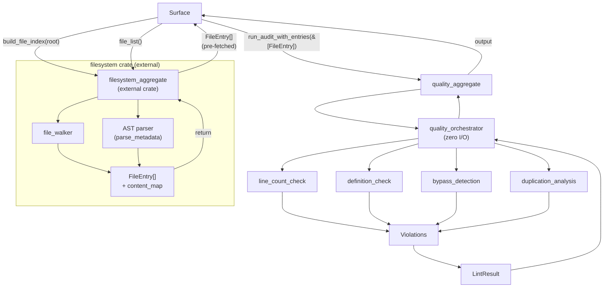

# FRD — quality-rules (v2.0.0)

---

## Feature Overview

The quality-rules crate enforces general code quality, formatting limits, and clean-coding policies. It protects the codebase from bloated files, empty structures, duplicate blocks, and bypass annotations while guaranteeing zero tolerance for warning/error suppressions.

File discovery, raw content reads, and AST parsing are handled by the external `filesystem` aggregate (`IFilesystemAggregate`). The Surface calls `filesystem.build_file_index(root)` to populate caches, then passes pre-fetched `&[FileEntry]` to the quality-rules orchestrator via `run_audit_with_entries`. The quality-rules crate does zero I/O — it only performs business logic analysis on pre-fetched data.

- **Architecture & Data Flow**

```mermaid
flowchart TD
    A["Surface"] -->|"build_file_index(root)"| D["filesystem_aggregate\n(external crate)"]
    A -->|"file_list()"| D

    subgraph FS ["filesystem crate (external)"]
        D --> E1["file_walker"]
        D --> E2["AST parser\n(parse_metadata)"]
        E1 --> G1["FileEntry[]\n+ content_map"]
        E2 --> G1
    end

    G1 -->|"return"| D
    D -->|"FileEntry[]\n(pre-fetched)"| A

    A -->|"run_audit_with_entries(&[FileEntry])"| B["quality_aggregate"]
    B --> C["quality_orchestrator\n(zero I/O)"]

    C --> H1["line_count_check"]
    C --> H2["definition_check"]
    C --> H3["bypass_detection"]
    C --> H4["duplication_analysis"]

    H1 --> I["Violations"]
    H2 --> I
    H3 --> I
    H4 --> I
    I --> J["LintResult"]
    J --> C
    C --> B
    B -->|output| A

```

---

## Functional Requirements

### FR-QualityRules-001: Maximum File Line Count (AES301)

| Aspect | Detail|
|--------|-------|
| Description | Flag source files whose line count exceeds the configured maximum. |
| Business Rules | AES301 fires FileTooLarge when a file's line count is above the max threshold; the violation message contains the observed count and the limit; files at exactly the limit are allowed. |
| Edge Cases | A file one line over the limit violates; a file at the limit does not; unreadable file yields no finding; empty path list yields no findings; message content includes the line count for diagnosis. |
| Capability | ArchLineChecker counts lines for both AES301 and AES302. |
| Protocol | ILineCheckerProtocol. |
| Method | Line-count check against the configured maximum returning an AES301 violation on overflow. |
| Input | File path plus content (or line count); source is CodeAnalysisRequest::RunAnalysis via ICodeAnalysisAggregate::execute. |
| Output | Violation (FileTooLarge) inside CodeAnalysisResponse::Analysis. |
| Error | Unreadable file reports no finding for that path rather than failing the analysis. |
| Event | None; analysis is synchronous. |
| Test | file_exceeding_max_lines_produces_aes301_violation and aes301_violation_message_contains_details assert violation and message content. |
| Metric | Seeded oversized file produces exactly one FileTooLarge finding; at-limit fixture produces zero. |

### FR-QualityRules-002: Minimum File Line Count (AES302)

| Aspect | Detail|
|--------|-------|
| Description | Flag source files whose line count falls below the configured minimum. |
| Business Rules | AES302 fires FileTooShort when a file's line count is under the min threshold; the violation message contains the observed count and the limit; files at exactly the minimum are allowed. |
| Edge Cases | A file one line under the minimum violates; at-minimum does not; empty file counts as below-minimum and violates; unreadable file yields no finding. |
| Capability | ArchLineChecker (shared with FR-001) counts lines against the minimum. |
| Protocol | ILineCheckerProtocol. |
| Method | Line-count check against the configured minimum returning an AES302 violation on shortfall. |
| Input | File path plus content; source is CodeAnalysisRequest::RunAnalysis. |
| Output | Violation (FileTooShort) inside CodeAnalysisResponse::Analysis. |
| Error | Unreadable file reports no finding rather than failing the analysis. |
| Event | None. |
| Test | file_below_min_lines_produces_aes302_violation and aes302_violation_message_contains_line_count assert violation and message content. |
| Metric | Seeded undersized file produces exactly one FileTooShort finding; at-minimum fixture produces zero. |

### FR-QualityRules-003: Mandatory Definitions & Dead Inheritance (AES303)

| Aspect | Detail|
|--------|-------|
| Description | Require struct/enum/trait/class/interface/type definitions and flag dead (never-implemented) inheritance. |
| Business Rules | AES303 sub-check 1 (MandatoryDefinitionChecker) fires when a source file has no mandatory definition kind. Sub-check 2 (DeadInheritanceChecker) fires DeadInheritance for a struct declared without an impl block. Empty class/interface variants are caught per language: Python empty class, JS empty class, JS empty interface all produce AES303. |
| Edge Cases | File without any struct or class produces AES303; struct without impl produces DeadInheritance; python empty class, js empty class, js empty interface each produce AES303; a file that has definitions passes quietly. |
| Capability | MandatoryDefinitionChecker enforces definition presence; DeadInheritanceChecker detects unimplemented inheritance. |
| Protocol | IMandatoryClassProtocol and IDeadInheritanceProtocol. |
| Method | Definition-presence check (MandatoryDefinitionChecker) plus dead-inheritance check (DeadInheritanceChecker), both over parsed entries. |
| Input | Parsed file entries (defs, impls); source is CodeAnalysisRequest::RunAnalysis. |
| Output | Violations MandatoryClassDefinition and DeadInheritance inside CodeAnalysisResponse::Analysis. |
| Error | Unparseable file contributes no findings; analysis continues across files. |
| Event | None. |
| Test | file_without_struct_or_class_produces_aes303, python_empty_class_produces_aes303, js_empty_interface_produces_aes303, and unit_struct_without_impl_produces_aes303_dead_inheritance assert both sub-checks. |
| Metric | Each seeded definition-miss fixture produces exactly one definition finding; seeded struct-without-impl produces one DeadInheritance finding. |

### FR-QualityRules-004: Bypass Detection (AES304)

| Aspect | Detail|
|--------|-------|
| Description | Detect bypass annotations and panic-style shortcuts that dodge quality checks. |
| Business Rules | AES304 fires per ViolationKind: BypassComment (bypass suppressions), UnwrapExpect, Panic, Todo, Unimplemented. Each occurrence in a scanned file is counted as its own finding with the kind carried in the message. |
| Edge Cases | Multiple bypass sites in one file each fire; a file with none passes; comment-only todo still flags Unimplemented/Todo kind as coded; unreadable file yields no finding. |
| Capability | BypassChecker scans for bypass annotations and panic-style calls. |
| Protocol | IBypassCheckerProtocol. |
| Method | Scan file content for bypass markers and panic constructs returning per-kind violations. |
| Input | File content plus path; source is CodeAnalysisRequest::RunAnalysis. |
| Output | Violations (BypassComment, UnwrapExpect, Panic, Todo, Unimplemented) inside CodeAnalysisResponse::Analysis. |
| Error | Unreadable file contributes no findings; no analysis failure occurs. |
| Event | None. |
| Test | Bypass-checker contract tests in the quality suite assert per-kind detection through IBypassCheckerProtocol (ViolationKind enums: UnwrapExpect, Panic, Todo, Unimplemented, BypassComment). |
| Metric | Seeded kind fixtures produce one finding of the matching kind each; clean fixture produces zero. |

### FR-QualityRules-005: Duplicate Code Detection (AES305)

| Aspect | Detail|
|--------|-------|
| Description | Detect excessive code duplication across the codebase. |
| Business Rules | AES305 fires CodeDuplication when duplicate regions across scanned files exceed the configured duplication threshold; identical files or near-clones group into a single finding naming the participants. |
| Edge Cases | Fully distinct files yield no duplication finding; exact duplicate pair yields one CodeDuplication finding; a file compared against itself is excluded; empty scan set yields no findings. |
| Capability | CodeDuplicationAnalyzer computes similarity groups. |
| Protocol | ICodeMetricAnalyzerProtocol. |
| Method | Duplication analysis over the scanned file set returning CodeDuplication violations. |
| Input | Set of file contents from the analysis request; source is CodeAnalysisRequest::RunAnalysis. |
| Output | Violation (CodeDuplication) inside CodeAnalysisResponse::Analysis. |
| Error | Unreadable file drops out of the comparison set rather than failing the run. |
| Event | None. |
| Test | Duplication contract coverage in the quality suite asserts CodeDuplication on a seeded clone pair and silence on distinct files. |
| Metric | Seeded clone pair produces one CodeDuplication finding; distinct-file fixture set produces zero. |

## Public Interface

| Aspect | Detail|
|--------|-------|
| Agent | CodeAnalysisOrchestrator — the agent-layer orchestrator behind the quality-rules stage of the check command. |
| Aggregate | ICodeAnalysisAggregate — the feature's single front door. |
| Method | execute(&self, request: CodeAnalysisRequest) -> CodeAnalysisResponse |
| Request | CodeAnalysisRequest::{RunAnalysis, Name} |
| Response | CodeAnalysisResponse::{Analysis, Name} |

## Reference

| Artifact | Purpose | Link|
|----------|---------|------|
| BACKLOG.md | Backlog tracking | [BACKLOG.md](BACKLOG.md)|
| PRD.md | Product requirements | [PRD.md](../../PRD.md)|
| FRD.md | Feature requirements | [FRD.md](FRD.md)|
| ROADMAP.md | Roadmap status | [ROADMAP.md](../../ROADMAP.md)|
| ARCHITECTURE.md | Layer contract | [ARCHITECTURE.md](../../ARCHITECTURE.md)|
