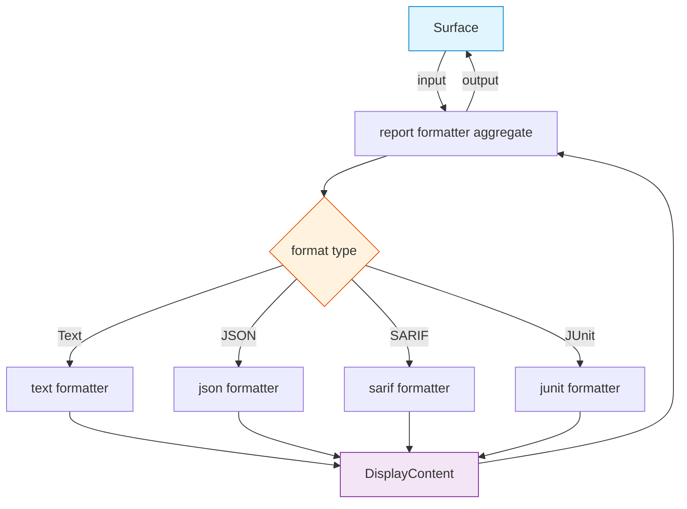

# FRD — report-formatter (v1.1.0)

---

## System Overview

The report-formatter crate provides formatting capabilities for scan report
output. It implements the report formatter protocol for each output format
(text, JSON, SARIF, JUnit) and exposes the report formatter aggregate via
the orchestrator for the surface layer to consume. The surface layer never
formats output directly — it always delegates through the aggregate trait.

All formatters are **self-contained** — they operate solely on `ScanReport`
data and do not depend on other rule crates.

### Architecture & Data Flow



### ScanReport Content

`ScanReport` contains two categories of findings:


| Category                  | Source                   | Rule codes        | Example                                                    |
| --------------------------- | -------------------------- | ------------------- | ------------------------------------------------------------ |
| **AES violations**        | Internal rule crates     | AES101–AES506    | `AES201 CRITICAL surface → capabilities import forbidden` |
| **External lint results** | External linter adapters | Tool-native codes | `clippy::needless_return`, `ruff::E501`                    |
| **PARSE_WARN**            | Report input (`report.results` with PARSE_ prefix) or `report.diagnostics` | `PARSE_WARN` | `File skipped: parse failure — syntax error` |

> **PARSE_WARN dual representation**: PARSE_WARN entries may arrive via
> `report.results` (as `LintResult` with code starting with `PARSE_`) or
> via `report.diagnostics` (as `PipelineDiagnostic`). All formatters
> handle both paths and render them consistently. PARSE_WARN is always
> visually distinct from AES violations.

All formatters handle all three categories.

---

## Functional Requirements

### FR-001: Text Format Output

- **Description**: Produce human-readable text output with severity badges
  and violation details. **Self-contained** — operates solely on
  `ScanReport` data without delegating to other crates.
- **Input**: `report: ScanReport`, `format: Format::Text`.
- **Output**: `DisplayContent` containing formatted text string.
- **Business Rules**:

  - Output includes:
    - Per-violation detail: severity badge, rule code, file:line, message.
    - Violation counts grouped by rule code, sorted by count (descending).
    - Severity breakdown: CRITICAL / HIGH / MEDIUM / LOW / INFO counts.
    - External lint results section (tool-native codes, grouped by tool).
    - Diagnostics section (PARSE_WARN warnings, if any).
    - Total violation count and compliance score (if available).
  - AES violations and external lint results are displayed in separate
    sections.
  - PARSE_WARN diagnostics displayed as warnings, visually distinct from
    AES violations.
- **Edge Cases**:

  - Empty results list → produces clean report with 0 violations.
  - Report with only PARSE_WARN diagnostics → shows warnings, 0 violations.
  - Report with only external lint results → shows external section, 0 AES
    violations.
- **Error Handling**: None — formatting is infallible.

---

### FR-002: JSON Format Output

- **Description**: Produce pretty-printed JSON output for CI/CD integration.
- **Input**: `report: ScanReport`, `format: Format::Json`.
- **Output**: `DisplayContent` containing pretty-printed JSON string.
- **Business Rules**:

  - Serializes report results via the JSON serialization library.
  - Output structure:
    ```json
    {
      "violations": [
        {
          "file": "path/to/file.rs",
          "line": 14,
          "code": "AES201",
          "severity": "CRITICAL",
          "message": "surface → capabilities import forbidden"
        }
      ],
      "external_results": [
        {
          "file": "path/to/file.rs",
          "line": 42,
          "code": "clippy::needless_return",
          "severity": "MEDIUM",
          "message": "..."
        }
      ],
      "diagnostics": [
        {
          "code": "PARSE_WARN",
          "severity": "WARNING",
          "message": "File skipped: parse failure — ..."
        }
      ],
      "summary": {
        "total_violations": 5,
        "critical": 2,
        "high": 1,
        "medium": 1,
        "low": 1,
        "score": 85.0
      }
    }
    ```
  - Falls back to empty object string on serialization failure.
- **Edge Cases**:

  - Empty results → produces valid JSON with empty arrays and zero summary.
  - Serialization failure → returns `{}` string.
- **Error Handling**: Serialization error caught gracefully.

---

### FR-003: SARIF 2.1.0 Format Output

- **Description**: Produce SARIF 2.1.0 JSON format for IDE integration and
  GitHub Code Scanning.
- **Input**: `report: ScanReport`, `format: Format::Sarif` (also
  `results: &[LintResult]` for direct call).
- **Output**: `DisplayContent` containing SARIF 2.1.0 JSON string.
- **Business Rules**:

  - Includes tool metadata: name `lint-arwaky`, version, information URI.
  - Severity mapping:


    | lint-arwaky Severity | SARIF Level |
    | ---------------------- | ------------- |
    | CRITICAL             | error       |
    | HIGH                 | error       |
    | MEDIUM               | warning     |
    | LOW                  | note        |
    | INFO                 | note        |
    | PARSE_WARN           | note        |
  - Each result includes: rule ID, level, message text, physical location.
  - Physical location includes artifact URI and start line.
  - Schema URI points to OASIS SARIF 2.1.0 schema.
  - Line numbers clamped to minimum 1.
  - AES violations and external lint results are both included in the
    `results` array, distinguished by rule ID prefix (`AES*` vs tool-native).
  - PARSE_WARN diagnostics included as results with level `note`.
  - Rules array includes metadata for all rule codes present in results.
- **Edge Cases**:

  - Empty results → valid SARIF with empty results array.
  - Line number 0 or negative → clamped to 1.
  - Serialization failure → returns empty object string.
- **Error Handling**: Serialization error caught gracefully.

---

### FR-004: JUnit XML Format Output

- **Description**: Produce JUnit XML format for CI/CD test report
  integration.
- **Input**: `report: ScanReport`, `format: Format::Junit` (also
  `results: &[LintResult]` for direct call).
- **Output**: `DisplayContent` containing JUnit XML string.
- **Business Rules**:

  - Each violation becomes a test case with classname (rule code) and name
    (file:line).
  - Non-INFO violations include `<failure>` element with message and type
    attributes.
  - INFO severity violations produce clean `<testcase>` without `<failure>`.
  - PARSE_WARN diagnostics produce `<testcase>` with `<skipped>` element.
  - External lint results included as test cases with tool-native classname.
  - XML is properly escaped: `&`, `<`, `>`, `"`, `'` → named entities.
  - Root element: `<testsuites>` with tests and failure counts.
  - Pre-allocated string capacity based on result count.
- **Edge Cases**:

  - Empty results → valid XML with 0 tests, 0 failures.
  - All violations INFO severity → no failure elements.
  - Special characters in messages → properly XML-escaped.
- **Error Handling**: None — XML generation is infallible.

---

### FR-005: Format Delegation (Orchestrator)

- **Description**: Route formatting request to the appropriate capabilities
  formatter based on `Format` enum.
- **Input**: `report: ScanReport`, `format: Format`.
- **Output**: `DisplayContent`.
- **Business Rules**:

  - Text format → text formatter.
  - JSON format → JSON formatter.
  - SARIF format → SARIF formatter.
  - JUnit format → JUnit formatter.
  - Each formatter implements the report formatter protocol.
  - Orchestrator holds a reference to each format's formatter implementation.
  - All formatters are self-contained — no dependency on other rule crates.
- **Edge Cases**:

  - Unknown format variant → exhaustive match ensures compile-time safety.
- **Error Handling**: None — dispatch is infallible.

---

### FR-006: Default Report Fallback

- **Description**: Produce a simple text summary when the requested format
  doesn't match.
- **Input**: `report: ScanReport`.
- **Output**: `String` containing summary text.
- **Business Rules**:

  - Shows violation count, diagnostic count, and score (if available).
  - Groups violations by code, sorted by count (descending).
  - Shows diagnostics with source, severity, and message.
  - Pre-allocated capacity based on result count.
- **Edge Cases**:

  - Empty results → "Violations: 0".
  - No score in report → score line omitted.
  - No diagnostics → diagnostics section omitted.
- **Error Handling**: None — pure function.

---

### FR-007: XML Escape Utility

- **Description**: Escape special XML characters for safe inclusion in JUnit
  XML output.
- **Input**: `s: &str`.
- **Output**: `String` with escaped characters.
- **Business Rules**:

  - `&` → `&amp;`
  - `<` → `&lt;`
  - `>` → `&gt;`
  - `"` → `&quot;`
  - `'` → `&apos;`
  - All other characters passed through unchanged.
- **Edge Cases**:

  - Empty string → empty output.
  - No special characters → string unchanged.
  - Multiple special characters → all escaped.
- **Error Handling**: None — pure function.

---

## API Contract


| Operation           | Input               | Output         | Description                    |
| --------------------- | --------------------- | ---------------- | -------------------------------- |
| Format              | scan report, format | DisplayContent | Route to appropriate formatter |
| Text Format         | scan report         | DisplayContent | Human-readable text output     |
| JSON Format         | scan report         | DisplayContent | Pretty-printed JSON output     |
| SARIF Format        | scan report         | DisplayContent | SARIF 2.1.0 JSON output        |
| SARIF Format Direct | lint results        | DisplayContent | Direct SARIF formatting        |
| JUnit Format        | scan report         | DisplayContent | JUnit XML output               |
| JUnit Format Direct | lint results        | DisplayContent | Direct JUnit formatting        |
| Default Format      | scan report         | String         | Default text summary fallback  |
| XML Escape          | string              | String         | XML entity escaping            |

---

## Integration Points

- **Internal**:

  - `shared` — taxonomy VOs, contract traits (report formatter protocol,
    report formatter aggregate), `LintResult`, `ScanReport`, `DisplayContent`.
- **External**:

  - JSON serialization library (`serde_json`) for JSON and SARIF formatters.
  - No other external dependencies — formatters are self-contained.
  - No dependency on other rule crates (quality-rules, import-rules, etc.).
  - No async runtime dependency.

---

## Non-functional Requirements

- **Performance**: Pre-allocated string capacity based on result count to
  minimize reallocation.
- **Memory**: No heap allocation beyond output string — all formatters are
  stateless.
- **Correctness**: SARIF output matches OASIS SARIF 2.1.0 schema. JUnit XML
  is valid XML with proper escaping. JSON output is valid and pretty-printed.
- **Thread Safety**: All formatters implement `Send + Sync` via trait bounds.
- **Extensibility**: New formats added by implementing the report formatter
  protocol and adding variant to the `Format` enum.

---

## Test Scenarios / QA Checklist

### FR-001 — Text Format


| # | Scenario                           | Expected                                   | Rule   |
| --- | ------------------------------------ | -------------------------------------------- | -------- |
| 1 | Report with AES violations         | Human-readable output with severity badges | FR-001 |
| 2 | Report with external lint results  | External section with tool-native codes    | FR-001 |
| 3 | Report with PARSE_WARN diagnostics | Warnings section, visually distinct        | FR-001 |
| 4 | Empty report                       | "0 violations" clean report                | FR-001 |
| 5 | Report with only PARSE_WARN        | Warnings shown, 0 violations               | FR-001 |

### FR-002 — JSON Format


| # | Scenario                     | Expected                                   | Rule   |
| --- | ------------------------------ | -------------------------------------------- | -------- |
| 1 | Normal report                | Valid pretty-printed JSON                  | FR-002 |
| 2 | Empty results                | Valid JSON with empty arrays, zero summary | FR-002 |
| 3 | Report with external results | `external_results` array populated         | FR-002 |
| 4 | Report with PARSE_WARN       | `diagnostics` array populated              | FR-002 |

### FR-003 — SARIF Format


| # | Scenario               | Expected                             | Rule   |
| --- | ------------------------ | -------------------------------------- | -------- |
| 1 | Normal report          | Valid SARIF 2.1.0 with tool metadata | FR-003 |
| 2 | CRITICAL/HIGH severity | SARIF level "error"                  | FR-003 |
| 3 | MEDIUM severity        | SARIF level "warning"                | FR-003 |
| 4 | LOW/INFO severity      | SARIF level "note"                   | FR-003 |
| 5 | PARSE_WARN diagnostic  | SARIF level "note"                   | FR-003 |
| 6 | Line number 0          | Clamped to 1                         | FR-003 |
| 7 | Empty results          | Valid SARIF with empty results array | FR-003 |
| 8 | External lint results  | Included with tool-native rule ID    | FR-003 |

### FR-004 — JUnit Format


| # | Scenario                      | Expected                              | Rule   |
| --- | ------------------------------- | --------------------------------------- | -------- |
| 1 | Normal violations             | `<failure>` elements present          | FR-004 |
| 2 | INFO severity violations      | Clean`<testcase>` without `<failure>` | FR-004 |
| 3 | PARSE_WARN diagnostics        | `<testcase>` with `<skipped>`         | FR-004 |
| 4 | Special characters in message | Properly XML-escaped                  | FR-004 |
| 5 | Test/failure counts           | Match actual results                  | FR-004 |
| 6 | Empty results                 | Valid XML with 0 tests, 0 failures    | FR-004 |
| 7 | External lint results         | Test cases with tool-native classname | FR-004 |

### FR-005–FR-007 — Orchestrator, Fallback, XML Escape


| # | Scenario                         | Expected                          | Rule   |
| --- | ---------------------------------- | ----------------------------------- | -------- |
| 1 | Orchestrator routes Text         | Text formatter invoked            | FR-005 |
| 2 | Orchestrator routes JSON         | JSON formatter invoked            | FR-005 |
| 3 | Orchestrator routes SARIF        | SARIF formatter invoked           | FR-005 |
| 4 | Orchestrator routes JUnit        | JUnit formatter invoked           | FR-005 |
| 5 | Default fallback with violations | Counts by code, sorted descending | FR-006 |
| 6 | Default fallback with score      | Score line included               | FR-006 |
| 7 | Default fallback empty           | "Violations: 0"                   | FR-006 |
| 8 | XML escape all 5 characters      | All escaped correctly             | FR-007 |
| 9 | XML escape normal text           | Unchanged                         | FR-007 |

---

## Assumptions & Constraints

- All formatters are infallible — they cannot return errors (only display
  content).
- `ScanReport` is the single input type for all formatters.
- Format routing is determined at compile time via exhaustive match on
  `Format` enum.
- All formatters are self-contained — no dependency on other rule crates.
- SARIF output uses the OASIS SARIF 2.1.0 schema — not earlier versions.
- JUnit XML follows the standard JUnit schema compatible with CI/CD parsers.
- `ScanReport` contains AES violations, external lint results (tool-native
  codes), and diagnostics (PARSE_WARN). All formatters handle all three
  categories.
- No async runtime dependency.

---

## Glossary


| Term                           | Definition                                                                                 |
| -------------------------------- | -------------------------------------------------------------------------------------------- |
| **AES**                        | Agentic Engineering System — the 7-layer coding convention                                |
| **SARIF**                      | Static Analysis Results Interchange Format — OASIS standard for tool output               |
| **JUnit XML**                  | XML format originally from JUnit, widely used for CI/CD test reporting                     |
| **DisplayContent**             | Semantic VO wrapping formatted string output                                               |
| **LintResult**                 | Individual violation finding with file, line, code, severity, message                      |
| **ScanReport**                 | Aggregated results + diagnostics from a full pipeline run                                  |
| **Report Formatter Protocol**  | Interface for individual format implementations (text, json, sarif, junit)                 |
| **Report Formatter Aggregate** | Interface for the orchestrator that routes to the correct formatter                        |
| **PARSE_WARN**                 | Non-AES warning for files that failed to parse. May appear as `LintResult` (code `PARSE_*`) in `report.results` or as `PipelineDiagnostic` in `report.diagnostics`. All formatters handle both paths. |
| **Tool-native code**           | External linter rule identifier (e.g.,`clippy::needless_return`, `ruff::E501`)             |

---

## Reference

- PRD: [PRD.md](../../PRD.md)
- Architecture: [ARCHITECTURE.md](../../ARCHITECTURE.md)
- CLI Commands FRD: `crates/cli-commands/FRD.md` (consumer of report-formatter)
- External Lint FRD: `crates/external-lint/FRD.md` (tool-native codes)
