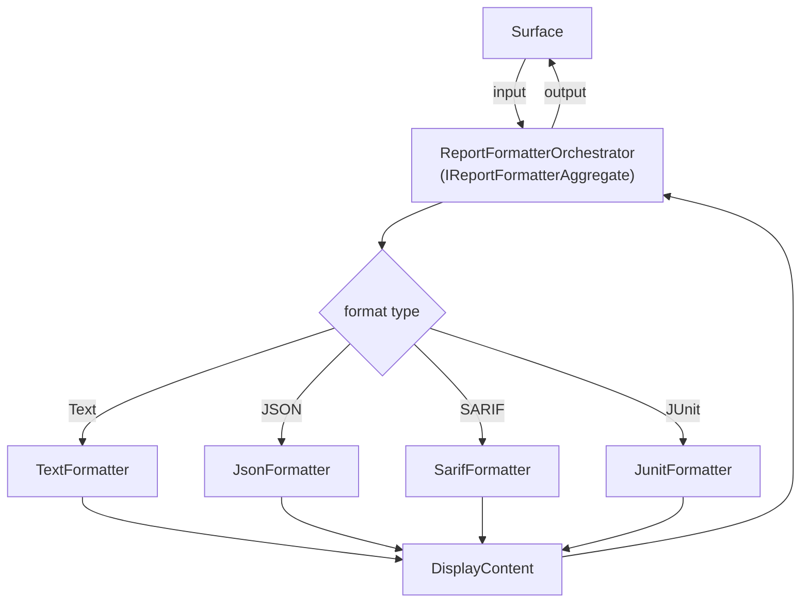

# FRD — report-formatter (v1.12.0)

---

## Reference

- Backlog: [BACKLOG.md](BACKLOG.md) — real condition for this feature; this file is specification only.
- PRD: [PRD.md](../../PRD.md)
- Architecture: [ARCHITECTURE.md](../../ARCHITECTURE.md)
- CLI Commands FRD: `crates/cli-commands/FRD.md` (consumer of report-formatter)
- External Lint FRD: `crates/external-lint/FRD.md` (tool-native codes)

## System Overview

The report-formatter crate provides formatting capabilities for scan report output. It implements the report formatter protocol for each output format (text, JSON, SARIF, JUnit) and exposes the report formatter aggregate via the orchestrator for the surface layer to consume. The surface layer never formats output directly — it always delegates through the aggregate trait.

All formatters are **self-contained** — they operate solely on `ScanReport` data and do not depend on other rule crates.

### Architecture & Data Flow

```mermaid
flowchart TD
    A["Surface"] -->|input| B["ReportFormatterOrchestrator\n(IReportFormatterAggregate)"]
    B --> C{"format type"}

    C -->|"Text"| D["TextFormatter"]
    C -->|"JSON"| E["JsonFormatter"]
    C -->|"SARIF"| F["SarifFormatter"]
    C -->|"JUnit"| G["JunitFormatter"]

    D --> H["DisplayContent"]
    E --> H
    F --> H
    G --> H

    H --> B
    B -->|output| A
```

### ScanReport Content

`ScanReport` contains two categories of findings:

| Category                  | Source                   | Rule codes        | Example                                                    |
| --------------------------- | -------------------------- | ------------------- | ------------------------------------------------------------ |
| **AES violations**        | Internal rule crates     | AES101–AES506    | `AES201 CRITICAL surface → capabilities import forbidden` |
| **External lint results** | External linter adapters | Tool-native codes | `clippy::needless_return`, `ruff::E501`                    |
| **PARSE_WARN**            | Report input or diagnostics | `PARSE_WARN` | `File skipped: parse failure — syntax error` |

> **PARSE_WARN dual representation**: PARSE_WARN entries may arrive via
> `report.results` (as `LintResult` with code starting with `PARSE_`) or
> via `report.diagnostics` (as `PipelineDiagnostic`). All formatters
> handle both paths and render them consistently.

---

## Functional Requirements

### FR-REPORTFORMATTER-001: Text Format Output

- **Description**: Produce human-readable text output with severity badges and violation details.
- **Input**: `ScanReport`, `Format::Text`.
- **Output**: `DisplayContent` containing formatted text string.
- **Business Rules**:

  - Output includes:
    - Per-violation detail: severity badge (`[!!!]` CRITICAL, `[!! ]` HIGH, `[! ]` MEDIUM, `[. ]` LOW, `[ ]` INFO), rule code, file:line, message.
    - Violation counts grouped by rule code, sorted by count (descending).
    - Severity breakdown: CRITICAL / HIGH / MEDIUM / LOW / INFO counts.
    - External lint results section (tool-native codes, grouped by tool).
    - Parse warnings section (PARSE_WARN entries).
    - Diagnostics section (PipelineDiagnostic entries).
    - Total violation count and compliance score (if available).
  - AES violations and external lint results are displayed in separate sections.
- **Edge Cases**:

  - Empty results list → produces clean report with 0 violations.
  - Report with only PARSE_WARN diagnostics → shows warnings, 0 violations.
  - Report with only external lint results → shows external section, 0 AES violations.
- **Error Handling**: None — formatting is infallible.

---

### FR-REPORTFORMATTER-002: JSON Format Output

- **Description**: Produce pretty-printed JSON output for CI/CD integration.
- **Input**: `ScanReport`, `Format::Json`.
- **Output**: `DisplayContent` containing pretty-printed JSON string.
- **Business Rules**:

  - Serializes report using shared JSON DTO value objects (`JsonReportDto`).
  - Separates results into `violations` (AES + PARSE_ codes) and `external_results` (tool-native codes).
  - Summary includes total violations, per-severity counts, and optional compliance score.
  - Diagnostics rendered as `JsonDiagnostic` entries with source, severity, and message.
- **Edge Cases**:

  - Empty results → valid JSON with empty arrays and zero summary.
  - Serialization failure → falls back to `{}` string.
- **Error Handling**: Serialization error caught gracefully.

---

### FR-REPORTFORMATTER-003: SARIF 2.1.0 Format Output

- **Description**: Produce SARIF 2.1.0 JSON format for IDE integration and GitHub Code Scanning.
- **Input**: `ScanReport`, `Format::Sarif`.
- **Output**: `DisplayContent` containing SARIF 2.1.0 JSON string.
- **Business Rules**:

  - Includes tool metadata: name `lint-arwaky`, version, information URI.
  - Severity mapping:

    | lint-arwaky Severity | SARIF Level |
    | ---------------------- | ------------- |
    | CRITICAL             | error       |
    | HIGH                 | error       |
    | MEDIUM               | warning     |
    | LOW                  | note        |
    | INFO                 | note        |
    | PARSE_WARN           | note        |

  - Each result includes: rule ID, level, message text, physical location (artifact URI + start line clamped to minimum 1).
  - Rules array includes metadata for all rule codes present in results.
  - Diagnostics from `report.diagnostics` included as additional SARIF results with rule ID `PARSE_WARN` and level `note`.
  - Uses shared SARIF value objects (`SarifLog`, `SarifRun`, `SarifResult`, etc.).
- **Edge Cases**:

  - Empty results → valid SARIF with empty results array.
  - Line number 0 or negative → clamped to 1.
  - Serialization failure → returns empty object string.
- **Error Handling**: Serialization error caught gracefully.

---

### FR-REPORTFORMATTER-004: JUnit XML Format Output

- **Description**: Produce JUnit XML format for CI/CD test report integration.
- **Input**: `ScanReport`, `Format::Junit`.
- **Output**: `DisplayContent` containing JUnit XML string.
- **Business Rules**:

  - Each violation becomes a test case with classname (rule code) and name (file:line).
  - Non-INFO violations include `<failure>` element with message and type attributes.
  - INFO severity violations produce clean `<testcase>` without `<failure>`.
  - PARSE_WARN diagnostics produce `<testcase>` with `<skipped>` element.
  - External lint results included as test cases with tool-native classname.
  - XML is properly escaped: `&`, `<`, `>`, `"`, `'` → named entities.
  - Root element: `<testsuites>` with tests and failure counts.
  - Pre-allocated string capacity based on result count.
- **Edge Cases**:

  - Empty results → valid XML with 0 tests, 0 failures.
  - All violations INFO severity → no failure elements.
  - Special characters in messages → properly XML-escaped.
- **Error Handling**: None — XML generation is infallible.

---

### FR-REPORTFORMATTER-005: Format Delegation (Orchestrator)

- **Description**: Route formatting request to the appropriate capabilities formatter based on `Format` enum.
- **Input**: `ScanReport`, `Format`.
- **Output**: `DisplayContent`.
- **Business Rules**:

  - Text format → text formatter.
  - JSON format → JSON formatter.
  - SARIF format → SARIF formatter.
  - JUnit format → JUnit formatter.
  - Each formatter implements the report formatter protocol.
  - Orchestrator holds an `Arc<dyn IReportFormatterProtocol>` for each format.
  - All formatters are self-contained — no dependency on other rule crates.
- **Edge Cases**:

  - Unknown format variant → exhaustive match ensures compile-time safety.
- **Error Handling**: None — dispatch is infallible.

---

### FR-REPORTFORMATTER-006: Default Report Fallback

- **Description**: Produce a simple text summary when the requested format doesn't match the formatter's supported format.
- **Input**: `ScanReport`.
- **Output**: `String` containing summary text.
- **Business Rules**:

  - Header: "Lint Arwaky Report".
  - Shows violation count, diagnostic count, and score (if available).
  - Groups violations by code, sorted by count (descending).
  - Shows diagnostics with source, severity, and message.
- **Edge Cases**:

  - Empty results → "Violations: 0".
  - No score in report → score line omitted.
  - No diagnostics → diagnostics section omitted.
- **Error Handling**: None — pure function.

---

### FR-REPORTFORMATTER-007: XML Escape Utility

- **Description**: Escape special XML characters for safe inclusion in JUnit XML output.
- **Input**: `&str`.
- **Output**: `String` with escaped characters.
- **Business Rules**:

  - `&` → `&amp;`
  - `<` → `&lt;`
  - `>` → `&gt;`
  - `"` → `&quot;`
  - `'` → `&apos;`
  - All other characters passed through unchanged.
- **Edge Cases**:

  - Empty string → empty output.
  - No special characters → string unchanged.
- **Error Handling**: None — pure function.

---

## API Contract

### Protocol API

| Method | Input | Output | Error | Event | Description |
| --- | --- | --- | --- | --- | --- |
| `format` | `ScanReport` | `DisplayContent` | None — formatting is infallible | — | Single method covering every output format the feature supports: text, JSON, SARIF, and JUnit. |

### Aggregate API

| Method | Input | Output | Error | Event | Description |
| --- | --- | --- | --- | --- | --- |
| `format` | `ScanReport`, `Format` | `DisplayContent` | None | — | Route the request to the formatter matching the requested format. |
| `format_text` | `ScanReport` | `DisplayContent` | None | — | Render human-readable text with severity badges and grouped counts. |
| `format_json` | `ScanReport` | `DisplayContent` | Serialization error falls back to an empty object | — | Render pretty-printed JSON for CI consumption. |
| `format_sarif` | `ScanReport` | `DisplayContent` | Serialization error falls back to an empty object | — | Render SARIF 2.1.0 JSON for IDE and code-scanning integration. |
| `format_junit` | `ScanReport` | `DisplayContent` | None | — | Render JUnit XML for CI test-report integration. |
| `format_default` | `ScanReport` | `String` | None | — | Render the plain summary used when no other format matches. |
| `escape_xml` | `&str` | `String` | None | — | Escape the five XML significant characters for safe inclusion in JUnit output. |

---

## Integration Points

| System | Direction | Purpose | Failure mode |
| --- | --- | --- | --- |
| Shared crate | in | Supplies taxonomy value objects, the formatter protocol and aggregate traits, the report and display types | None — types only, no runtime failure |
| JSON serialization library | in | Serializes JSON and SARIF documents | Serialization error → empty-object fallback string |
| Surface layer | out | Consumes formatted output through the aggregate trait | None — the aggregate is infallible |
| Other rule crates | n/a | Deliberately not depended on; formatters read only the scan report | n/a — no dependency exists |

---

## Non-functional Requirements

| Metric | Target | Measurement method |
| --- | --- | --- |
| Text rendering throughput | Pre-allocated string capacity sized from the result count | Read the formatter's capacity computation and profile a large report |
| Allocation footprint | No heap allocation beyond the output string | Confirm formatters hold no per-report state |
| SARIF conformance | Output validates against the OASIS SARIF 2.1.0 schema | Validate rendered output against the published schema |
| JUnit conformance | Output is well-formed XML with correct entity escaping | Parse rendered output and assert escaping round-trips |
| Thread safety | Every formatter is `Send + Sync` | Assert the trait bounds on each formatter type |
| Extensibility | A new format is added by implementing the protocol and adding a `Format` variant | Add a variant and confirm the exhaustive match forces the wiring |

---

## Test Scenarios

- A report carrying AES violations renders human-readable output with severity badges.
- A report carrying external lint results renders an external section with tool-native codes.
- A report carrying parse-warning diagnostics renders a warnings section visually distinct from violations.
- An empty report renders a clean report stating zero violations.
- A normal report renders valid pretty-printed JSON.
- A report with no results renders valid JSON with empty arrays and a zero summary.
- A report with external lint results populates the `external_results` array.
- A report carrying parse warnings populates the `diagnostics` array.
- A normal report renders valid SARIF 2.1.0 with tool metadata.
- A report holding critical or high severity violations maps to SARIF level `error`.
- A report holding medium severity violations maps to SARIF level `warning`.
- A report holding low or info severity violations maps to SARIF level `note`.
- A report carrying a parse-warning diagnostic maps to SARIF level `note`.
- A violation recorded at line 0 is clamped to line 1 in the SARIF location.
- A report with no results renders valid SARIF with an empty results array.
- A report carrying violations renders JUnit XML containing failure elements.
- A report whose violations are all info severity renders clean test cases with no failure elements.
- A report carrying parse-warning diagnostics renders test cases marked skipped.
- Special characters in a violation message are properly XML-escaped.
- The JUnit test and failure counts match the actual result set.
- An empty report renders valid XML with zero tests and zero failures.
- The orchestrator routes a text request to the text formatter.
- The orchestrator routes a JSON request to the JSON formatter.
- The orchestrator routes a SARIF request to the SARIF formatter.
- The orchestrator routes a JUnit request to the JUnit formatter.
- The default fallback groups a report's violations by code, sorted descending.
- The default fallback on an empty report states zero violations.
- The XML escape utility escapes all five significant characters correctly.
- The XML escape utility leaves ordinary text unchanged.

---

## Assumptions & Constraints

- All formatters are infallible — they cannot return errors (only display content).
- `ScanReport` is the single input type for all formatters.
- Format routing is determined at compile time via exhaustive match on `Format` enum.
- All formatters are self-contained — no dependency on other rule crates.
- SARIF output uses the OASIS SARIF 2.1.0 schema.
- JUnit XML follows the standard JUnit schema compatible with CI/CD parsers.
- `ScanReport` contains AES violations, external lint results (tool-native codes), and diagnostics (PARSE_WARN). All formatters handle all three categories.
- No async runtime dependency.

---

## Glossary

- **AES**: Agentic Engineering System — the 7-layer coding convention.
- **SARIF**: Static Analysis Results Interchange Format — the OASIS standard for tool output.
- **JUnit XML**: XML format originally from JUnit, widely used for CI/CD test reporting.
- **DisplayContent**: Semantic value object wrapping formatted string output.
- **LintResult**: Individual violation finding: file, line, code, severity, and message.
- **ScanReport**: Aggregated results plus diagnostics from a full pipeline run.
- **Report Formatter Protocol**: Interface for individual format implementations (text, JSON, SARIF, JUnit).
- **Report Formatter Aggregate**: Interface for the orchestrator that routes to the correct formatter.
- **PARSE_WARN**: Non-AES warning for files that failed to parse. Appears as a `LintResult` with a `PARSE_*` code in `report.results`, or as a `PipelineDiagnostic` in `report.diagnostics`.
- **Tool-native code**: An external linter's rule identifier, for example `clippy::needless_return` or `ruff::E501`.

---
