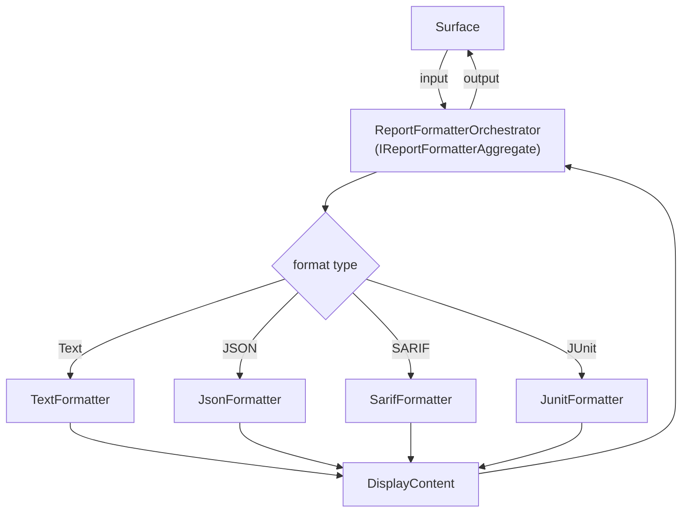

# FRD — report-formatter (v1.12.0)

---

## Reference

- Backlog: [BACKLOG.md](BACKLOG.md) — real condition for this feature; this file is specification only.
- PRD: [PRD.md](../../PRD.md)
- Architecture: [ARCHITECTURE.md](../../ARCHITECTURE.md)
- External Lint FRD: `crates/external-lint/FRD.md` (tool-native codes)

## System Overview

The report-formatter crate provides formatting capabilities for scan report output. It implements the report formatter protocol for each output format (text, JSON, SARIF, JUnit) and exposes the report formatter aggregate via the orchestrator for the surface layer to consume. The surface layer never formats output directly — it always delegates through the aggregate trait.

All formatters are **self-contained** — they operate solely on `ScanReport` data and do not depend on other rule crates.

### Architecture & Data Flow

```mermaid
flowchart TD
    A["Surface"] -->|input| B["ReportFormatterOrchestrator\n(IReportFormatterAggregate)"]
    B --> C{"format type"}

    C -->|"Text"| D["TextFormatter"]
    C -->|"JSON"| E["JsonFormatter"]
    C -->|"SARIF"| F["SarifFormatter"]
    C -->|"JUnit"| G["JunitFormatter"]

    D --> H["DisplayContent"]
    E --> H
    F --> H
    G --> H

    H --> B
    B -->|output| A
```

### ScanReport Content

`ScanReport` contains two categories of findings:

| Category                  | Source                   | Rule codes        | Example                                                    |
| --------------------------- | -------------------------- | ------------------- | ------------------------------------------------------------ |
| **AES violations**        | Internal rule crates     | AES101–AES506    | `AES201 CRITICAL surface → capabilities import forbidden` |
| **External lint results** | External linter adapters | Tool-native codes | `clippy::needless_return`, `ruff::E501`                    |
| **PARSE_WARN**            | Report input or diagnostics | `PARSE_WARN` | `File skipped: parse failure — syntax error` |

> **PARSE_WARN dual representation**: PARSE_WARN entries may arrive via
> `report.results` (as `LintResult` with code starting with `PARSE_`) or
> via `report.diagnostics` (as `PipelineDiagnostic`). All formatters
> handle both paths and render them consistently.

---

## Functional Requirements

### FR-ReportFormatter-001: Text Format Output

- **Description**: Produce human-readable text output with severity badges and violation details.
- **Input**: `ScanReport`, `Format::Text`.
- **Output**: `DisplayContent` containing formatted text string.
- **Business Rules**:

  - Output includes:
    - Per-violation detail: severity badge (`[!!!]` CRITICAL, `[!! ]` HIGH, `[! ]` MEDIUM, `[. ]` LOW, `[ ]` INFO), rule code, file:line, message.
    - Violation counts grouped by rule code, sorted by count (descending).
    - Severity breakdown: CRITICAL / HIGH / MEDIUM / LOW / INFO counts.
    - External lint results section (tool-native codes, grouped by tool).
    - Parse warnings section (PARSE_WARN entries).
    - Diagnostics section (PipelineDiagnostic entries).
    - Total violation count and compliance score (if available).
  - AES violations and external lint results are displayed in separate sections.
- **Edge Cases**:

  - Empty results list → produces clean report with 0 violations.
  - Report with only PARSE_WARN diagnostics → shows warnings, 0 violations.
  - Report with only external lint results → shows external section, 0 AES violations.
- **Error Handling**: None — formatting is infallible.

---

### FR-ReportFormatter-002: JSON Format Output

- **Description**: Produce pretty-printed JSON output for CI/CD integration.
- **Input**: `ScanReport`, `Format::Json`.
- **Output**: `DisplayContent` containing pretty-printed JSON string.
- **Business Rules**:

  - Serializes report using shared JSON DTO value objects (`JsonReportDto`).
  - Separates results into `violations` (AES + PARSE_ codes) and `external_results` (tool-native codes).
  - Summary includes total violations, per-severity counts, and optional compliance score.
  - Diagnostics rendered as `JsonDiagnostic` entries with source, severity, and message.
- **Edge Cases**:

  - Empty results → valid JSON with empty arrays and zero summary.
  - Serialization failure → falls back to `{}` string.
- **Error Handling**: Serialization error caught gracefully.

---

### FR-ReportFormatter-003: SARIF 2.1.0 Format Output

- **Description**: Produce SARIF 2.1.0 JSON format for IDE integration and GitHub Code Scanning.
- **Input**: `ScanReport`, `Format::Sarif`.
- **Output**: `DisplayContent` containing SARIF 2.1.0 JSON string.
- **Business Rules**:

  - Includes tool metadata: name `lint-arwaky`, version, information URI.
  - Severity mapping:

    | lint-arwaky Severity | SARIF Level |
    | ---------------------- | ------------- |
    | CRITICAL             | error       |
    | HIGH                 | error       |
    | MEDIUM               | warning     |
    | LOW                  | note        |
    | INFO                 | note        |
    | PARSE_WARN           | note        |

  - Each result includes: rule ID, level, message text, physical location (artifact URI + start line clamped to minimum 1).
  - Rules array includes metadata for all rule codes present in results.
  - Diagnostics from `report.diagnostics` included as additional SARIF results with rule ID `PARSE_WARN` and level `note`.
  - Uses shared SARIF value objects (`SarifLog`, `SarifRun`, `SarifResult`, etc.).
- **Edge Cases**:

  - Empty results → valid SARIF with empty results array.
  - Line number 0 or negative → clamped to 1.
  - Serialization failure → returns empty object string.
- **Error Handling**: Serialization error caught gracefully.

---

### FR-ReportFormatter-004: JUnit XML Format Output

- **Description**: Produce JUnit XML format for CI/CD test report integration.
- **Input**: `ScanReport`, `Format::Junit`.
- **Output**: `DisplayContent` containing JUnit XML string.
- **Business Rules**:

  - Each violation becomes a test case with classname (rule code) and name (file:line).
  - Non-INFO violations include `<failure>` element with message and type attributes.
  - INFO severity violations produce clean `<testcase>` without `<failure>`.
  - PARSE_WARN diagnostics produce `<testcase>` with `<skipped>` element.
  - External lint results included as test cases with tool-native classname.
  - XML is properly escaped: `&`, `<`, `>`, `"`, `'` → named entities.
  - Root element: `<testsuites>` with tests and failure counts.
  - Pre-allocated string capacity based on result count.
- **Edge Cases**:

  - Empty results → valid XML with 0 tests, 0 failures.
  - All violations INFO severity → no failure elements.
  - Special characters in messages → properly XML-escaped.
- **Error Handling**: None — XML generation is infallible.

---

### FR-ReportFormatter-005: Format Delegation (Orchestrator)

- **Description**: Route formatting request to the appropriate capabilities formatter based on `Format` enum.
- **Input**: `ScanReport`, `Format`.
- **Output**: `DisplayContent`.
- **Business Rules**:

  - Text format → text formatter.
  - JSON format → JSON formatter.
  - SARIF format → SARIF formatter.
  - JUnit format → JUnit formatter.
  - Each formatter implements the report formatter protocol.
  - Orchestrator holds an `Arc<dyn IReportFormatterProtocol>` for each format.
  - All formatters are self-contained — no dependency on other rule crates.
- **Edge Cases**:

  - Unknown format variant → exhaustive match ensures compile-time safety.
- **Error Handling**: None — dispatch is infallible.

---

### FR-ReportFormatter-006: Default Report Fallback

- **Description**: Produce a simple text summary when the requested format doesn't match the formatter's supported format.
- **Input**: `ScanReport`.
- **Output**: `String` containing summary text.
- **Business Rules**:

  - Header: "Lint Arwaky Report".
  - Shows violation count, diagnostic count, and score (if available).
  - Groups violations by code, sorted by count (descending).
  - Shows diagnostics with source, severity, and message.
- **Edge Cases**:

  - Empty results → "Violations: 0".
  - No score in report → score line omitted.
  - No diagnostics → diagnostics section omitted.
- **Error Handling**: None — pure function.

---

### FR-ReportFormatter-007: XML Escape Utility

- **Description**: Escape special XML characters for safe inclusion in JUnit XML output.
- **Input**: `&str`.
- **Output**: `String` with escaped characters.
- **Business Rules**:

  - `&` → `&amp;`
  - `<` → `&lt;`
  - `>` → `&gt;`
  - `"` → `&quot;`
  - `'` → `&apos;`
  - All other characters passed through unchanged.
- **Edge Cases**:

  - Empty string → empty output.
  - No special characters → string unchanged.
- **Error Handling**: None — pure function.

---

## API Contract

### Protocol API

| Method | Input | Output | Error | Event | Description |
|---|---|---|---|---|---|
| `format` | &ScanReport, Format | `DisplayContent` | — | — | Format. |
| `supported_format` | — | `Format` | — | — | Supported format. |

### Aggregate API

| Method | Input | Output | Error | Event | Description |
|---|---|---|---|---|---|
| `format` | &ScanReport, Format | `DisplayContent` | — | — | Single composite entry point over the feature. |

## Integration Points
| System | Direction | Purpose | Failure mode |
| --- | --- | --- | --- |
| `shared` crate | in | Supply the taxonomy value objects, the formatter protocol and aggregate contracts, and the JSON and SARIF value objects | A value object is missing at compile time → the build fails before any format is produced |
| JSON serialization library | in | Serialize the JSON and SARIF outputs | Serialization fails on a value → the failure is reported and no partial document is emitted |
| Report formatter protocol | out (internal) | Define the shape each format implementation satisfies | A formatter does not satisfy the protocol → it is not registered and the format is reported as unavailable |
| Report formatter aggregate | out (internal) | Route a report to the formatter for the requested format | An unknown format is requested → an invalid-argument error is returned instead of a default rendering |
| `Format` enum | out (internal) | Name the supported output formats | A format is added to the enum without a registered implementation → the format is rejected at selection time |

## Non-functional Requirements
| Metric | Target | Measurement method |
| --- | --- | --- |
| Output allocation | String capacity is pre-allocated from the result count to avoid reallocation | Profile a large report and confirm the allocation count is bounded by the result count, not the string length |
| Formatter memory | No allocation beyond the output string; formatters hold no state between calls | Measure retained memory after formatting a large report and assert it returns to baseline |
| SARIF conformance | Output validates against the OASIS SARIF 2.1.0 schema | Validate a generated SARIF document against the published schema |
| JUnit conformance | Output is well-formed XML with correct escaping | Parse generated JUnit XML and assert it is well-formed, including for findings containing markup characters |
| JSON conformance | Output is valid and pretty-printed | Parse generated JSON and assert it round-trips and is indented |
| Thread safety | Every formatter is `Send + Sync` | Assert the bound at compile time and share one formatter across threads in a test |
| Extensibility | A new format is added by implementing the protocol and adding an enum variant | Add a format in a test branch and assert selection routes to it without touching the orchestrator |
| Format selection | An unknown format is rejected at selection time | Request an unregistered format and assert an invalid-argument error rather than a default rendering |

## Test Scenarios / QA Checklist

Each scenario is stated below as a table of cases: the input condition and the expected result.

- **SCEN-001 — Text Format** — e.g. Report with AES violations → Human-readable output with severity badges
- **SCEN-002 — JSON Format** — e.g. Normal report → Valid pretty-printed JSON
- **SCEN-003 — SARIF Format** — e.g. Normal report → Valid SARIF 2.1.0 with tool metadata
- **SCEN-004 — JUnit Format** — e.g. Normal violations → `<failure>` elements present
- **SCEN-005–FR-ReportFormatter-007 — Orchestrator, Fallback, XML Escape** — e.g. Orchestrator routes Text → Text formatter invoked

### SCEN-001 — Text Format

FRD Ref: FR-ReportFormatter-001

| # | Scenario | Expected |
| - | - | - |
| 1 | Report with AES violations | Human-readable output with severity badges |
| 2 | Report with external lint results | External section with tool-native codes |
| 3 | Report with PARSE_WARN diagnostics | Warnings section, visually distinct |
| 4 | Empty report | "0 violations" clean report |

### SCEN-002 — JSON Format

FRD Ref: FR-ReportFormatter-002

| # | Scenario | Expected |
| - | - | - |
| 1 | Normal report | Valid pretty-printed JSON |
| 2 | Empty results | Valid JSON with empty arrays, zero summary |
| 3 | Report with external results | `external_results` array populated |
| 4 | Report with PARSE_WARN | `diagnostics` array populated |

### SCEN-003 — SARIF Format

FRD Ref: FR-ReportFormatter-003

| # | Scenario | Expected |
| - | - | - |
| 1 | Normal report | Valid SARIF 2.1.0 with tool metadata |
| 2 | CRITICAL/HIGH severity | SARIF level "error" |
| 3 | MEDIUM severity | SARIF level "warning" |
| 4 | LOW/INFO severity | SARIF level "note" |
| 5 | PARSE_WARN diagnostic | SARIF level "note" |
| 6 | Line number 0 | Clamped to 1 |
| 7 | Empty results | Valid SARIF with empty results array |

### SCEN-004 — JUnit Format

FRD Ref: FR-ReportFormatter-004

| # | Scenario | Expected |
| - | - | - |
| 1 | Normal violations | `<failure>` elements present |
| 2 | INFO severity violations | Clean `<testcase>` without `<failure>` |
| 3 | PARSE_WARN diagnostics | `<testcase>` with `<skipped>` |
| 4 | Special characters in message | Properly XML-escaped |
| 5 | Test/failure counts | Match actual results |
| 6 | Empty results | Valid XML with 0 tests, 0 failures |

### SCEN-005–FR-ReportFormatter-007 — Orchestrator, Fallback, XML Escape

FRD Ref: FR-ReportFormatter-005, FR-ReportFormatter-006, FR-ReportFormatter-007

| # | Scenario | Expected |
| - | - | - |
| 1 | Orchestrator routes Text | Text formatter invoked |
| 2 | Orchestrator routes JSON | JSON formatter invoked |
| 3 | Orchestrator routes SARIF | SARIF formatter invoked |
| 4 | Orchestrator routes JUnit | JUnit formatter invoked |
| 5 | Default fallback with violations | Counts by code, sorted descending |
| 6 | Default fallback empty | "Violations: 0" |
| 7 | XML escape all 5 characters | All escaped correctly |
| 8 | XML escape normal text | Unchanged |

---

## Assumptions & Constraints

- All formatters are infallible — they cannot return errors (only display content).
- `ScanReport` is the single input type for all formatters.
- Format routing is determined at compile time via exhaustive match on `Format` enum.
- All formatters are self-contained — no dependency on other rule crates.
- SARIF output uses the OASIS SARIF 2.1.0 schema.
- JUnit XML follows the standard JUnit schema compatible with CI/CD parsers.
- `ScanReport` contains AES violations, external lint results (tool-native codes), and diagnostics (PARSE_WARN). All formatters handle all three categories.
- No async runtime dependency.

---

## Glossary

- **AES**: Agentic Engineering System — the 7-layer coding convention
- **SARIF**: Static Analysis Results Interchange Format — OASIS standard for tool output
- **JUnit XML**: XML format originally from JUnit, widely used for CI/CD test reporting
- **DisplayContent**: Semantic VO wrapping formatted string output
- **LintResult**: Individual violation finding with file, line, code, severity, message
- **ScanReport**: Aggregated results + diagnostics from a full pipeline run
- **Report Formatter Protocol**: Interface for individual format implementations (text, json, sarif, junit)
- **Report Formatter Aggregate**: Interface for the orchestrator that routes to the correct formatter
- **PARSE_WARN**: Non-AES warning for files that failed to parse. May appear as `LintResult` (code `PARSE_*`) in `report.results` or as `PipelineDiagnostic` in `report.diagnostics`.
- **Tool-native code**: External linter rule identifier (e.g., `clippy::needless_return`, `ruff::E501`)

---
