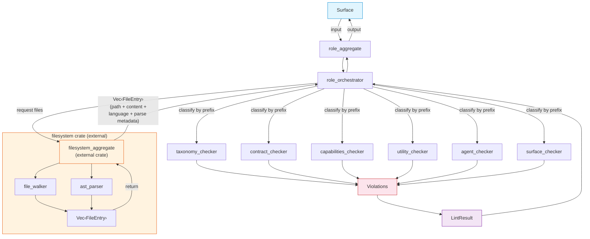

# FRD — role-rules (v1.1.0)

---

## System Overview

The role-rules crate enforces architectural boundaries and responsibility rules for each layer (Taxonomy, Contract, Capabilities, Agent, Surface, Utility) as defined by the 7-layer AES architecture. It receives pre-parsed file data from the external filesystem crate, classifies files by their filename prefix, and dispatches to 6 layer-specific role checkers (AES401–AES406). Root layer files are skipped (pure DI wiring only).

File system operations handled by the external `filesystem` crate. The role-rules crate receives `Vec<File>` (path + content + language + parse metadata) from the filesystem crate , then classifies and delegates analysis to its internal checkers. The role-rules crate does not perform file I/O or AST parsing directly.

Import checking is NOT performed by role-rules.All import validation (forbidden imports, mandatory imports, unused imports) is the responsibility of the import-rules crate (AES201–AES206). Role-rules only validates structural and responsibility constraints within each file.

### Architecture & Data Flow



```---

## Functional Requirements

### FR-001: File Classification and Dispatch

- **Description**: Classify each file received from the filesystem crate by its filename prefix to determine its AES layer, then dispatch to the appropriate layer-specific role checker.
- **Input**: `Vec<File>` (path + content + language + parse metadata, from filesystem crate), architecture configuration.
- **Output**: All violations found across all dispatched files.
- **Business Rules**:

  - Extract filename prefix as the first `_`-separated segment of the stem.
  - Match prefix to layer:


    | Prefix                       | Layer        | Checker                                   |
    | ------------------------------ | -------------- | ------------------------------------------- |
    | `taxonomy`                   | taxonomy     | taxonomy_checker (AES401)                 |
    | `contract`                   | contract     | contract_checker (AES402)                 |
    | `capabilities`, `capability` | capabilities | capabilities_checker (AES403)             |
    | `utility`                    | utility      | utility_checker (AES404)                  |
    | `agent`                      | agent        | agent_checker (AES405)                    |
    | `surface`, `surfaces`        | surface      | surface_checker (AES406)                  |
    | `root`                       | root         | **SKIP** (pure DI wiring, no role checks) |
  - Apply ignore paths from architecture configuration using **segment matching** (split path by `/`, match per segment — pattern `test` matches segment `test` only, not `latest` or `contest`).
  - Files with no underscore in the name have no prefix match → silently skipped.
  - Files with unrecognized prefix → silently skipped.
  - Barrel files (`mod.rs`, `lib.rs`, `main.rs`, `__init__.py`, `index.ts`) are skipped.
  - Files in the rule's `exceptions` list are skipped.
- **Edge Cases**:

  - Files matching multiple ignore patterns → excluded (any segment match suffices).
  - `capability_*` and `capabilities_*` both map to capabilities layer.
  - `surface_*` and `surfaces_*` both map to surface layer.
- **Error Handling**: Files that could not be read or parsed by the filesystem crate are excluded from `Vec<File>` and never reach role-rules. No empty-content fallback.

---

### FR-002: Taxonomy Purity and Primitive Restriction (AES401)

- **Description**: Audit taxonomy layer files (`taxonomy_*`) for raw primitive types in type annotations and ensure constant files contain only pure constant declarations. Uses AST parse metadata from the filesystem crate.
- **Input**: `FileEntry` (path + content + language + parse metadata).
- **Output**: AES401 violations.
- **Business Rules**:

  - **Entity/Error/Event primitive check** (`_entity`, `_error`, `_event` files):

    - Scan type annotations in struct fields, function parameters, and return types for raw primitives.
    - Forbidden primitives per language:


      | Language              | Forbidden Primitives                                                                                                           |
      | ----------------------- | -------------------------------------------------------------------------------------------------------------------------------- |
      | Rust                  | `String`, `str`, `i8`–`i128`, `u8`–`u128`, `f32`, `f64`, `bool`, `usize`, `isize`, `Vec<T>`, `HashMap<K,V>`, `BTreeMap<K,V>` |
      | Python                | `str`, `int`, `float`, `bool`, `list`, `dict`, `tuple`, `set`                                                                  |
      | TypeScript/JavaScript | `string`, `number`, `boolean`, `any`, `Array<T>`, `Record<K,V>`                                                                |
    - Type annotations using custom VO wrappers (e.g., `FilePath`, `LineNumber`, `SymbolName`) are NOT flagged.
    - Detection via AST parse metadata: extract struct field types, function parameter types, return types.
  - **Constant purity check** (`_constant` files):

    - Only constant declarations are allowed: `pub const` / `pub static` (Rust), module-level assignments (Python), `export const` (TS).
    - Forbidden: `struct`, `enum`, `fn`, `impl`, `mod`, `trait` (Rust); `class`, `def` (Python); `class`, `interface`, `function`, `type` (TS).
    - Detection via AST parse metadata: extract top-level item kinds.
  - **Skip rules**: Type definition lines (`struct Foo { ... }`, `class Foo`) are excluded from primitive scanning (the definition itself is not a violation; only field/parameter types are checked).
- **Edge Cases**:

  - Taxonomy file with mixed valid and invalid annotations → only the violating lines are reported.
  - Constant file with a helper function → AES401 violation (function in constant file).
  - Empty files → no violations.
  - Files with unsupported language → no violations.
- **Error Handling**: Emit AES401 with the file path, line number, primitive type found, and expected VO wrapper.

---

### FR-003: Contract Primitive Restriction (AES402)

- **Description**: Audit contract layer files (`contract_*`) for raw primitive types in method signatures. Uses AST parse metadata from the filesystem crate.
- **Input**: `File` (path + content + language + parse metadata).
- **Output**: AES402 violations.
- **Business Rules**:

  - **Protocol check** (`_protocol` files): Detect raw primitives in method signatures (parameters and return types) of trait/interface definitions.
  - **Aggregate check** (`_aggregate` files): Same check on aggregate trait/interface definitions.
  - Forbidden primitives: same list as FR-002 per language.
  - Detection via AST parse metadata: extract trait/interface method signatures, scan parameter types and return types.
  - Each violating signature is reported individually with line number.
- **Edge Cases**:

  - Protocol file with zero methods → no violations (nothing to check).
  - Aggregate file with only type aliases → no method signatures to extract, no violations.
  - Methods with custom VO types in signatures → no violation.
- **Error Handling**: Emit AES402 with the file path, line number, method name, primitive type found, and expected VO wrapper.

---

### FR-004: Capability Protocol Implementation (AES403)

- **Description**: Audit capability files (`capabilities_*` / `capability_*`) for protocol implementation and composition constraints. This rule checks **implementation only**, not imports. Import validation is handled by the import-rules crate (AES201–AES206).
- **Input**: `FileEntry` (path + content + language + parse metadata).
- **Output**: AES403 violations.
- **Business Rules**:

  - **Rule 1 — Max type declarations**: Maximum `max_types` (configurable, default 3) type declarations (struct/enum/class/interface) per file. Violation: "too many types". Checked first — if exceeded, skip Rule 2.
  - **Rule 2 — Protocol implementor**: At least 1 struct/class must implement a protocol trait/interface.
    - Rust: `impl Trait for Struct` where Trait is a protocol (detected via AST `ItemImpl` with `trait_` path).
    - Python: `class Name(Parent)` where Parent is a protocol class.
    - TypeScript: `class Name implements IProtocol`.
    - Violation: "missing protocol implementor".
  - Internal helper types (structs/classes without protocol impl) are allowed and not flagged individually.
  - Detection via AST parse metadata: extract type declarations and impl/inherits blocks.
- **Edge Cases**:

  - Capability file with no implementor → AES403 violation (Rule 2).
  - File with exactly `max_types` types → passes Rule 1.
  - File with > `max_types` types → AES403 violation (Rule 1 only, Rule 2 skipped).
  - File with helper struct + implementor struct = 2 types → passes Rule 1, passes Rule 2.
- **Error Handling**: Emit AES403 with the violation kind (`TooManyTypes` or `MissingProtocolImplementor`), file path, and relevant counts.

---

### FR-005: Utility Purity (AES404)

- **Description**: Audit utility files (`utility_*`) to ensure they contain only stateless standalone functions with no type definitions. Uses AST parse metadata from the filesystem crate.
- **Input**: `FileEntry` (path + content + language + parse metadata).
- **Output**: AES404 violations.
- **Business Rules**:

  - **Rust**: Forbid `struct`, `enum`, `trait`, `type` definitions. Only `fn` (functions) and `const`/`static` (constants) are allowed.
  - **Python**: Forbid `class` definitions. Allow `def` (stateless functions) and module-level assignments (constants).
  - **TypeScript/JavaScript**: Forbid `export class`, `export interface`, `export enum`, `export type`. Allow `export function`, `export const`.
  - Detection via AST parse metadata: extract top-level item kinds and flag forbidden categories.
- **Edge Cases**:

  - Utility file with a `struct` inside a comment → not flagged (AST does not parse comments as code).
  - Utility file with only helper functions (Rust/TS) → no violation.
  - Utility file with only helper functions (Python `def`) → no violation.
  - Utility file with `class` (Python) → AES404 violation.
  - Utility file with `struct` (Rust) → AES404 violation.
  - Empty files → no violations.
- **Error Handling**: Emit AES404 with the file path, line number, forbidden item kind, and expected content (stateless functions only).

---

### FR-006: Agent Orchestrator Composition (AES405)

- **Description**: Audit agent files (`agent_*`) for correct aggregate implementation and composition constraints. This rule checks **implementation only**, not imports. Import validation is handled by the import-rules crate (AES201–AES206).
- **Input**: `FileEntry` (path + content + language + parse metadata).
- **Output**: AES405 violations.
- **Business Rules**:

  - **Rule 1 — Aggregate implementor**: At least 1 struct/class must implement an aggregate trait/interface.
    - Rust: `impl Trait for Struct` where Trait is an aggregate (detected via AST `ItemImpl` with `trait_` path containing `aggregate` or matching config-defined aggregate patterns).
    - Python: `class Name(Parent)` where Parent is an aggregate class.
    - TypeScript: `class Name implements IAggregate`.
    - Violation: "missing aggregate implementor".
  - **Rule 2 — Max type declarations**: Maximum `max_types` (configurable, default 3) type declarations (struct/enum/class/interface) per file. Violation: "too many types".
  - Internal helper types (structs without aggregate impl) are allowed and not flagged individually.
  - Detection via AST parse metadata: extract type declarations and impl/inherits blocks.
- **Edge Cases**:

  - Agent file with no implementor → AES405 violation (Rule 1).
  - File with helper struct + orchestrator struct = 2 types → passes Rule 2.
  - File with > `max_types` types → AES405 violation (Rule 2).
- **Error Handling**: Emit AES405 with the violation kind (`MissingAggregateImplementor` or `TooManyTypes`), file path, and relevant counts.

---

### FR-007: Surface Passive Role (AES406)

- **Description**: Audit surface files (`surface_*` / `surfaces_*`) for role-appropriate constraints based on Smart/Utility/Passive classification. All thresholds are configurable via YAML.
- **Input**: `FileEntry` (path + content + language + parse metadata), architecture configuration.
- **Output**: AES406 violations.
- **Business Rules**:

  - **Surface classification by filename suffix** (configurable):

    - **Smart**: `_command`, `_controller`, `_page`, `_entry` — may contain orchestration logic.
    - **Utility**: `_hook`, `_store`, `_action`, `_screen`, `_router` — support smart surfaces.
    - **Passive**: All other surface suffixes — presentation-only.
  - **Global check (all surfaces)**:

    - Function count limit: max `max_functions` (configurable, default 15) `fn`/`def`/`function` declarations per file.
    - Applies to Smart, Utility, and Passive surfaces.
  - **Passive + Utility checks**:

    - Hierarchy check: Max `max_public_methods` (configurable, default 10) public methods per class/implementation block.
    - Method body length: Max `max_method_lines` (configurable, default 80) lines per method body.
    - If-nesting depth: Max `max_nesting_depth` (configurable, default 3) levels of nested conditional blocks.
  - **Domain logic check (Passive + Utility)**:

    - Max `max_control_flow` (configurable, default 3) control-flow statements (`if`, `else`, `for`, `while`, `match`, `switch`, `try`, `except`, `catch`) per file.
    - Exceeding flagged as domain logic violation — surface files should delegate logic to lower layers.
  - **Smart surface exemption**: Smart surfaces (`_command`, `_controller`, `_page`, `_entry`) are exempted from Passive + Utility checks (hierarchy, method length, nesting, domain logic) but still subject to the global function count limit.
  - Detection via AST parse metadata: extract function declarations, method declarations, method body line spans, nesting depth, control-flow statement counts.
- **Edge Cases**:

  - Surface file with 16 functions → AES406 violation (global limit) even if Smart surface.
  - Passive surface with 10 public methods in one class and 5 in another → both pass (limit is per class/impl, not per file).
  - Surface file with unclassifiable suffix → defaults to Passive group.
  - Smart surface with control-flow statements → no domain logic violation (exempt).
- **Error Handling**: Emit AES406 with the violation kind (`TooManyFunctions`, `TooManyMethods`, `MethodTooLong`, `NestingTooDeep`, `DomainLogic`), file path, line number, and actual vs configured threshold.

---


## API Contract


| Function                           | Input                                   | Output                     | Description                                                        |
| ------------------------------------ | ----------------------------------------- | ---------------------------- | -------------------------------------------------------------------- |
| Run role enforcement audit         | Target file path                        | Lint results               | Request files from filesystem crate, classify, run all role checks |
| Get auditor name                   | —                                      | String                     | Returns "role-rules"                                               |
| Classify and dispatch files        | `Vec<FileEntry>`, lint result collector | —                         | Classify files by prefix, dispatch to layer checkers               |
| Taxonomy entity primitive check    | `FileEntry`, lint result collector      | —                         | AES401 entity primitive check                                      |
| Taxonomy error primitive check     | `FileEntry`, lint result collector      | —                         | AES401 error primitive check                                       |
| Taxonomy event primitive check     | `FileEntry`, lint result collector      | —                         | AES401 event primitive check                                       |
| Taxonomy constant purity check     | `FileEntry`, lint result collector      | —                         | AES401 constant purity check                                       |
| Contract protocol primitive check  | `FileEntry`                             | Lint results               | AES402 protocol primitive check                                    |
| Contract aggregate primitive check | `FileEntry`                             | Lint results               | AES402 aggregate primitive check                                   |
| Capability composition check       | `FileEntry`, lint result collector      | —                         | AES403 capability composition check                                |
| Utility purity check               | `FileEntry`, lint result collector      | —                         | AES404 utility purity check                                        |
| Agent composition check            | `FileEntry`, lint result collector      | —                         | AES405 agent composition check                                     |
| Surface global function count      | `FileEntry`, lint result collector      | —                         | AES406 global function count                                       |
| Smart surface checks               | `FileEntry`, lint result collector      | —                         | AES406 smart surface checks (global limit only)                    |
| Utility surface checks             | `FileEntry`, lint result collector      | —                         | AES406 utility surface checks                                      |
| Passive surface checks             | `FileEntry`, lint result collector      | —                         | AES406 passive surface checks                                      |
| Create DI container with config    | Architecture configuration              | Role enforcement container | DI container with config                                           |
| Create DI from config orchestrator | Config orchestrator reference, root dir | Role enforcement container | Canonical DI from config orchestrator                              |
| Expose orchestrator                | —                                      | Role runner aggregate      | Expose orchestrator as trait object                                |

---

## Integration Points

- **Internal** (role-rules crate):

  - The role rules aggregate contract — role enforcement aggregate trait (aggregate contract).
  - The role rules protocol contracts — 6 layer-specific role checker protocols.
  - The shared source content value object — file path + content + language + parse metadata.
  - The common language detection utility — language detection from file extension.
  - The config system configuration value objects — architecture config for ignore paths, toggles, and thresholds.
  - The CLI result value objects — lint result output type.
  - The config system orchestrator aggregate — config loading from orchestrator.
- **External**:

  - **`filesystem` crate** — provides `filesystem_aggregate` which handles:
    - File walking and directory traversal (`file_walker`).
    - File reading with content loading.
    - Full AST parsing for all languages (`ast_parser`).
    - Returns `Vec<FileEntry>` (path + content + language + parse metadata) to the caller.
    - Files that cannot be read or parsed are excluded from the returned list.
  - No network calls. No filesystem writes. Pure static analysis.

---

## Non-functional Requirements

- **Performance**: Role checks operate on in-memory parse metadata. No I/O or parsing during check execution. File collection and parsing performed once by filesystem crate. Classification is O(1) per file (prefix match).
- **Memory**: `Vec<FileEntry>` held in memory for duration of scan. Parse metadata is structured (typed structs), not raw strings. For 10,000 files, peak memory depends on filesystem crate's return strategy.
- **Accuracy**: Zero false positives on correctly structured code. All detection uses AST parse metadata from the filesystem crate — no line-based or regex-based detection. Each AES rule has precisely defined skip rules and configurable thresholds.
- **Language coverage**: Rust, Python, TypeScript, JavaScript all produce accurate violations via AST parse metadata provided by the filesystem crate.
- **Configurability**: All thresholds, ignore paths, enable/disable toggles, surface classification suffixes, and layer-specific exceptions are config-driven via YAML. No hardcoded thresholds.

---

## Test Scenarios / QA Checklist

### AES401 — Taxonomy Purity


| #  | Scenario                                                   | Expected                                     | Rule   |
| ---- | ------------------------------------------------------------ | ---------------------------------------------- | -------- |
| 1  | Taxonomy entity file with`String` field type               | AES401 violation at exact line               | AES401 |
| 2  | Taxonomy entity file with custom VO field (`FilePath`)     | No violation                                 | pass   |
| 3  | Taxonomy entity file with`i32` field type                  | AES401 violation                             | AES401 |
| 4  | Taxonomy error file with`bool` parameter                   | AES401 violation                             | AES401 |
| 5  | Taxonomy event file with`Vec<String>` field                | AES401 violation                             | AES401 |
| 6  | Taxonomy constant file with`pub const MAX: u32 = 100` only | No violation                                 | pass   |
| 7  | Taxonomy constant file with`fn helper()`                   | AES401 violation (function in constant file) | AES401 |
| 8  | Taxonomy constant file with`struct Foo`                    | AES401 violation (struct in constant file)   | AES401 |
| 9  | Taxonomy VO file with custom types only                    | No violation                                 | pass   |
| 10 | Empty taxonomy file                                        | No violation                                 | pass   |

### AES402 — Contract Primitive Restriction


| # | Scenario                                             | Expected         | Rule   |
| --- | ------------------------------------------------------ | ------------------ | -------- |
| 1 | Contract protocol with`String` in method parameter   | AES402 violation | AES402 |
| 2 | Contract protocol with custom VO in method parameter | No violation     | pass   |
| 3 | Contract protocol with`bool` return type             | AES402 violation | AES402 |
| 4 | Contract aggregate with zero methods                 | No violation     | pass   |
| 5 | Contract aggregate with`i64` in method signature     | AES402 violation | AES402 |
| 6 | Contract protocol with all VO-typed signatures       | No violation     | pass   |

### AES403 — Capability Protocol Implementation


| # | Scenario                                                  | Expected                                     | Rule   |
| --- | ----------------------------------------------------------- | ---------------------------------------------- | -------- |
| 1 | Capability file with`impl IFooProtocol for FooCapability` | No violation                                 | pass   |
| 2 | Capability file with no protocol implementor              | AES403 — MissingProtocolImplementor         | AES403 |
| 3 | Capability file with 4 type declarations (max_types=3)    | AES403 — TooManyTypes                       | AES403 |
| 4 | Capability file with 3 types including helper struct      | No violation (helper allowed, count = 3)     | pass   |
| 5 | Capability file with exactly 3 types, 1 implementor       | No violation                                 | pass   |
| 6 | Capability file with >3 types, no implementor             | AES403 — TooManyTypes only (Rule 2 skipped) | AES403 |

### AES404 — Utility Purity


| #  | Scenario                                       | Expected                            | Rule   |
| ---- | ------------------------------------------------ | ------------------------------------- | -------- |
| 1  | Rust utility file with`struct Foo`             | AES404 violation                    | AES404 |
| 2  | Rust utility file with only`fn helper()`       | No violation                        | pass   |
| 3  | Rust utility file with`enum Bar`               | AES404 violation                    | AES404 |
| 4  | Python utility file with`def helper()`         | No violation (functions allowed)    | pass   |
| 5  | Python utility file with`class Foo`            | AES404 violation                    | AES404 |
| 6  | TS utility file with`export function helper()` | No violation                        | pass   |
| 7  | TS utility file with`export class Foo`         | AES404 violation                    | AES404 |
| 8  | TS utility file with`export interface IFoo`    | AES404 violation                    | AES404 |
| 9  | Utility file with`struct` inside comment       | No violation (AST ignores comments) | pass   |
| 10 | Empty utility file                             | No violation                        | pass   |

### AES405 — Agent Orchestrator Composition


| # | Scenario                                                      | Expected                              | Rule   |
| --- | --------------------------------------------------------------- | --------------------------------------- | -------- |
| 1 | Agent file with`impl IAgentAggregate for FooOrchestrator`     | No violation                          | pass   |
| 2 | Agent file with no aggregate implementor                      | AES405 — MissingAggregateImplementor | AES405 |
| 3 | Agent file with 4 type declarations (max_types=3)             | AES405 — TooManyTypes                | AES405 |
| 4 | Agent file with helper struct + orchestrator struct (2 types) | No violation                          | pass   |
| 5 | Agent file with implementor + 2 helpers (3 types)             | No violation                          | pass   |

### AES406 — Surface Passive Role


| #  | Scenario                                                     | Expected                                      | Rule   |
| ---- | -------------------------------------------------------------- | ----------------------------------------------- | -------- |
| 1  | Smart surface (`_command`) with 16 functions (max=15)        | AES406 — TooManyFunctions                    | AES406 |
| 2  | Smart surface with 10 functions                              | No violation                                  | pass   |
| 3  | Smart surface with control-flow statements                   | No violation (exempt from domain logic check) | pass   |
| 4  | Passive surface with 11 public methods in one class (max=10) | AES406 — TooManyMethods                      | AES406 |
| 5  | Passive surface with 10 methods in class A, 5 in class B     | No violation (per-class limit)                | pass   |
| 6  | Utility surface with method body > 80 lines                  | AES406 — MethodTooLong                       | AES406 |
| 7  | Passive surface with if-nesting depth 4 (max=3)              | AES406 — NestingTooDeep                      | AES406 |
| 8  | Utility surface with 4 control-flow statements (max=3)       | AES406 — DomainLogic                         | AES406 |
| 9  | Passive surface with 3 control-flow statements               | No violation                                  | pass   |
| 10 | Surface file with unclassifiable suffix                      | Treated as Passive                            | pass   |

### Classification & Configuration


| # | Scenario                                                    | Expected                                       | Rule   |
| --- | ------------------------------------------------------------- | ------------------------------------------------ | -------- |
| 1 | Root layer file (`root_app_entry`)                          | Completely skipped, zero violations            | skip   |
| 2 | Config`architecture.enabled: false`                         | Zero violations for entire scan                | config |
| 3 | Config AES401`enabled: false`                               | No AES401 violations, other rules still run    | config |
| 4 | Config`ignored_paths: ["tests"]`                            | `tests/` directory files produce no violations | config |
| 5 | File with no underscore (`main`)                            | Silently skipped                               | skip   |
| 6 | File with unrecognized prefix (`foobar_x_y`)                | Silently skipped                               | skip   |
| 7 | Barrel file (`mod.rs`)                                      | Skipped                                        | skip   |
| 8 | File in exceptions list                                     | Skipped for that rule                          | config |
| 9 | Multi-language workspace: same rule across Rust, Python, TS | Correct violations per language                | pass   |

---

## Assumptions & Constraints

- Files are classified by filename prefix (first `_`-separated segment), not by content analysis.
- Naming convention is assumed correct (enforced by the naming-rules crate).
- Root layer files are pure DI wiring and never checked.
- Language detection is based on file extension, performed by the filesystem crate.
- All detection uses AST parse metadata from the filesystem crate. No line-based or regex-based detection in the final implementation.
- Import checking is NOT performed by role-rules. All import validation is handled by the import-rules crate (AES201–AES206).
- The crate receives `Vec<FileEntry>` (path + content + language + parse metadata) from the external filesystem crate. No file I/O or AST parsing is performed internally.
- Files that cannot be read or parsed by the filesystem crate are excluded from the returned list and never reach role-rules.
- All thresholds are configurable via YAML. Default values apply when config values are absent.

---

## Glossary


| Term                 | Definition                                                                                                                             |
| ---------------------- | ---------------------------------------------------------------------------------------------------------------------------------------- |
| **AES**              | Agentic Engineering System — the 7-layer coding convention                                                                            |
| **Layer**            | Architectural boundary (taxonomy, contract, utility, capabilities, agent, surface, root)                                               |
| **Smart surface**    | Surface with`_command`, `_controller`, `_page`, `_entry` suffix — may contain orchestration logic                                     |
| **Utility surface**  | Surface with`_hook`, `_store`, `_action`, `_screen`, `_router` suffix — supports smart surfaces                                       |
| **Passive surface**  | Any surface file not classified as Smart or Utility — presentation-only                                                               |
| **Primitive type**   | Raw language types (`String`, `int`, `bool`, etc.) that violate VO-based signatures                                                    |
| **VO**               | Value Object — a typed wrapper around a primitive that replaces raw types in signatures                                               |
| **Parse metadata**   | Structured AST-derived data (type declarations, impl blocks, method signatures, function definitions) provided by the filesystem crate |
| **Filesystem crate** | External crate that handles file walking, reading, AST parsing. Returns`Vec<FileEntry>` to role-rules.                                 |
| **Segment matching** | Path matching by splitting on`/` and comparing individual segments (not substring containment)                                         |

---

## Appendix A: YAML Configuration Schema

### Top-Level Structure

```yaml
architecture:
  enabled: true
  rules:
    AES401: { ... }
    AES402: { ... }
    AES403: { ... }
    AES404: { ... }
    AES405: { ... }
    AES406: { ... }
```

### Rule Configuration Schema 

```yaml
AES4XX:
  enabled: true | false              # Enable/disable this rule
  exceptions: ["<filename>", ...]    # Filenames to skip (basename match)
  # Rule-specific fields:
  max_types: <integer>               # AES403, AES405 (default 3)
  max_functions: <integer>           # AES406 (default 15)
  max_public_methods: <integer>      # AES406 (default 10)
  max_method_lines: <integer>        # AES406 (default 80)
  max_nesting_depth: <integer>       # AES406 (default 3)
  max_control_flow: <integer>        # AES406 (default 3)
  surface_classification:            # AES406 only
    smart: ["<suffix>", ...]
    utility: ["<suffix>", ...]
```

## Reference

- PRD: [PRD.md](../../PRD.md)
- Architecture: [ARCHITECTURE.md](../../ARCHITECTURE.md)
- Filesystem crate
- Shared crate
