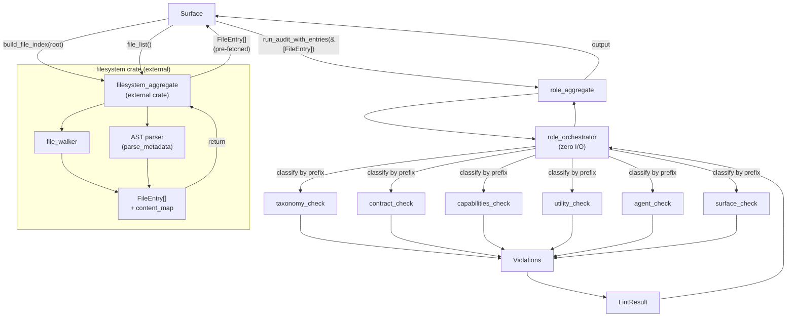

# FRD — role-rules (v2.0.0)

---

## Reference

- Backlog: [BACKLOG.md](BACKLOG.md) — real condition for this feature; this file is specification only.
- PRD: [PRD.md](../../PRD.md)
- Architecture: [ARCHITECTURE.md](../../ARCHITECTURE.md)
- Filesystem crate
- Shared crate

## System Overview

The role-rules crate enforces architectural boundaries and responsibility rules for each layer (Taxonomy, Contract, Capabilities, Agent, Surface, Utility) as defined by the 7-layer AES architecture. It receives pre-parsed file data from the external filesystem crate, classifies files by their filename prefix, and dispatches to 6 layer-specific role checkers (AES401–AES406). Root layer files are skipped (pure DI wiring only).

File discovery, raw content reads, and AST parsing are handled by the external `filesystem` crate. The Surface calls `filesystem.build_file_index(root)` to populate caches, then passes pre-fetched `&[FileEntry]` (with parse_metadata) to the role-rules orchestrator via `run_audit_with_entries`. The role-rules crate does zero I/O — it only performs business logic analysis on pre-fetched data.

Import checking is NOT performed by role-rules. All import validation (forbidden imports, mandatory imports, unused imports) is the responsibility of the import-rules crate (AES201–AES206). Role-rules only validates structural and responsibility constraints within each file.

### Architecture & Data Flow

```mermaid
flowchart TD
    A["Surface"] -->|"build_file_index(root)"| D["filesystem_aggregate\n(external crate)"]
    A -->|"file_list()"| D

    subgraph FS ["filesystem crate (external)"]
        D --> E1["file_walker"]
        D --> E2["AST parser\n(parse_metadata)"]
        E1 --> G1["FileEntry[]\n+ content_map"]
        E2 --> G1
    end

    G1 -->|"return"| D
    D -->|"FileEntry[]\n(pre-fetched)"| A

    A -->|"run_audit_with_entries(&[FileEntry])"| B["role_aggregate"]
    B --> C["role_orchestrator\n(zero I/O)"]

    C -->|"classify by prefix"| H1["taxonomy_check"]
    C -->|"classify by prefix"| H2["contract_check"]
    C -->|"classify by prefix"| H3["capabilities_check"]
    C -->|"classify by prefix"| H4["utility_check"]
    C -->|"classify by prefix"| H5["agent_check"]
    C -->|"classify by prefix"| H6["surface_check"]

    H1 --> I["Violations"]
    H2 --> I
    H3 --> I
    H4 --> I
    H5 --> I
    H6 --> I
    I --> J["LintResult"]
    J --> C
    C --> B
    B -->|output| A

```

## Functional Requirements

### FR-ROLERULES-001: File Classification and Dispatch

- **Description**: Classify each file received from the filesystem crate by its filename prefix to determine its AES layer, then dispatch to the appropriate layer-specific role checker.
- **Input**: File data (path + content + language + parse metadata, from filesystem crate), architecture configuration.
- **Output**: All violations found across all dispatched files.
- **Business Rules**:

  - Extract filename prefix as the first `_`-separated segment of the stem.
  - Match prefix to layer:

    | Prefix                       | Layer        | Checker                                   |
    | ---------------------------- | ------------ | ----------------------------------------- |
    | `taxonomy`                   | taxonomy     | taxonomy_checker (AES401)                 |
    | `contract`                   | contract     | contract_checker (AES402)                 |
    | `capabilities`, `capability` | capabilities | capabilities_checker (AES403)             |
    | `utility`                    | utility      | utility_checker (AES404)                  |
    | `agent`                      | agent        | agent_checker (AES405)                    |
    | `surface`, `surfaces`        | surface      | surface_checker (AES406)                  |
    | `root`                       | root         | **SKIP** (pure DI wiring, no role checks) |
  - Apply ignore paths from architecture configuration using **segment matching** (split path by `/`, match per segment — pattern `test` matches segment `test` only, not `latest` or `contest`).
  - Files with no underscore in the name have no prefix match → silently skipped.
  - Files with unrecognized prefix → silently skipped.
  - Barrel files are skipped: the module entry point, the library entry point, the package entry point, and the barrel file of each language.
  - Files in the rule's `exceptions` list are skipped.
  - The binary entry point is always skipped.
- **Edge Cases**:

  - Files matching multiple ignore patterns → excluded (any segment match suffices).
  - `capability_*` and `capabilities_*` both map to capabilities layer.
  - `surface_*` and `surfaces_*` both map to surface layer.
- **Error Handling**: Files that could not be read or parsed by the filesystem crate are excluded from the file list and never reach role-rules. No empty-content fallback.

---

### FR-ROLERULES-002: Taxonomy Purity and Primitive Restriction (AES401)

- **Description**: Audit taxonomy layer files (`taxonomy_*`) for raw primitive types in type annotations and ensure constant files contain only pure constant declarations.
- **Input**: `FileEntry` (path + content + language + parse metadata).
- **Output**: AES401 violations.
- **Business Rules**:

  - **Entity/Error/Event primitive check** (`_entity`, `_error`, `_event` files):

    - Scan type annotations in struct fields, function parameters, and return types for raw primitives.
    - Forbidden primitives per language:

      | Language              | Forbidden Primitives                                                                                                                                    |
      | --------------------- | ------------------------------------------------------------------------------------------------------------------------------------------------------- |
      | Rust                  | `String`, `i8`–`i128`, `u8`–`u128`, `f32`, `f64`, `bool`, `char`, `Vec<`, `HashMap<`, `BTreeMap<`, `Option<`, `Result<`, `Box<`, `Cell<`, `RefCell<`, `Arc<`, `Mutex<`, `Rc<` |
      | Python                | `str`, `int`, `float`, `bool`, `list`, `dict`, `tuple`, `set`                                                                                           |
      | TypeScript/JavaScript | `string`, `number`, `boolean`, `any`, `Array<`, `Record<`                                                                                               |
    - Type annotations using custom VO wrappers (e.g., `FilePath`, `LineNumber`, `SymbolName`) are NOT flagged.
    - Detection uses line-based scanning: extract type annotations after `:` in each line and match against the forbidden primitive list.
  - **Constant purity check** (`_constant` files):

    - Only constant declarations are allowed: `pub const` / `pub static` (Rust), module-level assignments (Python), `export const` (TS).
    - Forbidden: `struct`, `enum`, `fn`, `impl`, `mod`, `trait` (Rust); `class`, `def` (Python); `class`, `interface`, `function`, `type` (TS).
    - Uses AST parse metadata when available; falls back to line-based scanning when parse metadata is absent.
  - **Skip rules**: Type definition lines (`struct Foo { ... }`, `class Foo`) are excluded from primitive scanning (the definition itself is not a violation; only field/parameter types are checked).
- **Edge Cases**:

  - Taxonomy file with mixed valid and invalid annotations → only the violating lines are reported.
  - Constant file with a helper function → AES401 violation (function in constant file).
  - Empty files → no violations.
  - Files with unsupported language → no violations.
- **Error Handling**: Emit AES401 with the file path, line number, primitive type found, and expected VO wrapper.

---

### FR-ROLERULES-003: Contract Primitive Restriction (AES402)

- **Description**: Audit contract layer files (`contract_*`) for raw primitive types in method signatures. Uses the shared signature parser utility, not parse metadata.
- **Input**: `FileEntry` (path + content + language + parse metadata).
- **Output**: AES402 violations.
- **Business Rules**:

  - **Protocol check** (`_protocol` files): Detect raw primitives in method signatures (parameters and return types) of trait/interface definitions.
  - **Aggregate check** (`_aggregate` files): Same check on aggregate trait/interface definitions.
  - I/O protocol files (`io_protocol`, `filesystem_io`) are exempted from checking.
  - Forbidden primitives: same list as FR-ROLERULES-002 per language.
  - Detection uses the shared `utility_signature_parser` functions which extract method signatures and scan parameter/return types for forbidden primitives.
  - Each violating signature is reported individually with line number.
- **Edge Cases**:

  - Protocol file with zero methods → no violations (nothing to check).
  - Aggregate file with only type aliases → no method signatures to extract, no violations.
  - Methods with custom VO types in signatures → no violation.
- **Error Handling**: Emit AES402 with the file path, line number, method name, primitive type found, and expected VO wrapper.

---

### FR-ROLERULES-004: Capability Protocol Implementation (AES403)

- **Description**: Audit capability files (`capabilities_*` / `capability_*`) for protocol implementation and composition constraints. This rule checks **implementation only**, not imports. Import validation is handled by the import-rules crate (AES201–AES206).
- **Input**: `FileEntry` (path + content + language + parse metadata).
- **Output**: AES403 violations.
- **Business Rules**:

  - **Rule 1 — Max type declarations**: Maximum 3 type declarations (struct/enum/class/interface) per file. Violation: "too many types". Checked first — if exceeded, skip Rule 2.
  - **Rule 2 — Protocol implementor**: At least 1 struct/class must implement a protocol trait/interface.
    - Rust: `impl Trait for Struct` where Trait is a protocol (detected via AST `ItemImpl` with `trait_` path).
    - Python: `class Name(Parent)` where Parent is a protocol class.
    - TypeScript: `class Name implements IProtocol`.
    - Violation: "missing protocol implementor".
  - Internal helper types (structs/classes without protocol impl) are allowed and not flagged individually.
  - Detection uses AST parse metadata when available; falls back to line-based scanning when absent.
- **Edge Cases**:

  - Capability file with no implementor → AES403 violation (Rule 2).
  - File with exactly 3 types → passes Rule 1.
  - File with > 3 types → AES403 violation (Rule 1 only, Rule 2 skipped).
  - File with helper struct + implementor struct = 2 types → passes Rule 1, passes Rule 2.
- **Error Handling**: Emit AES403 with the violation kind (`TooManyTypes` or `MissingProtocolImplementor`), file path, and relevant counts.

---

### FR-ROLERULES-005: Utility Purity (AES404)

- **Description**: Audit utility files (`utility_*`) to ensure they contain only stateless standalone functions with no type definitions.
- **Input**: `FileEntry` (path + content + language + parse metadata).
- **Output**: AES404 violations.
- **Business Rules**:

  - **Rust**: Forbid `struct`, `enum`, `trait` definitions. Only `fn` (functions) and `const`/`static` (constants) are allowed.
  - **Python**: Forbid `class` definitions. Allow `def` (stateless functions) and module-level assignments (constants).
  - **TypeScript/JavaScript**: Forbid `class`, `interface`, `type alias` definitions. Allow `export function`, `export const`.
  - Detection uses AST parse metadata when available; falls back to line-based scanning (with comment stripping) when absent.
- **Edge Cases**:

  - Utility file with a `struct` inside a comment → not flagged (AST does not parse comments as code).
  - Utility file with only helper functions → no violation.
  - Utility file with `class` (Python) → AES404 violation.
  - Utility file with `struct` (Rust) → AES404 violation.
  - Empty files → no violations.
- **Error Handling**: Emit AES404 with the file path, line number, forbidden item kind, and expected content (stateless functions only).

---

### FR-ROLERULES-006: Agent Orchestrator Composition (AES405)

- **Description**: Audit agent files (`agent_*`) for correct aggregate implementation and composition constraints. This rule checks **implementation only**, not imports. Import validation is handled by the import-rules crate (AES201–AES206).
- **Input**: `FileEntry` (path + content + language + parse metadata).
- **Output**: AES405 violations.
- **Business Rules**:

  - **Rule 1 — Max type declarations**: Maximum 3 type declarations (struct/enum/class/interface) per file. Violation: "too many types". Checked first — if exceeded, skip Rule 2.
  - **Rule 2 — Aggregate implementor**: At least 1 struct/class must implement an aggregate trait/interface (trait name must contain "aggregate" or "Aggregate").
    - Rust: `impl Trait for Struct` where Trait name contains "aggregate".
    - Python: `class Name(Parent)` where Parent name contains "aggregate".
    - TypeScript: `class Name implements IAggregate` where interface name contains "aggregate".
    - Violation: "missing aggregate implementor".
  - **Any-type annotation check**: Scans all non-comment lines for `: Any`, `Any<`, `Any[`, `-> Any` patterns. Any use of the `Any` type is flagged.
  - Internal helper types (structs/classes without aggregate impl) are allowed and not flagged individually.
  - Detection uses AST parse metadata when available; falls back to line-based scanning when absent.
- **Edge Cases**:

  - Agent file with no implementor → AES405 violation (Rule 2).
  - File with helper struct + orchestrator struct = 2 types → passes Rule 1.
  - File with > 3 types → AES405 violation (Rule 1, Rule 2 skipped).
  - Agent file with `Any` type annotations → AES405 violation (Any check runs independently).
- **Error Handling**: Emit AES405 with the violation kind (`TooManyTypes`, `MissingAggregateImplementor`, or `AnyTypeAnnotation`), file path, and relevant counts.

---

### FR-ROLERULES-007: Surface Passive Role (AES406)

- **Description**: Audit surface files (`surface_*` / `surfaces_*`) for role-appropriate constraints based on Smart/Utility/Passive classification.
- **Input**: `FileEntry` (path + content + language + parse metadata).
- **Output**: AES406 violations.
- **Business Rules**:

  - **Surface classification by filename suffix**:

    - **Smart**: `_command`, `_controller`, `_page`, `_entry`, `_router` — may contain orchestration logic.
    - **Utility**: `_hook`, `_store`, `_action`, `_screen` — support smart surfaces.
    - **Passive**: All other surface suffixes — presentation-only.
  - **Function count limit**: Removed — no limit on function count per file. Smart surfaces are subject to no checks. Utility and Passive surfaces are subject to hierarchy and domain logic checks.
  - **Utility + Passive checks — hierarchy**:

    - Max 50 function definitions per file (counts all functions across all classes/impl blocks).
    - Uses AST parse metadata when available; falls back to line-based scanning when absent.
  - **Utility + Passive checks — domain logic**:

    - Max 50 control-flow statements (`if`, `else`, `for`, `while`, `match`, `switch`, `try:`, `except`, `catch`) per file.
    - Exceeding flagged as domain logic violation — surface files should delegate logic to lower layers.
  - **Smart surface exemption**: Smart surfaces are exempted from all checks (hierarchy, domain logic) — no violations produced for Smart surfaces.
  - Detection uses AST parse metadata for function definition counts; control-flow check uses line-based scanning on all files.
- **Edge Cases**:

  - Passive surface with > 50 functions → AES406 violation.
  - Utility surface with 40 control-flow statements → no violation (below threshold).
  - Surface file with unclassifiable suffix → defaults to Passive group.
  - Smart surface with control-flow statements → no violation (exempt).
- **Error Handling**: Emit AES406 with the violation kind (`TooManyMethods` or `DomainLogic`), file path, and actual vs configured threshold.

---

## API Contract

### Protocol API

| Method | Input | Output | Error | Event | Description |
| --- | --- | --- | --- | --- | --- |
| `execute` | `RoleRequest` (`RunAuditWithEntries { files }` or `Name`) | `RoleResponse` (`Audit { violations }` or `Name { name }`) | None | — | The single composite entry point covering classification, dispatch to all six layer checkers, and result collection. |

### Aggregate API

| Method | Input | Output | Error | Event | Description |
| --- | --- | --- | --- | --- | --- |
| `execute` | `RoleRequest` | `RoleResponse` | None | — | Aggregate request/response dispatch for the whole role audit. |
| `run_audit_with_entries` | `&[FileEntry]` | `Vec<LintResult>` | None | — | Classify every entry by prefix and run the matching layer checker, collecting all violations. |
| `run_all_role_checks` | `&[FileEntry]`, `&mut Vec<LintResult>` | Accumulated violations in place | None | — | Per-file loop that applies skip rules, ignore paths, rule enablement, and exceptions before dispatching. |
| `name` | — | `&str` | None | — | Report the runner's own name. |

---

## Integration Points

| System | Direction | Purpose | Failure mode |
| --- | --- | --- | --- |
| `IRoleRunnerAggregate` | in | Aggregate contract the surface composes to invoke the audit | Aggregate unavailable → the surface falls back to its other lint paths |
| `ITaxonomyRoleChecker` | in | Contract for taxonomy-layer purity checks (AES401) | Checker returns an error → propagated to the caller |
| `IContractRoleChecker` | in | Contract for contract-layer signature checks (AES402) | Checker returns an error → propagated to the caller |
| `ICapabilitiesRoleChecker` | in | Contract for capability-layer implementation checks (AES403) | Checker returns an error → propagated to the caller |
| `IUtilityRoleChecker` | in | Contract for utility-layer purity checks (AES404) | Checker returns an error → propagated to the caller |
| `IAgentRoleChecker` | in | Contract for agent-layer composition checks (AES405) | Checker returns an error → propagated to the caller |
| `ISurfaceRoleChecker` | in | Contract for surface-layer role checks (AES406) | Checker returns an error → propagated to the caller |
| `LayerNames` taxonomy VO | in | Layer name constants used to classify files and to pass the layer to a checker | Absent → a file with a recognized prefix is not dispatched |
| `RoleCheckerDeps` | out | DI bundle carrying all six injected checker instances | A checker missing from the bundle → that layer is not dispatched |
| `RoleContainer` root | out | DI composition root wiring all six checkers into the aggregate | Wiring incomplete → the aggregate returns an empty violation list |
| `filesystem` crate | in | File walking, content loading, and AST parsing for every supported language | Unreadable or unparseable files are excluded from the returned list and never reach role-rules |
| `shared` crate | in | Contracts, value objects, the default barrel-file exception list, and the shared signature parser | Signature parser unavailable → AES402 falls back to line-based scanning |
| Configuration (YAML) | in | Rule enable/disable toggles, ignore paths, and per-rule exceptions | Configuration absent → defaults apply and every rule stays enabled |

---

## Non-functional Requirements

| Metric | Target | Measurement method |
| --- | --- | --- |
| Classification cost | O(1) per file (one prefix match) | Read the prefix split in the classification loop and count comparisons per file |
| I/O during check execution | Zero — no reads, no writes, no parsing | Assert the crate's imports contain no filesystem or parser call in a check path |
| Parse-metadata reuse | File collection and parsing performed once by the filesystem crate, reused by all six checkers | Count parse invocations in a full-scan trace; each file is parsed once |
| Parse-metadata representation | Structured typed structs, not raw strings | Inspect the shape of the parse metadata the filesystem crate supplies |
| Detection accuracy | AST parse metadata when available, line-based scanning as fallback, with precisely defined skip rules per rule | Run each rule against fixtures with and without parse metadata and compare the violation set |
| Language coverage | Rust, Python, TypeScript, and JavaScript all produce accurate violations | Run the acceptance suite for each language and assert the expected violation set |
| Configurable behaviour | Rule enable/disable, ignore paths, and per-rule exceptions are configuration-driven | Toggle each setting and assert the corresponding change in violations |
| Threshold stability | Numeric thresholds (`max_types` = 3, `max_public_methods` = 50, `max_control_flow` = 50) are hardcoded constants, not read from config | Change the configured threshold and confirm the behaviour does not move |

---

## Test Scenarios

- A taxonomy entity file with a `String` field type produces an AES401 violation at the exact line where the primitive appears.
- A taxonomy entity file whose fields all use custom value objects produces no AES401 violation.
- A taxonomy entity file with an `i32` field type produces an AES401 violation.
- A taxonomy error file whose parameter is a `bool` primitive produces an AES401 violation.
- A taxonomy event file with a list-of-strings field produces an AES401 violation because raw list collections are forbidden in event definitions.
- A taxonomy constant file containing only `pub const` declarations produces no AES401 violation.
- A taxonomy constant file containing a helper function produces an AES401 violation because functions are forbidden in constant files.
- A taxonomy constant file containing a struct definition produces an AES401 violation.
- A taxonomy VO file that contains only custom types produces no AES401 violation.
- An empty taxonomy file produces no AES401 violation.
- A contract protocol file with a `String` parameter in a method signature produces an AES402 violation.
- A contract protocol file whose method parameters are all custom value objects produces no AES402 violation.
- A contract protocol file with a `bool` return type produces an AES402 violation.
- A contract aggregate file with zero methods produces no AES402 violation because there is nothing to extract.
- A contract aggregate file with an `i64` method signature produces an AES402 violation.
- A contract protocol file whose signatures are entirely typed with custom value objects produces no AES402 violation.
- A capability file that contains a struct implementing a protocol trait produces no AES403 violation.
- A capability file with no struct implementing any protocol trait produces an AES403 violation classified as `MissingProtocolImplementor`.
- A capability file with four type declarations (exceeding the maximum of three) produces an AES403 violation classified as `TooManyTypes`; Rule 2 is skipped when Rule 1 fails.
- A capability file with exactly three types including a helper struct produces no AES403 violation because the count is at the limit and helpers are allowed.
- A capability file with exactly three types including one implementor produces no AES403 violation.
- A capability file with more than three types and no implementor produces an AES403 violation classified as `TooManyTypes` only; the missing-implementor rule is skipped.
- A Rust utility file containing a `struct Foo` definition produces an AES404 violation.
- A Rust utility file containing only a `fn helper()` definition produces no AES404 violation.
- A Rust utility file containing an `enum Bar` definition produces an AES404 violation.
- A Python utility file containing only `def helper()` definitions produces no AES404 violation because functions are permitted.
- A Python utility file containing a `class Foo` definition produces an AES404 violation.
- A TypeScript utility file containing an `export function helper()` definition produces no AES404 violation.
- A TypeScript utility file containing an `export class Foo` definition produces an AES404 violation.
- A TypeScript utility file containing an `export interface IFoo` definition produces an AES404 violation.
- A utility file whose `struct` text appears only inside a comment is not flagged because the AST does not parse comments as code.
- An empty utility file produces no AES404 violation.
- An agent file containing a struct that implements an aggregate trait produces no AES405 violation.
- An agent file with no struct implementing any aggregate trait produces an AES405 violation classified as `MissingAggregateImplementor`.
- An agent file with four type declarations (exceeding the maximum of three) produces an AES405 violation classified as `TooManyTypes`; Rule 2 is skipped when Rule 1 fails.
- An agent file with a helper struct plus an orchestrator struct (two types total) produces no AES405 violation because the count is within limits.
- An agent file with one implementor struct and two helper structs (three types total) produces no AES405 violation.
- An agent file that contains an `Any` type annotation on a non-comment line produces an AES405 violation classified as `AnyTypeAnnotation`.
- An agent file whose `: Any` appears only inside a comment is not flagged because comment lines are excluded from the annotation check.
- A passive surface file with 51 function definitions (exceeding the maximum of 50) produces an AES406 violation classified as `TooManyMethods`.
- A passive surface file with exactly 50 function definitions produces no AES406 violation because it is at the threshold.
- A smart surface file with 100 function definitions produces no AES406 violation because smart surfaces are exempt from hierarchy checks.
- A smart surface file that contains control-flow statements produces no AES406 violation because smart surfaces are exempt from domain-logic checks.
- A passive surface file with 51 control-flow statements (exceeding the maximum of 50) produces an AES406 violation classified as `DomainLogic`.
- A utility surface file with 40 control-flow statements produces no AES406 violation because the count is below the threshold.
- A surface file with an unclassifiable suffix is treated as Passive for the purposes of AES406.
- A root-layer file such as `root_app_entry` is completely skipped and produces zero violations because root files are pure DI wiring.
- When the architecture configuration has `enabled` set to false, the entire scan produces zero violations regardless of any files present.
- When rule AES401 is individually disabled in the configuration, no AES401 violations appear while other rules continue to run.
- When the `ignored_paths` configuration contains `["tests"]`, files under the `tests/` directory produce no violations.
- A file with no underscore in its stem is silently skipped because there is no prefix to match.
- A file whose prefix is not recognized by any rule is silently skipped.
- A barrel file matching the default exception list is skipped during role checking.
- A file listed in a rule's exceptions list is skipped for that specific rule but is still checked by other enabled rules.
- The same role rule is executed across a multi-language workspace containing Rust, Python, and TypeScript files, and each language produces the correct violations for its syntax.

---

## Assumptions & Constraints

- Files are classified by filename prefix (first `_`-separated segment), not by content analysis.
- Naming convention is assumed correct (enforced by the naming-rules crate).
- Root layer files are pure DI wiring and never checked.
- Language detection is based on file extension, performed by the filesystem crate.
- Detection uses a combination of AST parse metadata (when available) and line-based scanning (fallback). Entity/error/event checks and surface domain logic checks are line-based. Contract checks use the shared signature parser.
- Import checking is NOT performed by role-rules. All import validation is handled by the import-rules crate (AES201–AES206).
- The crate receives file data (path + content + language + parse metadata) from the external filesystem crate. No file I/O or AST parsing is performed internally.
- Files that cannot be read or parsed by the filesystem crate are excluded from the returned list and never reach role-rules.
- All numeric thresholds are hardcoded constants (max_types = 3, max_public_methods = 50, max_control_flow = 50). Rule enable/disable, ignore paths, and exceptions are configurable via YAML.

---

## Glossary

- **AES**: Agentic Engineering System — the 7-layer coding convention.
- **Layer**: Architectural boundary (taxonomy, contract, utility, capabilities, agent, surface, root).
- **Smart surface**: Surface with a `_command`, `_controller`, `_page`, `_entry`, or `_router` suffix — may contain orchestration logic.
- **Utility surface**: Surface with a `_hook`, `_store`, `_action`, or `_screen` suffix — supports smart surfaces.
- **Passive surface**: Any surface file not classified as Smart or Utility — presentation-only.
- **Primitive type**: Raw language types (`String`, `int`, `bool`, etc.) that violate VO-based signatures.
- **VO**: Value Object — a typed wrapper around a primitive that replaces raw types in signatures.
- **Parse metadata**: Structured AST-derived data (type declarations, impl blocks, method signatures, function definitions) provided by the filesystem crate.
- **Filesystem crate**: External crate that handles file walking, reading, and AST parsing; returns file data to role-rules.
- **Segment matching**: Path matching by splitting on `/` and comparing individual segments rather than substring containment.

---
