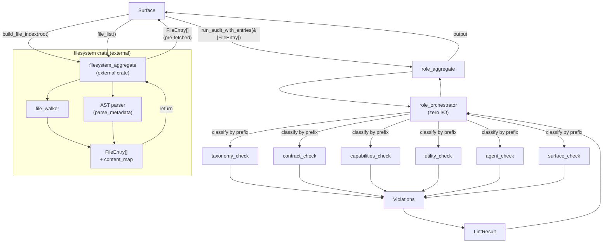

# FRD — role-rules (v2.0.0)

---

## Reference

- Backlog: [BACKLOG.md](BACKLOG.md) — real condition for this feature; this file is specification only.
- PRD: [PRD.md](../../PRD.md)
- Architecture: [ARCHITECTURE.md](../../ARCHITECTURE.md)
- Filesystem crate
- Shared crate

## System Overview

The role-rules crate enforces architectural boundaries and responsibility rules for each layer (Taxonomy, Contract, Capabilities, Agent, Surface, Utility) as defined by the 7-layer AES architecture. It receives pre-parsed file data from the external filesystem crate, classifies files by their filename prefix, and dispatches to 6 layer-specific role checkers (AES401–AES406). Root layer files are skipped (pure DI wiring only).

File discovery, raw content reads, and AST parsing are handled by the external `filesystem` crate. The Surface calls `filesystem.build_file_index(root)` to populate caches, then passes pre-fetched `&[FileEntry]` (with parse_metadata) to the role-rules orchestrator via `run_audit_with_entries`. The role-rules crate does zero I/O — it only performs business logic analysis on pre-fetched data.

Import checking is NOT performed by role-rules. All import validation (forbidden imports, mandatory imports, unused imports) is the responsibility of the import-rules crate (AES201–AES205). Role-rules only validates structural and responsibility constraints within each file.

- **Architecture & Data Flow**

```mermaid
flowchart TD
    A["Surface"] -->|"build_file_index(root)"| D["filesystem_aggregate\n(external crate)"]
    A -->|"file_list()"| D

    subgraph FS ["filesystem crate (external)"]
        D --> E1["file_walker"]
        D --> E2["AST parser\n(parse_metadata)"]
        E1 --> G1["FileEntry[]\n+ content_map"]
        E2 --> G1
    end

    G1 -->|"return"| D
    D -->|"FileEntry[]\n(pre-fetched)"| A

    A -->|"run_audit_with_entries(&[FileEntry])"| B["role_aggregate"]
    B --> C["role_orchestrator\n(zero I/O)"]

    C -->|"classify by prefix"| H1["taxonomy_check"]
    C -->|"classify by prefix"| H2["contract_check"]
    C -->|"classify by prefix"| H3["capabilities_check"]
    C -->|"classify by prefix"| H4["utility_check"]
    C -->|"classify by prefix"| H5["agent_check"]
    C -->|"classify by prefix"| H6["surface_check"]

    H1 --> I["Violations"]
    H2 --> I
    H3 --> I
    H4 --> I
    H5 --> I
    H6 --> I
    I --> J["LintResult"]
    J --> C
    C --> B
    B -->|output| A

```

## Functional Requirements

### FR-RoleRules-001: File Classification and Dispatch

- **Description**: Classify each file received from the filesystem crate by its filename prefix to determine its AES layer, then dispatch to the appropriate layer-specific role checker.
- **Input**: File data (path + content + language + parse metadata, from filesystem crate), architecture configuration.
- **Output**: All violations found across all dispatched files.
- **Business Rules**:

  - Extract filename prefix as the first `_`-separated segment of the stem.
  - Match prefix to layer:

    | Prefix                       | Layer        | Checker                                   |
    | ---------------------------- | ------------ | ----------------------------------------- |
    | `taxonomy`                   | taxonomy     | taxonomy_checker (AES401)                 |
    | `contract`                   | contract     | contract_checker (AES402)                 |
    | `capabilities`, `capability` | capabilities | capabilities_checker (AES403)             |
    | `utility`                    | utility      | utility_checker (AES404)                  |
    | `agent`                      | agent        | agent_checker (AES405)                    |
    | `surface`, `surfaces`        | surface      | surface_checker (AES406)                  |
    | `root`                       | root         | **SKIP** (pure DI wiring, no role checks) |

  - Apply ignore paths from architecture configuration using **segment matching** (split path by `/`, match per segment — pattern `test` matches segment `test` only, not `latest` or `contest`).
  - Files with no underscore in the name have no prefix match → silently skipped.
  - Files with unrecognized prefix → silently skipped.
  - Barrel files (module barrels, library roots, binary entries, package markers, and index barrels) are skipped.
  - Files in the rule's `exceptions` list are skipped.
  - Binary-entry files are always skipped.
- **Edge Cases**:

  - Files matching multiple ignore patterns → excluded (any segment match suffices).
  - `capability_*` and `capabilities_*` both map to capabilities layer.
  - `surface_*` and `surfaces_*` both map to surface layer.
- **Error Handling**: Files that could not be read or parsed by the filesystem crate are excluded from the file list and never reach role-rules. No empty-content fallback.

---

### FR-RoleRules-002: Taxonomy Purity and Primitive Restriction (AES401)

- **Description**: Audit taxonomy layer files (`taxonomy_*`) for raw primitive types in type annotations and ensure constant files contain only pure constant declarations.
- **Input**: `FileEntry` (path + content + language + parse metadata).
- **Output**: AES401 violations.
- **Business Rules**:

  - **Entity/Error/Event primitive check** (`_entity`, `_error`, `_event` files):

    - Scan type annotations in struct fields, function parameters, and return types for raw primitives.
    - Forbidden primitives per language:

      | Language              | Forbidden Primitives                                                                                                                                    |
      | --------------------- | ------------------------------------------------------------------------------------------------------------------------------------------------------- |
      | Rust                  | `String`, `i8`–`i128`, `u8`–`u128`, `f32`, `f64`, `bool`, `char`, `Vec<`, `HashMap<`, `BTreeMap<`, `Option<`, `Result<`, `Box<`, `Cell<`, `RefCell<`, `Arc<`, `Mutex<`, `Rc<` |
      | Python                | `str`, `int`, `float`, `bool`, `list`, `dict`, `tuple`, `set`                                                                                           |
      | TypeScript/JavaScript | `string`, `number`, `boolean`, `any`, `Array<`, `Record<`                                                                                               |

    - Type annotations using custom VO wrappers (e.g., `FilePath`, `LineNumber`, `SymbolName`) are NOT flagged.
    - Detection uses line-based scanning: extract type annotations after `:` in each line and match against the forbidden primitive list.
  - **Constant purity check** (`_constant` files):

    - Only constant declarations are allowed: `pub const` / `pub static` (Rust), module-level assignments (Python), `export const` (TS).
    - Forbidden: `struct`, `enum`, `fn`, `impl`, `mod`, `trait` (Rust); `class`, `def` (Python); `class`, `interface`, `function`, `type` (TS).
    - Uses AST parse metadata when available; falls back to line-based scanning when parse metadata is absent.
  - **Skip rules**: Type definition lines (`struct Foo { ... }`, `class Foo`) are excluded from primitive scanning (the definition itself is not a violation; only field/parameter types are checked).
- **Edge Cases**:

  - Taxonomy file with mixed valid and invalid annotations → only the violating lines are reported.
  - Constant file with a helper function → AES401 violation (function in constant file).
  - Empty files → no violations.
  - Files with unsupported language → no violations.
- **Error Handling**: Emit AES401 with the file path, line number, primitive type found, and expected VO wrapper.

---

### FR-RoleRules-003: Contract Primitive Restriction (AES402)

- **Description**: Audit contract layer files (`contract_*`) for raw primitive types in method signatures. Uses the shared signature parser utility, not parse metadata.
- **Input**: `FileEntry` (path + content + language + parse metadata).
- **Output**: AES402 violations.
- **Business Rules**:

  - **Protocol check** (`_protocol` files): Detect raw primitives in method signatures (parameters and return types) of trait/interface definitions.
  - **Aggregate check** (`_aggregate` files): Same check on aggregate trait/interface definitions.
  - I/O protocol files (`io_protocol`, `filesystem_io`) are exempted from checking.
  - Forbidden primitives: same list as FR-RoleRules-002 per language.
  - Detection uses the shared `utility_signature_parser` functions which extract method signatures and scan parameter/return types for forbidden primitives.
  - Each violating signature is reported individually with line number.
- **Edge Cases**:

  - Protocol file with zero methods → no violations (nothing to check).
  - Aggregate file with only type aliases → no method signatures to extract, no violations.
  - Methods with custom VO types in signatures → no violation.
- **Error Handling**: Emit AES402 with the file path, line number, method name, primitive type found, and expected VO wrapper.

---

### FR-RoleRules-004: Capability Protocol Implementation (AES403)

- **Description**: Audit capability files (`capabilities_*` / `capability_*`) for protocol implementation and composition constraints. This rule checks **implementation only**, not imports. Import validation is handled by the import-rules crate (AES201–AES205).
- **Input**: `FileEntry` (path + content + language + parse metadata).
- **Output**: AES403 violations.
- **Business Rules**:

  - **Rule 1 — Max type declarations**: Maximum 3 type declarations (struct/enum/class/interface) per file. Violation: "too many types". Checked first — if exceeded, skip Rule 2.
  - **Rule 2 — Protocol implementor**: At least 1 struct/class must implement a protocol trait/interface.
    - Rust: `impl Trait for Struct` where Trait is a protocol (detected via AST `ItemImpl` with `trait_` path).
    - Python: `class Name(Parent)` where Parent is a protocol class.
    - TypeScript: `class Name implements IProtocol`.
    - Violation: "missing protocol implementor".
  - Internal helper types (structs/classes without protocol impl) are allowed and not flagged individually.
  - Detection uses AST parse metadata when available; falls back to line-based scanning when absent.
  - **Rule 3 — Single protocol**: exactly 1 protocol trait per capability file; 2 or more must be split, with shared helpers moved to a `utility_*` file.
  - **Rule 4 — Block order**: Block 2 (protocol impl) must precede Block 3 (inherent impl). HIGH.
  - **Rule 5 — Block markers**: the `Block 1:` / `Block 2:` / `Block 3:` banner comments must all be present, in ascending order, and none above 3. MEDIUM. A banner is `Block <digits>:` standing as a whole word inside a comment, so prose such as `Block 1 (types) -> Block 2` and `Sub-Block 4:` are not markers. This is distinct from Rule 4: Rule 4 compares two `impl` lines and cannot tell a file that documents its three blocks from one whose `impl` blocks merely happen to land in a valid order.
  - **Rule 6 — Constant placement**: a file-level `const` is a violation; it belongs in the feature's taxonomy constant module. An associated `const` nested in an `impl` is exempt.
  - **Rule 7 — Test placement**: an inline `#[cfg(test)]` or `mod tests` is a violation; test code belongs in the feature's test target.
  - **Rule 8 — Helper visibility**: a Block 3 helper that is `pub` with no production caller should be `fn`, or `pub(crate)` when a same-crate test module calls it. A helper called only from a `tests/` target stays `pub`, because that target compiles as a separate crate.
- **Edge Cases**:

  - Capability file with no implementor → AES403 violation (Rule 2).
  - File with exactly 3 types → passes Rule 1.
  - File with > 3 types → AES403 violation (Rule 1 only, Rule 2 skipped).
  - File with helper struct + implementor struct = 2 types → passes Rule 1, passes Rule 2.
  - File with all three banners in order → passes Rule 5.
  - File with no `Block N:` banner at all → AES403 violation (Rule 5).
  - File with `Block 1:` and `Block 3:` but no `Block 2:` → AES403 violation (Rule 5).
  - File whose banners read 1 → 3 → 2 → AES403 violation (Rule 5).
  - File carrying a `Block 4:` banner → AES403 violation (Rule 5).
  - A comment containing the prose `Block 1 (types) -> Block 2` → not a marker, so it neither satisfies nor violates Rule 5.
- **Error Handling**: Emit AES403 with the violation kind (`TooManyTypes` or `MissingProtocolImplementor`), file path, and relevant counts.

---

### FR-RoleRules-005: Utility Purity (AES404)

- **Description**: Audit utility files (`utility_*`) to ensure they contain only stateless standalone functions with no type definitions.
- **Input**: `FileEntry` (path + content + language + parse metadata).
- **Output**: AES404 violations.
- **Business Rules**:

  - **Rust**: Forbid `struct`, `enum`, `trait` definitions. Only `fn` (functions) and `const`/`static` (constants) are allowed.
  - **Python**: Forbid `class` definitions. Allow `def` (stateless functions) and module-level assignments (constants).
  - **TypeScript/JavaScript**: Forbid `class`, `interface`, `type alias` definitions. Allow `export function`, `export const`.
  - Detection uses AST parse metadata when available; falls back to line-based scanning (with comment stripping) when absent.
- **Edge Cases**:

  - Utility file with a `struct` inside a comment → not flagged (AST does not parse comments as code).
  - Utility file with only helper functions → no violation.
  - Utility file with `class` (Python) → AES404 violation.
  - Utility file with `struct` (Rust) → AES404 violation.
  - Empty files → no violations.
- **Error Handling**: Emit AES404 with the file path, line number, forbidden item kind, and expected content (stateless functions only).

---

### FR-RoleRules-006: Agent Orchestrator Composition (AES405)

- **Description**: Audit agent files (`agent_*`) for correct aggregate implementation and composition constraints. This rule checks **implementation only**, not imports. Import validation is handled by the import-rules crate (AES201–AES205).
- **Input**: `FileEntry` (path + content + language + parse metadata).
- **Output**: AES405 violations.
- **Business Rules**:

  - **Rule 1 — Max type declarations**: Maximum 3 type declarations (struct/enum/class/interface) per file. Violation: "too many types". Checked first — if exceeded, skip Rule 2.
  - **Rule 2 — Aggregate implementor**: At least 1 struct/class must implement an aggregate trait/interface (trait name must contain "aggregate" or "Aggregate").
    - Rust: `impl Trait for Struct` where Trait name contains "aggregate".
    - Python: `class Name(Parent)` where Parent name contains "aggregate".
    - TypeScript: `class Name implements IAggregate` where interface name contains "aggregate".
    - Violation: "missing aggregate implementor".
  - **Any-type annotation check**: Scans all non-comment lines for `: Any`, `Any<`, `Any[`, `-> Any` patterns. Any use of the `Any` type is flagged.
  - Internal helper types (structs/classes without aggregate impl) are allowed and not flagged individually.
  - Detection uses AST parse metadata when available; falls back to line-based scanning when absent.
- **Edge Cases**:

  - Agent file with no implementor → AES405 violation (Rule 2).
  - File with helper struct + orchestrator struct = 2 types → passes Rule 1.
  - File with > 3 types → AES405 violation (Rule 1, Rule 2 skipped).
  - Agent file with `Any` type annotations → AES405 violation (Any check runs independently).
- **Error Handling**: Emit AES405 with the violation kind (`TooManyTypes`, `MissingAggregateImplementor`, or `AnyTypeAnnotation`), file path, and relevant counts.

---

### FR-RoleRules-007: Surface Passive Role (AES406)

- **Description**: Audit surface files (`surface_*` / `surfaces_*`) for role-appropriate constraints based on Smart/Utility/Passive classification.
- **Input**: `FileEntry` (path + content + language + parse metadata).
- **Output**: AES406 violations.
- **Business Rules**:

  - **Surface classification by filename suffix**:

    - **Smart**: `_command`, `_controller`, `_page`, `_entry`, `_router` — may contain orchestration logic.
    - **Utility**: `_hook`, `_store`, `_action`, `_screen` — support smart surfaces.
    - **Passive**: All other surface suffixes — presentation-only.
  - **Function count limit**: Removed — no limit on function count per file. Smart surfaces are subject to no checks. Utility and Passive surfaces are subject to hierarchy and domain logic checks.
  - **Utility + Passive checks — hierarchy**:

    - Max 50 function definitions per file (counts all functions across all classes/impl blocks).
    - Uses AST parse metadata when available; falls back to line-based scanning when absent.
  - **Utility + Passive checks — domain logic**:

    - Max 50 control-flow statements (`if`, `else`, `for`, `while`, `match`, `switch`, `try:`, `except`, `catch`) per file.
    - Exceeding flagged as domain logic violation — surface files should delegate logic to lower layers.
  - **Smart surface exemption**: Smart surfaces are exempted from all checks (hierarchy, domain logic) — no violations produced for Smart surfaces.
  - Detection uses AST parse metadata for function definition counts; control-flow check uses line-based scanning on all files.
- **Edge Cases**:

  - Passive surface with > 50 functions → AES406 violation.
  - Utility surface with 40 control-flow statements → no violation (below threshold).
  - Surface file with unclassifiable suffix → defaults to Passive group.
  - Smart surface with control-flow statements → no violation (exempt).
- **Error Handling**: Emit AES406 with the violation kind (`TooManyMethods` or `DomainLogic`), file path, and actual vs configured threshold.

---

## API Contract

### Protocol API

| Method | Input | Output | Error | Event | Description |
|---|---|---|---|---|---|
| `check_agent_routing` | &FileEntry, &str, &mut Vec<LintResult> | `` | — | — | Check agent routing. |
| `check_capability_routing` | &FileEntry, &str, &mut Vec<LintResult> | `` | — | — | Check capability routing. |
| `check_protocol` | &FileEntry | `Vec<LintResult>` | — | — | Check protocol. |
| `check_aggregate` | &FileEntry | `Vec<LintResult>` | — | — | Check aggregate. |
| `check_smart_surface` | &FileEntry, &mut Vec<LintResult> | `` | — | — | Check smart surface. |
| `check_utility_surface` | &FileEntry, &mut Vec<LintResult> | `` | — | — | Check utility surface. |
| `check_passive_surface` | &FileEntry, &mut Vec<LintResult> | `` | — | — | Check passive surface. |
| `check_fn_count_limit` | &FileEntry, &mut Vec<LintResult> | `` | — | — | Check fn count limit. |
| `check_entity` | &FileEntry, &mut Vec<LintResult> | `` | — | — | Check entity. |
| `check_error` | &FileEntry, &mut Vec<LintResult> | `` | — | — | Check error. |
| `check_event` | &FileEntry, &mut Vec<LintResult> | `` | — | — | Check event. |
| `check_constant` | &FileEntry, &mut Vec<LintResult> | `` | — | — | Check constant. |
| `check_utility_convention` | &FileEntry, &mut Vec<LintResult> | `` | — | — | Check utility convention. |

### Aggregate API

| Method | Input | Output | Error | Event | Description |
|---|---|---|---|---|---|
| `execute` | RoleRequest | `RoleResponse` | — | — | Single composite entry point over the feature. |

## Integration Points

| System | Direction | Purpose | Failure mode |
| --- | --- | --- | --- |
| Role runner aggregate contract | out (internal) | Expose the single composite entry point the surface calls | A request supplies no entries → the orchestrator returns an empty result set and performs no I/O of its own |
| Layer-specific role checker protocols | out (internal) | Define the shape each of the six per-layer role checks implements | A checker does not satisfy its protocol → it is not wired, and that layer's rules are reported as not run |
| Layer names taxonomy | in | Name the seven layers a file can be classified into | A prefix maps to no layer → the file is skipped by the layer-role rules and checked structurally |
| `filesystem` aggregate | in | Walk the workspace, read content, and provide full AST parse metadata for every supported language | A file cannot be read or parsed → it is excluded from the analyzed set and the rest of the walk proceeds |
| `shared` crate | in | Supply the contracts, value objects, and the default barrel-file exception list | Parse metadata is unavailable → the checker falls back to line-based scanning rather than reporting nothing |
| `Rayon` | in (internal) | Parallelize the per-file role checks | A worker is interrupted → the parallel iterator yields only the results it completed, and the run is reported as partial |

## Non-functional Requirements

| Metric | Target | Measurement method |
| --- | --- | --- |
| Check execution | Role checks read in-memory parse metadata and perform no I/O or parsing | Deny filesystem access during the check phase and assert findings are still produced |
| Collection cost | Files are collected and parsed once per scan, not once per rule | Count parse operations for one scan and confirm it does not grow with rule count |
| Classification | O(1) per file by prefix match | Scale the file count tenfold and confirm linear growth with a small constant |
| Memory | File data is resident for the scan; parse metadata is structured rather than raw strings | Measure retained memory and assert it tracks the structured metadata size |
| Language coverage | Rust, Python, TypeScript, and JavaScript all produce accurate violations through parse metadata | Assert each supported language has a fixture that reports a violation at the exact line |
| Fallback correctness | Line-based scanning is used only when parse metadata is unavailable, and agrees with the metadata path | Run both paths over the same inputs and assert the finding sets match |
| Threshold determinism | Numeric thresholds are compiled-in constants, not configuration | Assert the threshold constants are not read from configuration |
| Configuration coverage | Enable/disable toggles, ignored paths, and per-rule exceptions are configuration-driven | Flip each setting and assert the corresponding rules change behaviour |

## Test Scenarios / QA Checklist

Each scenario is stated below as a table of cases: the input condition and the expected result.

- **AES401 — Taxonomy Purity** — e.g. Taxonomy entity file with `String` field type → AES401 violation at exact line
- **AES402 — Contract Primitive Restriction** — e.g. Contract protocol with `String` in method parameter → AES402 violation
- **AES403 — Capability Protocol Implementation** — e.g. Capability file with protocol implementor → No violation
- **AES404 — Utility Purity** — e.g. Rust utility file with `struct Foo` → AES404 violation
- **AES405 — Agent Orchestrator Composition** — e.g. Agent file with aggregate trait implementor → No violation
- **AES406 — Surface Passive Role** — e.g. Passive surface with 51 functions (max=50) → AES406 — TooManyMethods
- **Classification & Configuration** — e.g. Root layer file (`root_app_entry`) → Completely skipped, zero violations

- **AES401 — Taxonomy Purity**

| # | Scenario | Expected |
| - | - | - |
| 1 | Taxonomy entity file with `String` field type | AES401 violation at exact line |
| 2 | Taxonomy entity file with custom VO field | No violation |
| 3 | Taxonomy entity file with `i32` field type | AES401 violation |
| 4 | Taxonomy error file with `bool` parameter | AES401 violation |
| 5 | Taxonomy event file with `Vec<String>` field | AES401 violation |
| 6 | Taxonomy constant file with `pub const` only | No violation |
| 7 | Taxonomy constant file with `fn helper()` | AES401 violation (function in constant file) |
| 8 | Taxonomy constant file with `struct Foo` | AES401 violation (struct in constant file) |
| 9 | Taxonomy VO file with custom types only | No violation |
| 10 | Empty taxonomy file | No violation |

- **AES402 — Contract Primitive Restriction**

| # | Scenario | Expected |
| - | - | - |
| 1 | Contract protocol with `String` in method parameter | AES402 violation |
| 2 | Contract protocol with custom VO in method parameter | No violation |
| 3 | Contract protocol with `bool` return type | AES402 violation |
| 4 | Contract aggregate with zero methods | No violation |
| 5 | Contract aggregate with `i64` in method signature | AES402 violation |
| 6 | Contract protocol with all VO-typed signatures | No violation |

- **AES403 — Capability Protocol Implementation**

| # | Scenario | Expected |
| - | - | - |
| 1 | Capability file with protocol implementor | No violation |
| 2 | Capability file with no protocol implementor | AES403 — MissingProtocolImplementor |
| 3 | Capability file with 4 type declarations (max=3) | AES403 — TooManyTypes |
| 4 | Capability file with 3 types including helper struct | No violation (helper allowed, count = 3) |
| 5 | Capability file with exactly 3 types, 1 implementor | No violation |
| 6 | Capability file with >3 types, no implementor | AES403 — TooManyTypes only (Rule 2 skipped) |
| 7 | Capability file carrying all three block banners in order | No violation |
| 8 | Capability file with no block banner comment | AES403 — BlockMarkers (no markers) |
| 9 | Capability file missing the `Block 2:` banner | AES403 — BlockMarkers (missing marker) |
| 10 | Capability file whose banners are out of order (1 → 3 → 2) | AES403 — BlockMarkers (out of order) |
| 11 | Capability file carrying a `Block 4:` banner | AES403 — BlockMarkers (beyond Block 3) |
| 12 | Comment containing prose `Block 1 (types) -> Block 2` | Not read as a marker |
| 13 | Comment containing `Sub-Block 4:` | Not read as a marker |
| 14 | Capability file implementing 2 protocol traits | AES403 — MultiProtocol |

- **AES404 — Utility Purity**

| # | Scenario | Expected |
| - | - | - |
| 1 | Rust utility file with `struct Foo` | AES404 violation |
| 2 | Rust utility file with only `fn helper()` | No violation |
| 3 | Rust utility file with `enum Bar` | AES404 violation |
| 4 | Python utility file with `def helper()` | No violation (functions allowed) |
| 5 | Python utility file with `class Foo` | AES404 violation |
| 6 | TS utility file with `export function helper()` | No violation |
| 7 | TS utility file with `export class Foo` | AES404 violation |
| 8 | TS utility file with `export interface IFoo` | AES404 violation |
| 9 | Utility file with `struct` inside comment | No violation (AST ignores comments) |
| 10 | Empty utility file | No violation |

- **AES405 — Agent Orchestrator Composition**

| # | Scenario | Expected |
| - | - | - |
| 1 | Agent file with aggregate trait implementor | No violation |
| 2 | Agent file with no aggregate implementor | AES405 — MissingAggregateImplementor |
| 3 | Agent file with 4 type declarations (max=3) | AES405 — TooManyTypes |
| 4 | Agent file with helper struct + orchestrator struct (2 types) | No violation |
| 5 | Agent file with implementor + 2 helpers (3 types) | No violation |
| 6 | Agent file with `Any` type annotation | AES405 — AnyTypeAnnotation |
| 7 | Agent file with `: Any` in comment | No violation (comment skipped) |

- **AES406 — Surface Passive Role**

| # | Scenario | Expected |
| - | - | - |
| 1 | Passive surface with 51 functions (max=50) | AES406 — TooManyMethods |
| 2 | Passive surface with 50 functions | No violation |
| 3 | Smart surface with 100 functions | No violation (exempt) |
| 4 | Smart surface with control-flow statements | No violation (exempt from domain logic check) |
| 5 | Passive surface with 51 control-flow statements (max=50) | AES406 — DomainLogic |
| 6 | Utility surface with 40 control-flow statements | No violation (below threshold) |
| 7 | Surface file with unclassifiable suffix | Treated as Passive |

- **Classification & Configuration**

| # | Scenario | Expected |
| - | - | - |
| 1 | Root layer file (`root_app_entry`) | Completely skipped, zero violations |
| 2 | Config `architecture.enabled: false` | Zero violations for entire scan |
| 3 | Config AES401 `enabled: false` | No AES401 violations, other rules still run |
| 4 | Config `ignored_paths: ["tests"]` | `tests/` directory files produce no violations |
| 5 | File with no underscore (`main`) | Silently skipped |
| 6 | File with unrecognized prefix (`foobar_x_y`) | Silently skipped |
| 7 | Barrel file (module barrel) | Skipped |
| 8 | File in exceptions list | Skipped for that rule |
| 9 | Multi-language workspace: same rule across Rust, Python, TS | Correct violations per language |

---

## Assumptions & Constraints

- Files are classified by filename prefix (first `_`-separated segment), not by content analysis.
- Naming convention is assumed correct (enforced by the naming-rules crate).
- Root layer files are pure DI wiring and never checked.
- Language detection is based on file extension, performed by the filesystem crate.
- Detection uses a combination of AST parse metadata (when available) and line-based scanning (fallback). Entity/error/event checks and surface domain logic checks are line-based. Contract checks use the shared signature parser.
- Import checking is NOT performed by role-rules. All import validation is handled by the import-rules crate (AES201–AES205).
- The crate receives file data (path + content + language + parse metadata) from the external filesystem crate. No file I/O or AST parsing is performed internally.
- Files that cannot be read or parsed by the filesystem crate are excluded from the returned list and never reach role-rules.
- All numeric thresholds are hardcoded constants (max_types = 3, max_public_methods = 50, max_control_flow = 50). Rule enable/disable, ignore paths, and exceptions are configurable via YAML.

---

## Glossary

- **AES**: Agentic Engineering System — the 7-layer coding convention
- **Layer**: Architectural boundary (taxonomy, contract, utility, capabilities, agent, surface, root)
- **Smart surface**: Surface with `_command`, `_controller`, `_page`, `_entry`, `_router` suffix — may contain orchestration logic
- **Utility surface**: Surface with `_hook`, `_store`, `_action`, `_screen` suffix — supports smart surfaces
- **Passive surface**: Any surface file not classified as Smart or Utility — presentation-only
- **Primitive type**: Raw language types (`String`, `int`, `bool`, etc.) that violate VO-based signatures
- **VO**: Value Object — a typed wrapper around a primitive that replaces raw types in signatures
- **Parse metadata**: Structured AST-derived data (type declarations, impl blocks, method signatures, function definitions) provided by the filesystem crate
- **Filesystem crate**: External crate that handles file walking, reading, AST parsing. Returns file data to role-rules.
- **Segment matching**: Path matching by splitting on `/` and comparing individual segments (not substring containment)

---
