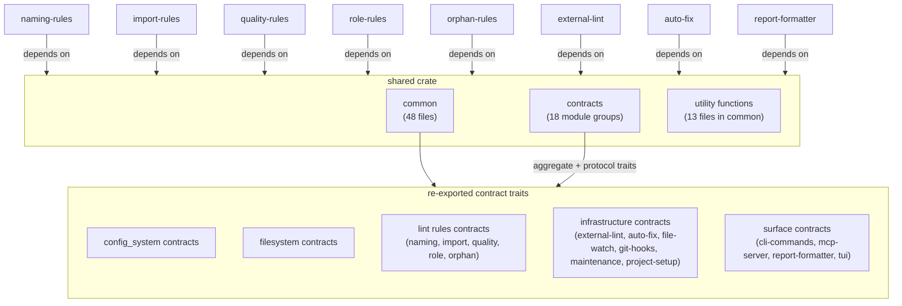

# FRD — shared

---

## System Overview

The shared crate provides the **domain foundation** for the entire lint-arwaky workspace: taxonomy value objects, contract trait definitions, and stateless utility functions. It contains zero business logic implementations and depends on no other feature crate.

Every other crate in the workspace imports shared to access domain types and protocol contracts. The crate re-exports all contract traits from feature crates (config-system, filesystem, naming-rules, import-rules, quality-rules, role-rules, orphan-rules, external-lint, auto-fix, report-formatter, file-watch, git-hooks, maintenance, project-setup) so consumers only need a single dependency.

### Architecture & Data Flow

---

## Functional Requirements

### FR-001: Domain Value Objects

**What it produces**: Typed value objects representing domain concepts used across all crates.

| Category | Types Provided |
|----------|---------------|
| Paths | `FilePath`, `DirectoryPath`, `FilePathList` |
| Severity | `Severity` (INFO/LOW/MEDIUM/HIGH/CRITICAL) with `score_impact()` |
| Language | `Language`, `LanguageInfo`, `ConfigLanguage`, `LanguageVO` |
| Lint output | `LintResult`, `ViolationItem`, `LintMessage`, `ComplianceStatus` |
| Scoring | `Score`, `Threshold` |
| Layer definition | `LayerDefinition`, `LayerMapVO`, `NamingConfig`, `LayerNamingConfig`, `OrphanRuleVO` |
| Layout | `LineNumber`, `ColumnNumber`, `Count`, `Location`, `LocationList` |
| Format | `Format` (Text/Json/Sarif/Junit) |
| Identity | `NameVariants`, `SymbolName`, `AdapterName`, `ActionName`, `JobId` |
| Source content | `ContentString`, `SourceContentVO`, `FileContentPair` |
| Errors | `ExitCode` (Ok=0, PolicyFail=1, RuntimeError=2, PrerequisiteMissing=3), `ErrorCode`, `LinterOperationError`, `AdapterError` |
| Suggestion | `DescriptionVO`, `MetadataVO` |
| Display | `DisplayContent` |
| Git | `GitBranchName` |
| Duration | `Timeout` |
| Code analysis | `CodeAnalysisRuleVO`, `MandatoryImportRuleVO` |

- **Input**: Domain events and operations from all crate layers.
- **Output**: Strongly-typed value objects with serialization support (`Serialize`/`Deserialize`).
- **Business Rules**:
  - All VOs are created via `string_value_object!` or `primitive_value_object!` macros for consistency.
  - VOs are copy/clone where semantically appropriate.
  - `Severity` provides `score_impact()` returning a numeric weight for scoring calculations.
  - `ExitCode` constants define the project-wide exit code contract.
- **Edge Cases**:
  - Unknown language variants produce `Language::Unknown` or `ConfigLanguage::Unknown`.
  - Empty file paths produce `FilePath("")` without error.

---

### FR-002: Contract Trait Definitions

**What it produces**: Protocol and aggregate trait definitions consumed by all feature crates via DI.

| Domain | Contracts Provided |
|--------|-------------------|
| Config system | `IConfigOrchestratorAggregate`, `IConfigParserProtocol`, `IConfigReaderProtocol`, `IConfigValidatorProtocol`, `IWorkspaceDetectorProtocol` |
| Filesystem | `IFilesystemAggregate`, `IParserProtocol`, `IGraphProtocol`, `IFileSystemIOProtocol`, `IToolResolutionProtocol`, `IWorkspaceProtocol` |
| Naming rules | `INamingConventionChecker`, `ISuffixPrefixChecker`, `INamingRunnerAggregate` |
| Import rules | `ICycleImportProtocol`, `IDummyImportCheckerProtocol`, `IImportForbiddenProtocol`, `IImportMandatoryProtocol`, `IUnusedImportProtocol`, `IImportRunnerAggregate` |
| Quality rules | `IBypassCheckerProtocol`, `IMandatoryClassProtocol`, `ICodeAnalysisAggregate`, `ICodeMetricAnalyzerProtocol`, `IDeadInheritanceProtocol`, `ILineCheckerProtocol` |
| Role rules | `IAgentRoleChecker`, `ICapabilitiesRoleChecker`, `IContractRoleChecker`, `ISurfaceRoleChecker`, `ITaxonomyRoleChecker`, `IUtilityRoleChecker`, `IRoleRunnerAggregate` |
| Orphan rules | `IAgentOrphanProtocol`, `ICapabilitiesOrphanProtocol`, `IContractOrphanProtocol`, `ISurfacesOrphanProtocol`, `ITaxonomyOrphanProtocol`, `IUtilityOrphanProtocol`, `IOrphanParserProtocol`, `IOrphanAggregate` |
| External lint | `ILinterAdapterProtocol`, `ICommandExecutorProtocol`, `IExternalLintExecutorProtocol`, `IExternalLintSelectorProtocol`, `IExternalLintAggregate` |
| Auto-fix | `IFileAdapterProtocol`, `IFixProtocol`, `LintFixOrchestratorAggregate` |
| Report formatter | `IReportFormatterProtocol`, `IReportFormatterAggregate` |
| File watch | `IChangeAnalyzerProtocol`, `IWatchProviderProtocol`, `IWatchAggregate` |
| Git hooks | `IDiffProtocol`, `IHookProtocol`, `IHookManagerProtocol`, `GitHooksAggregate`, `HookManagementOrchestratorAggregate` |
| Maintenance | `IMaintenanceCheckerProtocol`, `IToolExecutorProtocol`, `MaintenanceCommandsAggregate` |
| Project setup | `ISetupInstallerProtocol`, `ISetupManagementProtocol`, `SetupManagementAggregate` |

- **Input**: Feature crate implementations register against these traits.
- **Output**: Trait objects (`Arc<dyn Trait>`) consumed across crate boundaries.
- **Business Rules**:
  - All traits require `Send + Sync` for thread safety.
  - Protocol traits define focused, single-responsibility contracts.
  - Aggregate traits compose related protocol traits into a single surface.
  - Contracts define public promises only — no implementation, no layer imports.
- **Edge Cases**:
  - Unknown adapter — protocols return defaults (e.g., `true` for `is_adapter_enabled`).

---

### FR-003: Common Utility Functions

**What it produces**: Stateless, domain-agnostic utility functions reusable across modules.

| Module | Functions | Purpose |
|--------|-----------|---------|
| Command runner | `run_command`, `run_command_in_dir`, `run_command_async`, `run_command_in_dir_async` | Shell command execution |
| Compliance score | `compute_score` | 0–100 score from lint violations |
| Language detector | `detect_language`, `is_lintable`, `detect_language_info`, `detect_language_info_from_source` | Language identification from file paths/content |
| Layer detector | `detect_layer_from_prefix`, `resolve_specialized_layer`, `detect_module_layer`, `extract_filename`, `collect_layer_keys`, `get_layer_def`, `resolve_module_path_to_layer` | AES layer classification from filenames |
| Parser dispatcher | `parse_file_content`, `is_supported` | Routes parsing to language-specific parser |
| Rust parser | `parse_rust` | Syn-based AST parsing for Rust files |
| Python parser | `parse_python` | Comment-aware parsing for Python files |
| TypeScript parser | `parse_ts` | Comment-aware parsing for TypeScript/JavaScript files |
| Path filter | `is_path_ignored` | Glob-style path filtering with `**/*.ext` patterns |
| Path normalization | `normalize_path`, `resolve_capabilities_path` | Platform-aware path normalization |
| Scope matcher | `file_belongs_to_scope`, `extract_file_stem`, `extract_layer_prefix`, `extract_suffix` | Scope classification for lint rules |
| Signature parser | `extract_trait_method_signatures`, `extract_python_method_signatures`, `extract_typescript_method_signatures`, `signature_uses_forbidden_primitive` | Method signature extraction for bypass detection |
| Value object macros | `string_value_object!`, `primitive_value_object!` | Foundation macros for all VOs |

- **Input**: File paths, content strings, configuration objects.
- **Output**: Parsed structures, detection results, filtered paths.
- **Business Rules**:
  - All functions are pure (no side effects except filesystem reads in parsers).
  - Language parsers produce structured AST metadata without regex fallback.
  - Path filter supports `**/*.ext`, `prefix/*`, `.dir`, and multi-segment patterns.
- **Edge Cases**:
  - Empty content produces valid but empty parse results.
  - Unsupported language produces `Language::Unknown`.

---

### FR-004: Feature Crate Taxonomy

**What it produces**: Domain-specific VOs, errors, and constants for each feature crate's contract traits.

| Domain | Taxonomy Types |
|--------|---------------|
| Config system | `ArchitectureConfig`, `ArchitectureRule`, `NamingRuleVO`, `RoleRuleVO`, `ConfigError`, `ConfigKey`, `WorkspaceInfo`, `AdapterEntry`, `AdapterStatus`, `ProjectConfig`, `Thresholds`, `ConfigResult`, `ConfigSource`, `ValidationResult` |
| Filesystem | `FileEntry`, `ImportEntry`, `ParseWarning`, `ParseMetadata`, `ScanTiming`, `GraphAnalysisContext`, `DefinitionEntry`, `ImplEntry`, per-language metadata (Rust, Python, TypeScript, JavaScript) |
| Naming rules | Constants: `ADAPTER_NAME`, `LAYER_PREFIXES`, `SOURCE_EXTENSIONS`, `SUFFIX_POLICY_STRICT` |
| Import rules | `AesImportViolation`, `ResolvedImportVO`, `DependencyEdge`, `ImportError` |
| Quality rules | `AesCodeAnalysisViolation`, `GraphAnalysisContext`, `InboundLinkMap`, `InheritanceMap` |
| Role rules | `AesRoleViolation`, layer name constants (`LAYER_AGENT`, `LAYER_CAPABILITIES`, etc.) |
| Orphan rules | `AesOrphanViolation`, `OrphanEntryPatternListVO`, `FileParseResultVO` with per-language AST node VOs |
| External lint | `ExternalLintContext` |
| Auto-fix | `FixResult`, `FixOutcome`, `FixApplied` |
| Report formatter | JSON DTOs (`JsonReportDto`, `JsonViolation`, `JsonDiagnostic`, `JsonSummary`), SARIF 2.1.0 types (`SarifLog`, `SarifRun`, `SarifTool`, etc.) |
| CLI commands | `ScanReport`, `ScanRequest`, `CommandCatalogVO`, `PipelineDiagnostic` |
| MCP server | `ExecuteCommandArgs`, `GetConfigArgs`, `ListCommandsArgs`, `ReadSkillArgs` |
| TUI | `AppState`, `TuiEvent`, `ScanUpdate`, `WatchMessage`, file display models |
| File watch | `WatchConfig`, `WatchEvent`, `GitDiffResultVO`, `WatchServiceError` |
| Git hooks | `GitDiffDataVO`, `HookIgnoreUpdateVO`, `GitHookError` |
| Maintenance | `DoctorResultVO`, `DependencyReport`, `SecurityScanReport`, `MaintenanceStatsVO` |
| Project setup | `SetupError`, `InstallPackagesResult`, `PreFlightResult` |

- **Input**: Feature crate implementations produce and consume these types.
- **Output**: Shared vocabulary enabling cross-crate type safety without circular dependencies.
- **Business Rules**:
  - VOs are domain-safe — no filesystem or I/O types leak into contract signatures.
  - Error types carry structured context (error codes, field names, module names).
  - Constants are `pub const` values with clear documentation.

---

## Data Production Map

| FR     | Output Data                                    |
| ------ | ----------------------------------------------- |
| FR-001 | Domain VOs, errors, constants, enums            |
| FR-002 | Protocol traits, aggregate traits               |
| FR-003 | Stateless utility functions, AST parsers         |
| FR-004 | Feature-specific taxonomy types                  |

---

## API Contract

All operations are accessible as public items from `shared`. The crate provides no service methods — only types, traits, and pure functions.

### Value Objects (FR-001)

| Category | Key Types | Purpose |
|----------|-----------|---------|
| Path types | `FilePath`, `DirectoryPath`, `FilePathList` | Typed path representations |
| Severity | `Severity` | Lint violation severity with score impact |
| Lint output | `LintResult`, `ViolationItem`, `LintMessage` | Core lint output structure |
| Config | `ConfigLanguage`, `Language`, `Format` | Configuration enums |

### Contract Traits (FR-002)

Consumers import via `shared::config_system::*`, `shared::filesystem::*`, etc. Each domain module re-exports its protocol and aggregate traits.

### Utility Functions (FR-003)

All accessible from `shared::common::utility_*` modules. Pure functions with no state.

---

## Non-functional Requirements

- **Performance**: Zero runtime overhead — all types are compile-time checked.
- **Memory**: VOs are stack-allocated where possible; heap allocation only for collections and strings.
- **Concurrency**: All traits require `Send + Sync`. No mutable shared state.
- **Security**: `ExitCode` constants enforce the exit code contract. `ConfigLanguage` enum prevents path injection.
- **Reliability**: Macros produce consistent, well-typed VOs with standard derives.

---

## Test Scenarios / QA Checklist

| # | Scenario | Expected | Rule |
|---|----------|----------|------|
| 1 | All contract traits compile as `Send + Sync` | Compile succeeds | FR-002 |
| 2 | `string_value_object!` produces `Display + From<&str>` | Macro expansion succeeds | FR-001 |
| 3 | `primitive_value_object!` produces `Display + Copy` | Macro expansion succeeds | FR-001 |
| 4 | `Severity::score_impact()` returns correct weights | Correct numeric values | FR-001 |
| 5 | `ExitCode` constants match PRD spec (0, 1, 2, 3) | Exact match | FR-001 |
| 6 | `detect_language()` identifies .rs/.py/.ts/.js extensions | Correct language enum | FR-003 |
| 7 | `compute_score()` produces 0–100 range | Score in [0, 100] | FR-003 |
| 8 | `is_path_ignored()` handles `**/*.ext` patterns | Correct filtering | FR-003 |

---

## Glossary

| Term | Definition |
|------|-----------|
| **VO** | Value Object — immutable, identity-less typed wrapper |
| **Protocol trait** | Focused contract for a single capability (e.g., `IParserProtocol`) |
| **Aggregate trait** | Composed contract combining multiple protocol traits |
| **Aggregate** | Implementation of an aggregate trait that orchestrates protocol implementations |
| **DI** | Dependency Injection — protocols injected via `Arc<dyn Trait>` |
| **Exit code** | Numeric return code: 0=Ok, 1=PolicyFail, 2=RuntimeError, 3=PrerequisiteMissing |

---

## Reference

- PRD: [PRD.md](../../PRD.md)
- Architecture: [ARCHITECTURE.md](../../ARCHITECTURE.md)
- AES Rules: [.agents/rules/RULES_AES.md](../../.agents/rules/RULES_AES.md)
