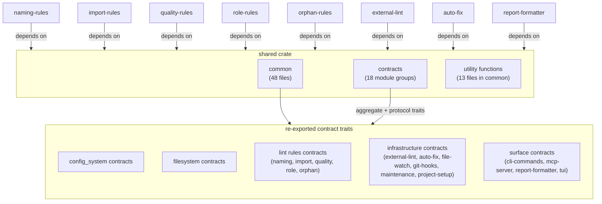

# FRD — shared

---

## Reference

- PRD: [PRD.md](../../PRD.md)
- Backlog: [BACKLOG.md](BACKLOG.md) — real condition for this crate; this file is specification only.
- Architecture: [ARCHITECTURE.md](../../ARCHITECTURE.md)
- AES Rules: [.agents/rules/RULES_AES.md](../../.agents/rules/RULES_AES.md)

## System Overview

The shared crate provides the **domain foundation** for the entire lint-arwaky workspace: taxonomy value objects, contract trait definitions, and stateless utility functions. It contains zero business logic implementations and depends on no other feature crate.

Every other crate in the workspace imports shared to access domain types and protocol contracts. The crate re-exports all contract traits from feature crates (config-system, filesystem, naming-rules, import-rules, quality-rules, role-rules, orphan-rules, external-lint, auto-fix, report-formatter, file-watch, git-hooks, maintenance, project-setup) so consumers only need a single dependency.

### Architecture & Data Flow

```mermaid
flowchart TD
    subgraph SHARED ["shared crate"]
        direction TB
        C["common\n(48 files)"]
        T["contracts\n(18 module groups)"]
        U["utility functions\n(13 files in common)"]
    end

    subgraph LAYERS ["re-exported contract traits"]
        direction TB
        L0["config_system contracts"]
        L1["filesystem contracts"]
        L2["lint rules contracts\n(naming, import, quality, role, orphan)"]
        L3["infrastructure contracts\n(external-lint, auto-fix, file-watch, git-hooks, maintenance, project-setup)"]
        L4["surface contracts\n(cli-commands, mcp-server, report-formatter, tui)"]
    end

    C --> LAYERS
    T -->|"aggregate + protocol traits"| LAYERS

    N["naming-rules"] -->|"depends on"| SHARED
    I["import-rules"] -->|"depends on"| SHARED
    Q["quality-rules"] -->|"depends on"| SHARED
    R["role-rules"] -->|"depends on"| SHARED
    O["orphan-rules"] -->|"depends on"| SHARED
    EL["external-lint"] -->|"depends on"| SHARED
    AF["auto-fix"] -->|"depends on"| SHARED
    RF["report-formatter"] -->|"depends on"| SHARED
```

---

## Functional Requirements

### FR-SHARED-001: Domain Value Objects

- **Description**: Provide the typed value objects that represent every domain concept crossing a crate boundary, so that paths, severities, languages, lint results, and exit codes are exchanged as distinct types rather than raw strings.
- **Input**: Domain events and operations from all crate layers.
- **Output**: Strongly-typed value objects with serialization support (`Serialize`/`Deserialize`).
- **Business Rules**:
  - All VOs are created via `string_value_object!` or `primitive_value_object!` macros for consistency.
  - VOs are copy/clone where semantically appropriate.
  - `Severity` provides `score_impact()` returning a numeric weight for scoring calculations.
  - `ExitCode` constants define the project-wide exit code contract.
- **Edge Cases**:
  - Unknown language variants produce `Language::Unknown` or `ConfigLanguage::Unknown`.
  - Empty file paths produce `FilePath("")` without error.
- **Error Handling**: Value objects are pure data; construction failure is impossible. The crate surfaces no I/O errors — all failure cases live in the crates that produce or consume the VOs.

---

### FR-SHARED-002: Contract Trait Definitions

- **Description**: Provide the protocol and aggregate trait definitions that every feature crate implements, so that dependencies are injected through trait objects rather than bound to concrete types at compile time.
- **Input**: Feature crate implementations register against these traits.
- **Output**: Trait objects (`Arc<dyn Trait>`) consumed across crate boundaries.
- **Business Rules**:
  - All traits require `Send + Sync` for thread safety.
  - Protocol traits define focused, single-responsibility contracts.
  - Aggregate traits compose related protocol traits into a single surface.
  - Contracts define public promises only — no implementation, no layer imports.
- **Edge Cases**:
  - Unknown adapter — protocols return defaults (e.g., `true` for `is_adapter_enabled`).
- **Error Handling**: Traits carry no error type of their own; a method that can fail declares its own error in the signature. The contract layer has no runtime failure mode, and a missing implementation is a wiring error surfaced at construction time rather than at call time.

---

### FR-SHARED-003: Common Utility Functions

- **Description**: Provide stateless, domain-agnostic utility functions reusable across modules for command execution, language detection, layer classification, file parsing, path operations, scope matching, and VO macro generation.
- **Input**: File paths, content strings, configuration objects.
- **Output**: Parsed structures, detection results, filtered paths.
- **Business Rules**:
  - All functions are pure (no side effects except filesystem reads in parsers).
  - Language parsers produce structured AST metadata without regex fallback.
  - Path filter supports `**/*.ext`, `prefix/*`, `.dir`, and multi-segment patterns.
- **Edge Cases**:
  - Empty content produces valid but empty parse results.
  - Unsupported language produces `Language::Unknown`.
- **Error Handling**: Functions return results or defaults rather than throwing; unsupported languages and empty inputs are handled gracefully without crashes.

---

### FR-SHARED-004: Feature Crate Taxonomy

- **Description**: Provide the domain-specific value objects, error types, and constants that each feature crate's contract traits reference, so the vocabulary a contract names is defined in exactly one place.
- **Input**: Feature crate implementations produce and consume these types.
- **Output**: Shared vocabulary enabling cross-crate type safety without circular dependencies.
- **Business Rules**:
  - VOs are domain-safe — no filesystem or I/O types leak into contract signatures.
  - Error types carry structured context (error codes, field names, module names).
  - Constants are `pub const` values with clear documentation.
- **Edge Cases**: The taxonomy module group is one entry point per feature crate; a missing module is a compile-time failure, not a runtime one. An unknown configuration key is rejected at load time before any value is constructed.
- **Error Handling**: Taxonomy types are pure data and carry no I/O; error paths only surface at the boundary where a caller converts a missing or malformed input into a typed error before it enters the shared vocabulary.

---

## API Contract

All operations are accessible as public items from `shared`. The crate provides no service methods — only types, traits, and pure functions.

### Protocol API

| Method | Input | Output | Error | Event | Description |
| --- | --- | --- | --- | --- | --- |
| `parse_file_content` | Source file path, file content | Parsed AST metadata plus a parse warning list | None — an unparseable file returns an empty result with a warning | — | The single composite parsing entry point: identifies the language, routes to the language-specific parser, and returns structured AST metadata with no regex fallback. |

### Aggregate API

| Method | Input | Output | Error | Event | Description |
| --- | --- | --- | --- | --- | --- |
| `execute` | One aggregate request (for example a run-audit, run-scan, or run-format request) | One aggregate response carrying the corresponding result | Declared per trait by the owning feature crate; the shared layer performs no fallible work of its own | — | Every aggregate contract in the workspace exposes a single `execute` that dispatches internally, so a surface depends on one trait rather than many. |
| `compute_score` | Slice of lint violations | `Score` in the range 0–100 | None | — | Derive a compliance score from a set of violations. |
| `detect_language` | File path or source content | `Language` or `LanguageInfo` | None — an unrecognised input yields `Language::Unknown` | — | Identify the language of a file from its path or its content. |
| `is_lintable` | File path | `bool` | None | — | Decide whether a path carries an extension the lint pipeline targets. |
| `is_path_ignored` | File path, glob-style ignore patterns | `bool` | None | — | Decide whether a path matches an ignore pattern. |
| `detect_layer_from_prefix` | Filename | AES layer identifier | None | — | Classify a file into its AES layer from the filename prefix. |
| `Severity::score_impact` | — | Numeric weight | None | — | Return the scoring weight a severity contributes. |

---

## Integration Points

| System | Direction | Purpose | Failure mode |
| --- | --- | --- | --- |
| All other crates | out | Consume VOs, protocol/aggregate traits, and utility functions | N/A (pure types, no failure) |
| `config-system` crate | out | Define config enums and merge contracts | N/A |
| `external-lint` crate | out | Define `AdapterDetail`, exit-code, and tool-name VOs | N/A |
| `report-formatter` crate | out | Consume `LintResult` / `ViolationItem` for output | N/A |

## Non-functional Requirements

| Metric | Target | Measurement method |
| --- | --- | --- |
| Runtime overhead | Zero — all types are resolved at compile time and carry no behaviour | Confirm the crate contributes no runtime code path; a build with the crate removed produces identical linter behaviour |
| Memory footprint | Value objects are stack-allocated where possible; heap allocation only for collections and strings | Inspect the allocation profile of a scan and confirm no per-violation heap traffic originates in the shared layer |
| Thread safety | Every public trait requires `Send + Sync`; no mutable shared state | Assert `Send + Sync` on each trait and confirm no interior-mutable field is declared on a VO |
| Path injection resistance | The `ConfigLanguage` enum constrains language selection to declared variants instead of free-form strings | Attempt to construct a language from an arbitrary path and confirm the enum rejects it at compile time |
| Exit code fidelity | The `ExitCode` constants match the documented contract exactly (0, 1, 2, 3) | Compare the constant values against the product specification in the root PRD |
| Value object consistency | Macros produce uniformly derived, well-typed value objects | Expand each macro in a test and assert the expected derive set and trait implementations |

## Test Scenarios

- Every public contract trait in the crate compiles cleanly with the `Send` and `Sync` auto-traits in scope.
- Expanding the `string_value_object!` macro produces a type that implements `Display` and a borrowed-string conversion.
- Expanding the `primitive_value_object!` macro produces a type that implements `Display` and is `Copy`.
- The `score_impact` method on every severity variant returns the documented numeric weight.
- The `ExitCode` constants map to the exact values 0, 1, 2, and 3 in the documented order.
- The language detector recognises `.rs`, `.py`, `.ts`, and `.js` extensions and returns the correct language enum for each.
- The compliance-score computation yields a value that is always within the 0-to-100 range for any valid input set.
- The path-ignored check filters paths that match `**/*.ext` glob patterns while leaving non-matching paths untouched.

---

## Assumptions & Constraints

- `shared` exposes no I/O, no file access, and no side effects — all types are compile-time checked.
- All public traits require `Send + Sync`; no interior mutability is allowed in shared VOs.
- VOs are identity-less: equality is by value, not reference.
- The crate is consumed by every other crate; it has no internal dependencies beyond the standard library.

---

## Glossary

- **VO**: Value Object — an immutable, identity-less typed wrapper.
- **Protocol trait**: Focused contract for a single capability (for example, `IParserProtocol`).
- **Aggregate trait**: Composed contract combining multiple protocol traits.
- **Aggregate**: Implementation of an aggregate trait that orchestrates protocol implementations.
- **DI**: Dependency Injection — protocols injected via `Arc<dyn Trait>`.
- **Exit code**: Numeric return code: 0 = Ok, 1 = PolicyFail, 2 = RuntimeError, 3 = PrerequisiteMissing.

---

## Data Production Map

| FR     | Output Data                                    |
| ------ | ----------------------------------------------- |
| FR-SHARED-001 | Domain VOs, errors, constants, enums            |
| FR-SHARED-002 | Protocol traits, aggregate traits               |
| FR-SHARED-003 | Stateless utility functions, AST parsers         |
| FR-SHARED-004 | Feature-specific taxonomy types                  |

---
