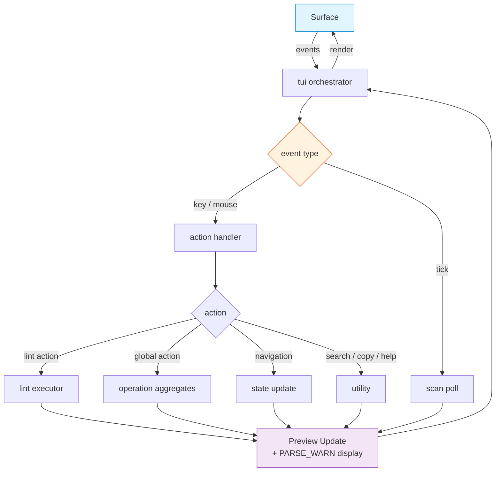

# FRD — tui (v1.1.0)

> **Changelog**: Ghost command `duplicates` removed. "Runtime creation failure" changed to "Thread spawn failure". AES glossary added. PARSE_WARN display added. Test scenarios converted to table format.

---

## System Overview

A state-driven 3-panel Ratatui terminal UI that provides real-time AES
architecture linting with file browsing, preview, and all CLI commands
mapped to keyboard shortcuts.

**Product priority (locked):** **P1 — supported surface.** Critical-path
acceptance required for layout (FR-001), navigation (FR-002/003), path
dialog (FR-011), lint action (FR-005), and background scan progress
(FR-012). TUI must invoke the same aggregates as CLI (no divergent lint
path).

### Layout

```
┌──────────────────────────────────────────────────────────┐
│ lint-arwaky TUI │ Path: /home/user/project  [q/Esc] Quit│
├──────────┬───────────────┬───────────────────────────────┤
│  Tree    │  File List    │  Preview                      │
│  (20%)   │  (35%)        │  (45%)                        │
│          │               │                               │
│  src/    │  lib.rs       │  1 │ // PURPOSE: Module ...   │
│  tests/  │  mod.rs       │  2 │ pub mod surface_...      │
│          │  main.rs      │  3 │                           │
│          │               │                               │
├──────────┴───────────────┴───────────────────────────────┤
│ [c]check [s]scan [f]fix [t]ci [o]orphan [d]doctor  ...  │
│ [y]copy [?]help [/]search                               │
├──────────────────────────────────────────────────────────┤
│ Done: /home/user/project | 0 violations                  │
└──────────────────────────────────────────────────────────┘
```

### Architecture & Data Flow



---

## Functional Requirements

### FR-001: Render 3-Panel Layout

- **Description**: Render a three-panel layout with header, shortcut bar,
  and status bar.
- **Input**: Application state.
- **Output**: Ratatui frame rendered to terminal.
- **Business Rules**:

  - Layout proportions: Tree (20%) | File List (35%) | Preview (45%).
  - Header bar (1 row): shows
    `"lint-arwaky TUI | Path: <current_dir> [q/Esc] Quit"`.
  - Shortcut bar (3 rows): key hints for available actions.
  - Status bar (1 row): current status message
    (e.g., `"Done: <path> | N violations"`).
  - Path dialog overlay: shown on startup, user types project root or
    presses Tab for CWD.
- **Edge Cases**:

  - Terminal smaller than 5 rows or 10 columns → mouse click handling
    disabled.
  - Terminal resize → layout recalculates on next render.
  - Empty directory → file list shows "Empty or inaccessible" status.
- **Error Handling**: Terminal I/O errors propagate from the draw call.

---

### FR-002: Navigate File List

- **Description**: Navigate the file list panel using keyboard shortcuts
  with context-aware scrolling.
- **Input**: Key events (j/k, Up/Down, Home/End, PageUp/PageDown).
- **Output**: Updated application state with new selection index, scroll
  offset, and preview content.
- **Business Rules**:

  - `j` / `Down`: Move down — if Preview focused, scroll preview by
    3 lines; otherwise move selection.
  - `k` / `Up`: Move up — if Preview focused, scroll preview by 3 lines;
    otherwise move selection.
  - `Home`: Jump to top — if Preview focused, scroll to top; otherwise
    select first entry.
  - `End`: Jump to bottom — if Preview focused, scroll to bottom;
    otherwise select last entry.
  - Selection change triggers automatic file preview loading.
  - Scroll offset resets to 0 when directory changes.
- **Edge Cases**:

  - Selection at first entry → no further upward movement.
  - Selection at last entry → no further downward movement.
  - Preview scroll at bounds → clamped to valid range.
  - Empty file list → no selection changes.
- **Error Handling**: No error paths; bounds checking prevents overflow.

---

### FR-003: Navigate Directories

- **Description**: Enter directories and navigate back to parent, clamped
  to project root boundary.
- **Input**: Key events (h/Left, l/Right/Enter).
- **Output**: Updated application state with new current directory and file
  listing.
- **Business Rules**:

  - `h` / `Left`: Navigate to parent directory, but only if parent starts
    with project root.
  - `l` / `Right` / `Enter`: If entry is directory, enter it; if file,
    load preview.
  - Navigation clamped to project root — cannot go above it.
  - After navigation, file list is re-sorted: directories first, then
    alphabetically.
- **Edge Cases**:

  - At project root → `h`/`Left` does nothing.
  - Entry is a symlink to directory → treated as directory.
  - Directory is empty → status bar shows "Empty or inaccessible".
  - Entry is a file → preview loaded in Preview panel.
- **Error Handling**: Directory read failures result in empty listing with
  status message.

---

### FR-004: Focus Cycling Between Panels

- **Description**: Cycle keyboard focus between Tree, FileList, and Preview
  panels.
- **Input**: Tab / BackTab (Shift+Tab).
- **Output**: Updated application state with new panel focus value.
- **Business Rules**:

  - Tab: cycle forward — Tree → FileList → Preview → Tree.
  - BackTab: cycle backward — Tree → Preview → FileList → Tree.
  - Focus determines which panel responds to j/k/Home/End keys.
- **Edge Cases**: Only three panels — cycle wraps after third.
- **Error Handling**: No error paths; pure state transition.

---

### FR-005: Run Lint Actions (Path-Scoped)

- **Description**: Execute lint actions on the currently selected file or
  directory.
- **Input**: Key events (c, s, f, t, o, Ctrl+S, Ctrl+P).
- **Output**: Updated application state with preview text showing action
  results and violation count.
- **Business Rules**:

  - `c` → check: AES compliance check on selected path.
  - `s` → scan: Multi-adapter scan (runs in background thread with
    progress indicator).
  - `f` → fix: Auto-fix violations (supports dry-run/live modes).
  - `t` → ci: CI mode with configurable threshold (PASS/FAIL status).
  - `o` → orphan: Dead code detection on selected path.
  - `Ctrl+S` → security: Vulnerability scan via external linters.
  - `Ctrl+P` → dependencies: Dependency analysis report.
  - All results displayed in Preview panel.
  - PARSE_WARN diagnostics displayed as warnings in Preview panel,
    visually distinct from AES violations.
  - Violation count shown in status bar after action completes.
  - `scan` runs in background thread; other long-running actions blocked
    while scan in progress.
- **Edge Cases**:

  - Scan already running → new scan request ignored.
  - Long-running action during active scan → blocked until scan completes.
  - Action on empty directory → action runs on path, may return zero
    results.
  - Fix orchestrator not available → fallback to violation scan with
    message.
- **Error Handling**: Action failures return a lint execution result with
  `success: false` and error message.

---

### FR-006: Run Global Actions

- **Description**: Execute actions that operate globally (not path-scoped).
- **Input**: Key events (d, i, I, m, C, H, U, a, v, w).
- **Output**: Updated application state with preview text showing action
  results.
- **Business Rules**:

  - `d` → doctor: Environment diagnostics (toolchain check).
  - `i` → init: Create config files for detected languages.
  - `I` → install: Install adapter dependencies (Python/JS).
  - `m` → mcp-config: Generate MCP configuration JSON.
  - `C` → config-show: Display current configuration.
  - `H` → install-hook: Install git pre-commit hook.
  - `U` → uninstall-hook: Remove git pre-commit hook.
  - `a` → adapters: List available linter adapters with install status.
  - `v` → version: Show lint-arwaky version.
  - `w` → watch: Displays message "Watch mode is not supported in TUI.
    Use `lint-arwaky-cli watch` in a terminal." (explicit unsupported,
    not a stub).
- **Edge Cases**:

  - Setup aggregate not available → message directs user to CLI.
  - Git hook operations on non-git repo → error message returned.
  - MCP config serialization failure → error message returned.
- **Error Handling**: Failures return a lint execution result with error
  message.

---

### FR-007: Search and Filter Files

- **Description**: Incremental file filtering within the current directory
  listing.
- **Input**: `/` to start, character input, Backspace, Enter, Esc.
- **Output**: Filtered file list in application state.
- **Business Rules**:

  - `/` toggles search mode; shows search query in UI.
  - Character input appends to search query; filtering is case-insensitive
    substring match.
  - Backspace removes last character from query.
  - Enter confirms search and exits search mode (keeps filter).
  - Esc cancels search and clears filter.
- **Edge Cases**:

  - Empty query → all entries shown.
  - No matches → empty file list.
  - Search mode active → all keyboard input goes to search (no navigation).
- **Error Handling**: No error paths; pure string matching.

---

### FR-008: Mouse Interaction

- **Description**: Support mouse clicks, scroll wheel, and drag for panel
  interaction and scrolling.
- **Input**: Mouse events (click, scroll, drag).
- **Output**: Updated application state with focus changes and scroll
  position.
- **Business Rules**:

  - Left click on file list: Select entry + focus FileList.
  - Left click on preview: Jump to proportional scroll position + focus
    Preview.
  - Left click on scrollbar (rightmost 3 columns): Jump to position +
    focus Preview.
  - Scroll wheel: Scroll focused panel (Preview by 3 lines, FileList by
    1 entry).
  - Left drag on scrollbar: Scrub through preview content.
  - Mouse events below shortcut bar (last 4 rows) are ignored.
- **Edge Cases**:

  - Terminal too small (< 5 rows, < 10 cols) → all mouse events ignored.
  - Click on scrollbar in empty preview → no-op.
  - Scroll at content bounds → clamped to valid range.
- **Error Handling**: No error paths; bounds checking prevents overflow.

---

### FR-009: Copy Actions

- **Description**: Copy preview content to clipboard or save to file.
- **Input**: `y` (clipboard), `Ctrl+Y` (file).
- **Output**: Updated status message.
- **Business Rules**:

  - `y`: Copy preview text to system clipboard via arboard or
    xclip/wl-copy fallback.
  - `Ctrl+Y`: Write preview text to `lint-results.txt` in current
    directory.
  - Empty preview → "Nothing to copy" status message.
- **Edge Cases**:

  - Clipboard unavailable → error message with installation hint.
  - File write permission denied → error message in status bar.
- **Error Handling**: Clipboard and file write failures return descriptive
  status messages.

---

### FR-010: Help Overlay

- **Description**: Toggle a help overlay showing all keyboard shortcuts.
- **Input**: `?` key.
- **Output**: Help overlay rendered in Preview panel.
- **Business Rules**:

  - `?` toggles help visibility state.
  - When active, preview mode switches to help overlay.
  - When inactive, preview mode returns to file content.
- **Edge Cases**: `?` pressed while in search mode → no effect (search
  takes priority).
- **Error Handling**: No error paths.

---

### FR-011: Path Input Dialog

- **Description**: Startup dialog for entering project root path.
- **Input**: Character input, Backspace, Enter, Tab.
- **Output**: Updated application state with project root set.
- **Business Rules**:

  - Shown on startup; all keyboard input routed to path editing.
  - Character input appends to path string.
  - Backspace removes last character.
  - Tab: Use current working directory as project root.
  - Enter: Validate path; if valid directory, set as project root and load
    directory.
  - Esc: Quit the application.
- **Edge Cases**:

  - Invalid path entered → "Invalid path" status message, dialog stays
    open.
  - CWD is inaccessible → Tab uses "." as fallback.
- **Error Handling**: Invalid path stays in dialog; no crash.

---

### FR-012: Background Scan with Progress

- **Description**: Run multi-adapter scan in a background thread with
  real-time progress updates.
- **Input**: `s` key (scan action).
- **Output**: Preview panel shows scan output when complete; status bar
  shows progress during scan.
- **Business Rules**:

  - Scan spawns a new thread via `std::thread::spawn` (no async runtime).
  - Progress communicated via a bounded `std::sync::mpsc` channel.
  - Progress messages update status bar with phase, done, total.
  - Complete messages show final output and violation count.
  - While scanning: check/fix/ci/orphan/security/dependencies actions are
    blocked.
  - Only one scan at a time — second `s` press ignored during active scan.
- **Edge Cases**:

  - Thread spawn failure → returns failure result immediately.
  - Channel disconnected → scan thread exits without panic.
  - Scan takes very long → UI remains responsive (event loop continues
    polling).
- **Error Handling**: Thread spawn failures return a lint execution result
  with error message.

---

## API Contract


| Operation         | Input            | Output           | Purpose                                              |
| ------------------- | ------------------ | ------------------ | ------------------------------------------------------ |
| Run TUI           | —               | Result           | Initialize terminal, run event loop, restore on exit |
| Handle event      | State, TUI event | —               | Delegate event to action handler                     |
| Load directory    | State, path      | —               | Read directory, sort entries, reset selection        |
| Load preview      | State            | —               | Load file preview for selected entry                 |
| Start scan        | State            | Channel receiver | Start background scan thread                         |
| Poll scan         | State, receiver  | —               | Poll scan progress and update state                  |
| Run check         | Path, flags      | Execution result | AES compliance check                                 |
| Run scan action   | Path             | Execution result | Multi-adapter scan                                   |
| Run fix           | Path, flags      | Execution result | Auto-fix violations                                  |
| Run CI            | Path, flags      | Execution result | CI mode with threshold                               |
| Run doctor        | —               | Execution result | Environment diagnostics                              |
| List directory    | Path             | File entry list  | List directory entries                               |
| Read file preview | Path, max lines  | Display content  | Read file with line numbers                          |
| Copy to clipboard | String           | Boolean          | Copy text via arboard or fallback                    |

---

## Integration Points

- **Internal**:

  - TUI aggregate — aggregate trait for TUI orchestration.
  - Action handler protocol — protocol for the central state machine.
  - Lint executor protocol — protocol for all lint action methods.
  - Code analysis aggregate — core AES lint engine.
  - External lint aggregate — external linter integration.
  - Maintenance commands aggregate — doctor/dependency commands.
  - Config orchestrator aggregate — configuration management.
  - Hook manager protocol — git hook install/uninstall.
  - Analysis pipeline aggregate in the CLI commands crate — comprehensive
    scan pipeline.
- **External**:

  - `ratatui` — terminal UI rendering framework.
  - `crossterm` — terminal I/O, raw mode, mouse capture, alternate screen.
  - `arboard` — clipboard access (with xclip/wl-copy fallback).
  - No async runtime dependency.

---

## Non-functional Requirements

- **Performance**: Terminal renders at ~20fps (50ms poll interval). Event
  processing is O(1) per keypress. Directory listing is O(n) in entry
  count. File preview limited to 100 lines.
- **Memory**: Preview text capped at 100 lines (~10KB). File listing
  scales with directory size. Application state is stack-allocated per
  session.
- **Accuracy**: File extension detection uses OS-provided extension. Scroll
  position is always clamped to valid bounds. Violation counts are exact.
- **Concurrency**: Background scan uses `std::thread::spawn` with
  `std::sync::mpsc` channel. No async runtime dependency.

---

## Test Scenarios / QA Checklist

### FR-001 — Layout


| # | Scenario          | Expected                                | Rule   |
| --- | ------------------- | ----------------------------------------- | -------- |
| 1 | TUI launches      | 3-panel layout with correct proportions | FR-001 |
| 2 | Terminal resize   | Layout recalculates                     | FR-001 |
| 3 | Terminal < 5 rows | Mouse disabled                          | FR-001 |

### FR-002/003 — Navigation


| # | Scenario             | Expected                | Rule   |
| --- | ---------------------- | ------------------------- | -------- |
| 1 | j/k in file list     | Selection moves         | FR-002 |
| 2 | j/k in preview focus | Preview scrolls 3 lines | FR-002 |
| 3 | Home/End             | Jump to top/bottom      | FR-002 |
| 4 | h/l/Enter            | Directory navigation    | FR-003 |
| 5 | At project root, h   | No-op (clamped)         | FR-003 |
| 6 | Tab/BackTab          | Focus cycles panels     | FR-004 |

### FR-005 — Lint Actions


| # | Scenario               | Expected                              | Rule   |
| --- | ------------------------ | --------------------------------------- | -------- |
| 1 | `c` check              | Results in preview, count in status   | FR-005 |
| 2 | `s` scan               | Background thread, progress indicator | FR-005 |
| 3 | `s` during active scan | Ignored                               | FR-005 |
| 4 | `f` fix                | Auto-fix results displayed            | FR-005 |
| 5 | `t` ci                 | PASS/FAIL with threshold              | FR-005 |
| 6 | `o` orphan             | Orphan results displayed              | FR-005 |
| 7 | PARSE_WARN in results  | Displayed as warnings                 | FR-005 |

### FR-006 — Global Actions


| # | Scenario    | Expected                   | Rule   |
| --- | ------------- | ---------------------------- | -------- |
| 1 | `d` doctor  | Toolchain status displayed | FR-006 |
| 2 | `i` init    | Config files created       | FR-006 |
| 3 | `v` version | Version displayed          | FR-006 |
| 4 | `w` watch   | "Use CLI" message          | FR-006 |

### FR-007–FR-012 — Search, Mouse, Copy, Help, Path, Scan


| #  | Scenario                         | Expected                         | Rule   |
| ---- | ---------------------------------- | ---------------------------------- | -------- |
| 1  | `/` search filters incrementally | File list filtered               | FR-007 |
| 2  | Esc cancels search               | Filter cleared                   | FR-007 |
| 3  | Mouse click on file list         | Entry selected, FileList focused | FR-008 |
| 4  | Mouse scroll wheel               | Focused panel scrolls            | FR-008 |
| 5  | `y` copies to clipboard          | Clipboard updated                | FR-009 |
| 6  | `Ctrl+Y` saves to file           | lint-results.txt written         | FR-009 |
| 7  | `?` toggles help                 | Help overlay shown/hidden        | FR-010 |
| 8  | Path dialog: Tab                 | CWD used                         | FR-011 |
| 9  | Path dialog: invalid path        | "Invalid path", dialog stays     | FR-011 |
| 10 | Background scan progress         | Status bar updates               | FR-012 |
| 11 | Thread spawn failure             | Error result returned            | FR-012 |
| 12 | q/Esc quits                      | Terminal restored                | all    |

---

## Assumptions & Constraints

- Terminal must support crossterm (most modern terminals do).
- Mouse support requires terminal with mouse capture capability.
- Clipboard support requires xclip (X11), wl-copy (Wayland), or arboard.
- Background scan uses `std::thread::spawn` with `std::sync::mpsc` channel.
  No async runtime dependency.
- File preview limited to first 100 lines; large files are truncated.
- Path dialog is shown on startup; CWD is used as initial directory.
- The TUI requires the full lint-arwaky workspace to be built (all
  aggregates wired).
- PARSE_WARN diagnostics are displayed as warnings in the Preview panel,
  visually distinct from AES violations.
- Watch mode is not supported in TUI — explicit message directs user to CLI.

---

## Glossary


| Term                  | Definition                                                                                              |
| ----------------------- | --------------------------------------------------------------------------------------------------------- |
| **AES**               | Agentic Engineering System — the 7-layer coding convention                                             |
| **Panel Focus**       | Which panel (Tree/FileList/Preview) receives keyboard input                                             |
| **Preview Mode**      | What content the Preview panel displays (file content, lint results, help overlay)                      |
| **Application State** | Central state holding all TUI state (selection, scroll, focus, etc.)                                    |
| **Layer Badge**       | Colored tag showing the AES layer (taxonomy/contract/capabilities/agent/root/surface/utility) of a file |
| **PARSE_WARN**        | Non-AES warning diagnostic for files that failed to parse. Displayed as warnings in Preview panel.      |

---

## Reference

- PRD: [PRD.md](../../PRD.md) (TUI = P1; Exit Code Contract)
- Architecture: [ARCHITECTURE.md](../../ARCHITECTURE.md)
- CLI Commands FRD: `crates/cli-commands/FRD.md` (same aggregates, full parity)
