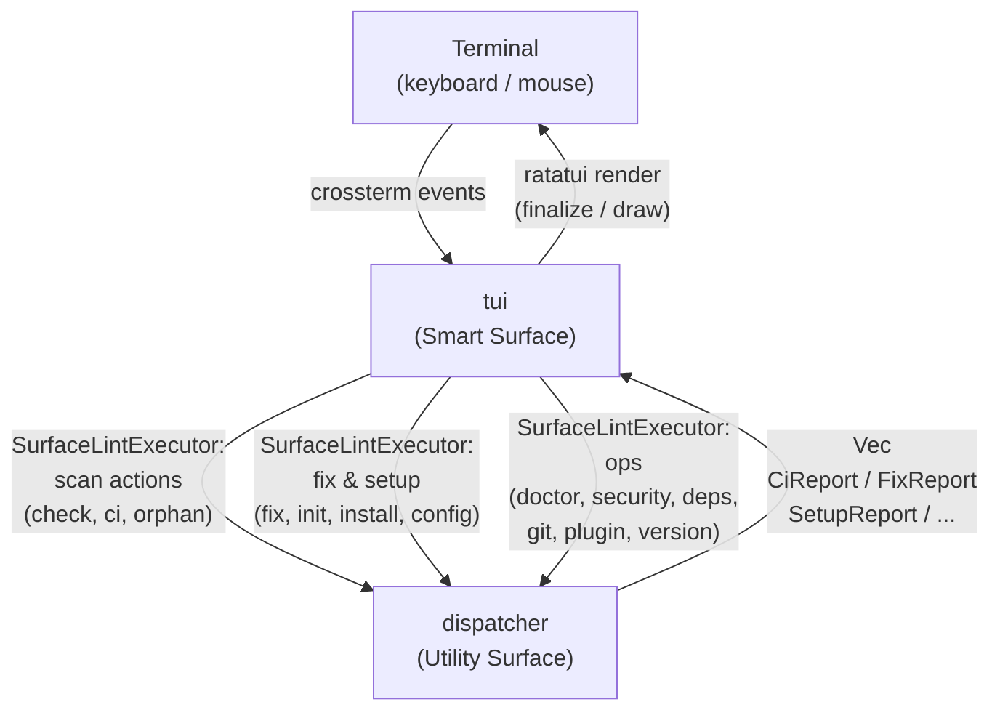

# FRD — tui

## Reference
- Backlog: [BACKLOG.md](BACKLOG.md) — real condition for this feature; this file is specification only.
- PRD: [PRD.md](../../PRD.md)
- Architecture: [ARCHITECTURE.md](../../ARCHITECTURE.md)

## System Overview
The tui crate is a **Smart Surface** — a Ratatui-based interactive terminal UI for lint-arwaky. It parses keyboard and mouse input, delegates all business logic to the dispatcher crate via `dispatcher::surface_*_action::*`, and renders output. No business logic lives here.

### Architecture & Data Flow

```mermaid
flowchart TD
    A["Terminal\n(keyboard / mouse)"] -->|"crossterm events"| B["tui\n(Smart Surface)"]
    B -->|"SurfaceLintExecutor:\nscan actions\n(check, ci, orphan)"| D["dispatcher\n(Utility Surface)"]
    B -->|"SurfaceLintExecutor:\nfix & setup\n(fix, init, install, config)"| D
    B -->|"SurfaceLintExecutor:\nops\n(doctor, security, deps,\ngit, plugin, version)"| D
    D -->|"Vec<ViolationItem>\nCiReport / FixReport\nSetupReport / ..."| B
    B -->|"ratatui render\n(finalize / draw)"| A
```
### Dependency Rule
- TUI imports: shared (taxonomies, aggregates), dispatcher (surface_*_action)
- TUI must NOT own business logic — delegates to dispatcher via DI

## Functional Requirements
### FR-TUI-001: Terminal Setup & Event Loop
- **Description**: Initialize the terminal in raw mode with alternate screen and mouse capture, then run the blocking event loop until quit.
- **Input**: `SurfaceActionHandler` (injected via `TuiCommandSurface`).
- **Output**: Clean terminal restored to normal mode, alternate screen left, with success or error status.
- **Business Rules**:
  - Enables raw mode, alternate screen, and mouse capture on start.
  - Initializes `AppState` with CWD as project root.
  - Sets `terminal_height` and `terminal_width` from `terminal_size()` on startup.
  - Event loop polls crossterm events at 50ms intervals.
  - Scans run in a background thread via `start_scan()`; other long-running actions are blocked during a scan.
  - Clean shutdown restores terminal state on every exit path.
- **Edge Cases**:
  - Terminal too small (< 5 rows / 10 cols): mouse clicks silently ignored.
  - Scan already running: new scan or action requests are silently dropped.
- **Error Handling**: `anyhow::Result<()>`; returns error on terminal setup failure.

### FR-TUI-002: Input Translation
- **Description**: Translate raw crossterm events into normalized `TuiEvent` variants for the action handler.
- **Input**: `crossterm::event::Event`, `&AppState`.
- **Output**: A `TuiEvent` variant (navigation, action, search, path, mouse, or none).
- **Business Rules**:
  - In path-dialog mode, all key input is treated as path editing (Char, Backspace, Enter, Tab, Esc).
  - In search mode, character input is appended to the search query (Char, Backspace, Enter, Esc).
  - In normal mode, vim-style navigation (j/k/h/l), action keys (c/s/f/t/o/D/d/i/I/m/C/H/U/a/v/y/?/), and Ctrl combos (q, s, p, y) are translated.
  - Mouse events: left click → selection, drag → scrollbar jump, scroll up/down → panel scroll.
- **Edge Cases**:
  - Unknown key in any mode: returns `TuiEvent::None`.
  - Mouse event when terminal is too small: ignored.
- **Error Handling**: Infallible — always returns a `TuiEvent`.

### FR-TUI-003: File Navigation
- **Description**: Update `AppState` with a sorted directory listing and file preview when the user navigates.
- **Input**: `TuiEvent` variants (MoveDown/Up/Top/Bottom, NavigateBack/Forward).
- **Output**: Updated `AppState.entries`, selection index, scroll offset, and preview content (first 100 lines of the selected file).
- **Business Rules**:
  - `load_directory`: lists directory via filesystem aggregate, sorts dirs-first then alphabetically, filters hidden entries (starting with `.`), resets selection.
  - `navigate_forward`: if entry is a directory → enter it; if file → load preview.
  - `navigate_back`: go to parent, clamped at project root.
  - `load_file_preview`: reads up to 100 lines via filesystem aggregate, formats with line numbers.
  - Preview panel shows file content in `PreviewMode::FileContent`.
- **Edge Cases**:
  - Empty directory: status shows "Empty or inaccessible".
  - Inaccessible directory: same as empty.
  - Navigate above project root: no-op.
- **Error Handling**: Silent — invalid paths produce status messages, no errors returned.

### FR-TUI-004: Lint Action Execution
- **Description**: Dispatch lint and diagnostic actions to the injected `SurfaceLintExecutor` and surface progress/output in the preview panel.
- **Input**: `TuiEvent` variants (ActionCheck/Scan/Fix/Ci/Orphan/Security/Duplicates/Dependencies/...).
- **Output**: `LintExecutionResult` containing text output and violation count for the preview panel; scan progress updates via channel while running.
- **Business Rules**:
  - Path-requiring actions (check, scan, fix, ci, orphan, security, duplicates, dependencies): use `run_action` with the selected path.
  - Global actions (doctor, init, install, mcp-config, config-show, install-hook, uninstall-hook, adapters, version): use `run_action_no_path`.
  - Scan runs in a background thread, sending `ScanUpdate::Progress`/`Complete` via `mpsc::sync_channel(16)`.
  - Other actions run synchronously, briefly blocking the event loop.
  - Duplicates (`D` key): `ActionDuplicates` event is mapped but not yet delegated to `SurfaceLintExecutor` — currently a no-op.
  - Watch mode is explicitly unsupported in the TUI; pressing `w` shows "Watch mode is not supported in TUI" message.
- **Edge Cases**:
  - Scan already in progress: new scan request is silently dropped.
  - Action requested while scanning: blocked (except quit and resize).
  - Fix without `FixOrchestratorAggregate`: falls back to a CLI fallback message.
- **Error Handling**: Embedded in `LintExecutionResult` — never returns `Err`.

### FR-TUI-005: Domain Aggregate Facade
- **Description**: Expose each lintable action as a synchronous method on `SurfaceLintExecutor`, delegating to dispatcher functions.
- **Input**: Action method name, selected path, and action flags.
- **Output**: `LintExecutionResult` — text output plus violation count for the action.
- **Business Rules**:
  - Builder pattern: `SurfaceLintExecutor::new(...).with_fix(...).with_setup(...).with_maintenance(...)`.
  - Optional aggregates: if not injected, methods return CLI fallback messages suggesting the equivalent CLI command.
  - All methods are synchronous, consistent with the dispatcher sync API.
  - `discover_adapters` scans the filesystem for known adapter binaries.
- **Edge Cases**:
  - Missing aggregate: returns a helpful CLI command suggestion.
  - Async aggregate called from a sync context: suggests using the CLI.
- **Error Handling**: Embedded in `LintExecutionResult`.

### FR-TUI-006: Search Mode
- **Description**: Filter the file list based on an incremental search query.
- **Input**: Character input events (search mode).
- **Output**: `AppState.filtered_indices` recomputed from the current query.
- **Business Rules**:
  - `/` toggles search mode on and off.
  - Characters append to `search_query`.
  - Backspace removes the last character.
  - `Enter` confirms the search, exits search mode, and keeps the filter active.
  - `Esc` cancels the search, clears the query and filter.
  - `compute_filtered_indices()` is called after each input event.
- **Edge Cases**:
  - Empty query: shows all files.
  - No matches: filtered list is empty.
- **Error Handling**: Infallible.

### FR-TUI-007: Path Dialog
- **Description**: Allow the user to type a project root path at startup and load the corresponding directory.
- **Input**: Character input events (when `show_path_dialog = true`).
- **Output**: Updated `AppState.project_root` and a fresh directory listing for the confirmed root.
- **Business Rules**:
  - Shown on TUI startup — user types project root or presses Tab for CWD.
  - `Enter`: validates the path exists, sets it as the project root, and reloads the directory listing.
  - `Tab`: uses `std::env::current_dir()` as the project root.
  - `Esc`: quits the TUI.
  - Invalid path: shows "Invalid path" status.
- **Edge Cases**:
  - Path does not exist: "Invalid path" message, dialog stays open.
  - Empty input + Enter: same as invalid.
- **Error Handling**: Silent validation — status message on failure.

### FR-TUI-008: Mouse Interaction
- **Description**: Translate mouse clicks, drags, and scrolls into panel focus changes and scroll jumps.
- **Input**: `MouseClick`, `MouseDrag`, `MouseScrollUp/Down` events.
- **Output**: Updated `AppState.focus`, `preview_scroll`, and `selected_index`.
- **Business Rules**:
  - Click on file list area → select entry, set focus to FileList.
  - Click on preview area → jump to proportional scroll position, set focus to Preview.
  - Click/drag on scrollbar thumb → jump to proportional scroll position.
  - Mouse scroll up/down → scroll the active panel (preview or file list).
  - Layout zones are computed from `terminal_height` and `terminal_width`.
- **Edge Cases**:
  - Terminal too small (`h < 5 || w < 10`): all mouse events are ignored.
  - Click outside all zones: no-op.
- **Error Handling**: Infallible.

### FR-TUI-009: UI Rendering
- **Description**: Render ratatui widgets for the header, tree, file list, preview, shortcuts, status, path dialog, and help overlay panels.
- **Input**: `&AppState`.
- **Output**: Frame drawn with the correct layout, panel contents, and badge coloring.
- **Business Rules**:
  - Layout: vertical split → header | panels | shortcuts | status.
  - Panels: horizontal split → tree (20%) | file_list (35%) | preview (45%).
  - Path dialog replaces all panels when `show_path_dialog = true`.
  - Help overlay replaces the preview when `show_help = true`.
  - Preview modes: `ActionOutput`, `LintResults`, `FileContent`, `HelpOverlay`.
  - File list shows AES layer badge coloring (taxonomy=cyan, contract=blue, capabilities=magenta, agent=green, surfaces=red, root=white).
  - Preview view includes a vertical scrollbar with thumb position.
  - Help content is embedded as a static string in the preview view.
- **Edge Cases**:
  - Terminal resize: layout recalculates, terminal dimensions are updated.
- **Error Handling**: Infallible rendering.

### FR-TUI-010: Clipboard & File Export
- **Description**: Copy the preview content to the system clipboard or save it to `lint-results.txt`.
- **Input**: `CopyToClipboard`, `CopyToFile` events.
- **Output**: Clipboard content set, or `lint-results.txt` written on disk; status message shown on success or failure.
- **Business Rules**:
  - `CopyToClipboard`: tries arboard first, falls back to `xclip`/`wl-copy` shell commands.
  - `CopyToFile`: writes `state.preview_text` to `lint-results.txt` via filesystem aggregate.
  - Empty preview: shows "Nothing to copy" status.
- **Edge Cases**:
  - Clipboard unavailable: shows "install xclip or wl-copy" message.
  - File write fails: shows "Save failed" status.
- **Error Handling**: Status messages on failure.

### FR-TUI-011: Logging
- **Description**: Initialize a tracing subscriber and log each TUI event at the appropriate level.
- **Input**: `TuiEvent` variants.
- **Output**: Log lines written to a rotating file under the XDG state directory; no console output (stdout is owned by ratatui).
- **Business Rules**:
  - `init()`: sets up a tracing subscriber with an hourly-rotating file appender under `$XDG_STATE_HOME/lint-arwaky/log/tui.log` (i.e. `~/.local/state/lint-arwaky/log` on Linux), with no console layer. Falls back to `./log` with an eprintln notice if `dirs::state_dir()` is unavailable.
  - `record()`: logs event variant name at `tracing::debug!(target = "tui")` for navigation events, `tracing::info!(target = "tui")` for action events.
  - Integration point: `record(&tui_event)` is called in the event loop immediately after `from_crossterm_event()` translates a crossterm event, and before the event is dispatched to the action handler or intercepted for scan management.
- **Edge Cases**:
  - Init failure: returns error (non-fatal to TUI startup).
- **Error Handling**: `anyhow::Result<()>` for init.

### FR-TUI-012: Utility Functions
- **Description**: Provide stateless helper functions for file operations and result formatting used by the TUI surfaces.
- **Input**: File paths, lint results, clipboard text, toolchain diagnostics.
- **Output**: Boolean validation results, parent path, clipboard success flag, formatted display strings, and lint execution results for reports.
- **Business Rules**:
  - All functions are stateless free functions (AES406 utility pattern).
  - `list_directory`: reads directory entries, returns `DirectoryEntry` with name, path, and is_dir.
  - `read_file_preview`: reads up to N lines, returns formatted string.
  - `parent_directory`: resolves the parent `FilePath` of a given path.
  - `is_valid_directory`: returns whether the path is a directory.
  - `copy_text_to_clipboard`: copies text to the system clipboard, falling back to shell commands.
  - `format_results`: converts `LintResultList` to a display string.
  - `format_config_result`: formats config data into display text.
  - `file_size_human`: formats a byte count into human-readable form (unused in production).
  - `path_components`: decomposes a path into components (unused in production).
  - `format_doctor_report`: formats `ToolchainDiagnostics` into a `LintExecutionResult` (unused in production).
  - `format_dependency_report`: formats a `DependencyReport` into a `LintExecutionResult` (unused in production).
- **Edge Cases**:
  - Returns empty/default on failure for all functions.
- **Error Handling**: Returns empty or default values on failure.

## API Contract

### Protocol API

| Method | Input | Output | Error | Event | Description |
| --- | --- | --- | --- | --- | --- |
| `run` | `SurfaceActionHandler` | `Result<()>` | Terminal setup failure | — | Single composite entry point: initializes the terminal, runs the event loop, and restores state on exit. |

### Aggregate API

| Method | Input | Output | Error | Event | Description |
| --- | --- | --- | --- | --- | --- |
| `handle` | `&mut AppState`, `TuiEvent` | — | None | — | Dispatch a normalized UI event to the action handler. |
| `start_scan` | `&mut AppState` | `Option<Receiver<ScanUpdate>>` | None | — | Spawn a background scan thread; returns the progress receiver or `None` if already scanning. |
| `poll_scan` | `&mut AppState`, `&Receiver<ScanUpdate>` | — | None | — | Process pending scan-progress messages and update the preview. |
| `poll_pending_background_action` | `&mut AppState` | — | None | — | Poll and complete any pending global action. |
| `start_background_action` | `AppState`, `TuiEvent` | — | None | — | Spawn a background thread for a global action. |
| `load_directory` | `&mut AppState`, `&str` | — | None | — | Load and sort a directory listing, resetting selection and scroll. |
| `load_file_preview` | `&mut AppState`, `&str` | — | None | — | Read up to 100 lines of a file and display with line numbers. |
| `load_preview` | `&mut AppState` | — | None | — | Load the preview for the currently selected file entry. |
| `check` | `&str`, `&ActionFlags` | `LintExecutionResult` | None | — | Run a code-analysis check on a path. |
| `scan` | `&str` | `LintExecutionResult` | None | — | Run a comprehensive multi-linter scan on a path. |
| `fix` | `&str`, `&ActionFlags` | `LintExecutionResult` | None | — | Run auto-fix on a path with the given flags. |
| `ci` | `&str`, `&ActionFlags` | `LintExecutionResult` | None | — | Run CI-threshold validation on a path. |
| `orphan` | `&str` | `LintExecutionResult` | None | — | Run orphan-file detection on a path. |
| `security` | `&str` | `LintExecutionResult` | None | — | Run a security scan on a path. |
| `dependencies` | `&str` | `LintExecutionResult` | None | — | Produce a dependency report for a path. |
| `doctor` | — | `LintExecutionResult` | None | — | Produce toolchain diagnostics. |
| `init` | `&ActionFlags` | `LintExecutionResult` | None | — | Run project initialization. |
| `install` | `&ActionFlags` | `LintExecutionResult` | None | — | Run installer for lint-arwaky. |
| `mcp_config` | `&ActionFlags` | `LintExecutionResult` | None | — | Produce MCP client configuration. |
| `config_show` | — | `LintExecutionResult` | None | — | Show the active architecture configuration. |
| `install_hook` | — | `LintExecutionResult` | None | — | Install the pre-commit git hook. |
| `uninstall_hook` | — | `LintExecutionResult` | None | — | Remove the pre-commit git hook. |
| `adapters` | — | `LintExecutionResult` | None | — | List available linter adapters. |
| `version` | — | `LintExecutionResult` | None | — | Display the lint-arwaky version. |
| `is_valid_directory` | `&FilePath` | `bool` | None | — | Check whether a path points to a valid directory. |
| `parent_directory` | `&FilePath` | `Option<FilePath>` | None | — | Resolve the parent directory of a path. |
| `copy_text_to_clipboard` | `&str` | `bool` | None | — | Copy text to the system clipboard, falling back to shell commands. |
| `format_results` | `&LintResultList` | `String` | None | — | Format lint results into a display string. |
| `format_config_result` | — | `String` | None | — | Format configuration data into display text. |
| `init_logging` | — | `anyhow::Result<()>` | Trace-init failure | — | Initialize the hourly-rotating tracing file subscriber. |
| `record_event` | `&TuiEvent` | — | None | — | Log a TUI event at the appropriate tracing level. |

## Integration Points

| System | Direction | Purpose | Failure mode |
| --- | --- | --- | --- |
| ratatui + crossterm | in | Terminal rendering and raw-mode input | terminal without raw mode → startup error, FR-TUI-001 |
| lint aggregates (import / naming / quality / orphan) | out | Called through `lint_executor` for check / scan / fix | executor error surfaced in preview pane |
| filesystem crate | out | File / directory walking for the browser | directory unreadable → "Empty or inaccessible" status |
| arboard (clipboard) | out | Copy-to-file / export | clipboard unavailable → skip, no crash |
| tracing (log) | out | Structured log lines to stderr | log loss does not affect the TUI session |

## Non-functional Requirements

| Metric | Target | Measurement method |
| --- | --- | --- |
| Event loop poll interval | 50ms | Read the crossterm timeout constant |
| Scan concurrency | Background thread; event loop unblocked | Verify with `std::thread::spawn` usage |
| Mutable state surface | `AppState` is the sole mutable container | Inspect the crate for non-AppState mutable globals |
| Minimum terminal size | 5 rows × 10 cols (mouse) / 40 cols × 15 rows (full layout) | Read the guard constants in the command-surface guard |
| Background-scan channel capacity | 16 messages | Read the `sync_channel` capacity constant |

## Test Scenarios

- Pressing 'j' in normal mode yields `TuiEvent::MoveDown`.
- Pressing 's' in normal mode yields `TuiEvent::ActionScan`.
- Pressing Shift+s yields `TuiEvent::ActionSecurity`.
- Typing 'a' in search mode yields `TuiEvent::SearchInput('a')`.
- Typing 'a' in path-dialog mode yields `TuiEvent::PathInput('a')`.
- An unknown key yields `TuiEvent::None`.
- Pressing uppercase 'D' in normal mode yields `TuiEvent::ActionDuplicates`.
- Pressing lowercase 'd' in normal mode yields `TuiEvent::ActionDoctor`.
- Pressing Ctrl+p yields `TuiEvent::ActionDependencies`.
- Pressing Ctrl+y yields `TuiEvent::CopyToFile`.
- Pressing '?' in normal mode yields `TuiEvent::ToggleHelp`.
- Pressing '/' in normal mode yields `TuiEvent::ToggleSearch`.
- Navigating into a directory loads entries and resets selection.
- Navigating into a file loads a preview of up to 100 lines.
- Navigating back from the project root is a no-op.
- Entering an empty directory shows "Empty or inaccessible" status.
- Pressing 'c' on a file shows code analysis results in the preview.
- Pressing 's' on a directory starts a background scan with progress updates.
- Pressing 'f' with the dry-run flag shows dry-run preview output.
- Pressing 'w' shows "Watch mode is not supported in TUI".
- Pressing 'D' on a directory produces no output (not yet delegated).
- Pressing 'o' on a directory shows orphan detection results.
- Pressing 't' on a directory shows CI threshold validation results.
- Pressing 'd' globally shows toolchain diagnostics output.
- Requesting an action while a scan is in progress is blocked.
- Pressing 'p' on a file shows a dependency report or a CLI fallback message.
- Calling `check()` with the code-analysis aggregate yields a `LintExecutionResult` with a violation count.
- Calling `scan()` delegates to the scan collector and returns a full scan output.
- Calling `fix()` without the fix aggregate yields a CLI fallback message.
- Calling `fix()` with the fix aggregate yields a fix result with a mode prefix.
- Calling `security()` with the maintenance aggregate yields a security scan result.
- Calling `dependencies()` with the maintenance aggregate yields a dependency report.
- Calling `doctor()` without the maintenance aggregate yields a CLI fallback message.
- Calling `version()` always returns success with the version string.

## Assumptions & Constraints
- One TUI session owns the terminal (raw mode); a background scan thread is the only concurrent work.
- `AppState` is the sole mutable state container; actions are stateless.
- Terminal supports raw mode, alt-screen, and at least 5 rows × 10 cols; otherwise the binary exits with a clear message.
- All lint rules run through the injected aggregates — the TUI holds no rule logic of its own.

## Glossary
- **Smart Surface**: A thin UI wrapper that parses user input, calls domain aggregates, and renders output — it owns no business logic.
- **SurfaceLintExecutor**: The facade over dispatcher functions that exposes every lintable action as a synchronous method returning `LintExecutionResult`.
- **SurfaceActionHandler**: The state machine that maps `TuiEvent` variants to directory navigation, file preview loading, and background action dispatch.
- **TuiCommandSurface**: The crossterm event loop and ratatui rendering entry point invoked by `TuiContainer::run`.
- **AppState**: The mutable TUI state container holding selection, scroll, focus, preview, and scan-status fields.
- **TuiEvent**: A normalized UI event enum covering navigation, action, search, path, mouse, and lifecycle variants.
- **LintExecutionResult**: The output of a lint action carrying display text and a violation count.

---