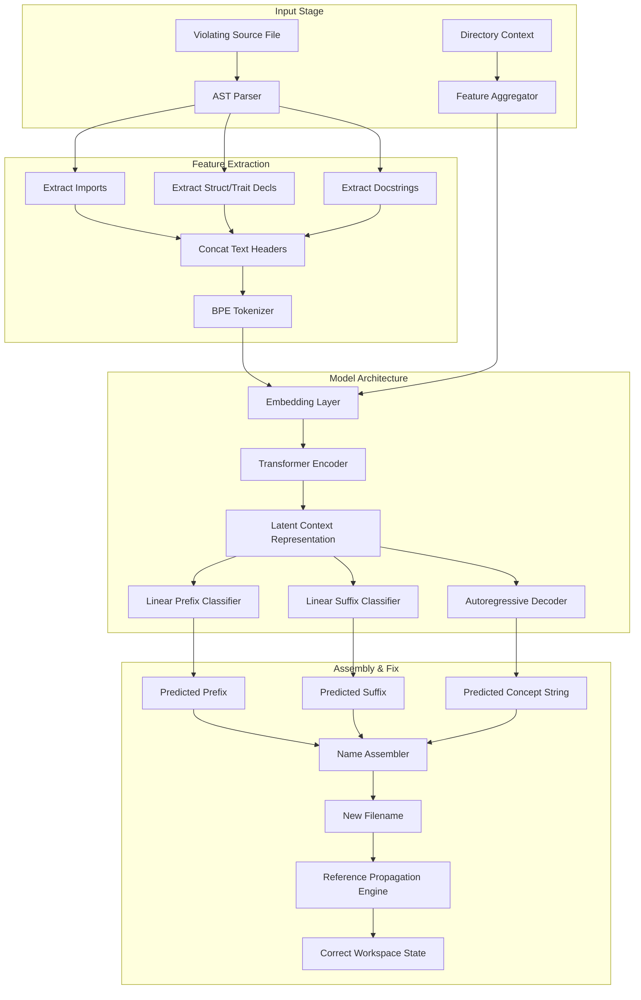

# Deep Learning-Based Semantic Code Naming and Reference Propagation using Rust Burn Framework

**Authors:** Development Team, Agentic Engineering Systems Group  
**Date:** June 22, 2026  
**Document Class:** Technical Research Proposal & Architectural Design Spec  

---

## Abstract
Static analysis tools play a critical role in enforcing software architecture, but repairing violations is typically a manual and error-prone process. In this paper, we propose a lightweight, fully local deep learning model implemented via the Rust **Burn** framework to automatically repair naming violations (AES101 and AES102) within the Agentic Engineering System (AES) architecture. Unlike simple heuristic renamers, our approach uses a multi-task Transformer architecture to extract semantic concepts from AST nodes, predicts valid prefix/suffix layer combinations, and executes reference-propagation refactoring. The proposed system fits within a $<15\text{MB}$ memory footprint and executes inference in $<50\text{ms}$ on commodity CPUs, eliminating dependencies on external LLM APIs.

---

## 1. Introduction

Software systems are increasingly organized under strict multi-layer architectural guidelines to maintain separation of concerns. The **Agentic Engineering System (AES)** is a 7-layer architecture designed for building agentic tools and linters. It organizes software components into a strict bottom-up dependency model:

$$\text{Taxonomy} \rightarrow \text{Contract} \rightarrow \text{Capabilities / Infrastructure} \rightarrow \text{Agent} \rightarrow \text{Surfaces} \rightarrow \text{Root}$$

In the **lint-arwaky** codebase—a static analysis engine enforcing this architecture—the physical file naming structure acts as the foundation of the validation pipeline. Under rules **AES101** and **AES102**, every filename must explicitly specify its layer (via prefix) and functional role (via suffix) following the pattern:

$$\text{filename} = \text{prefix\_concept\_suffix}.\text{extension}$$

Because subsequent architectural rules (such as import boundaries, circular dependency checks, and role validation) rely on the filename to resolve a file's layer, naming errors cause the entire validation pipeline to cascade into false positives or failures.

Currently, resolving these violations requires human engineers to read the file, synthesize the core business concept, deduce the appropriate layer prefix/suffix, rename the file, and manually fix all import declarations across the workspace. We present a deep learning-based method implemented in Rust to automate this entire lifecycle locally.

### 1.1 Data Security & Privacy Guarantee (Local Execution)

Because this model is designed to operate on proprietary enterprise source code, data security is paramount. By leveraging the **Rust Burn** framework, the AI model is distributed directly as part of the `lint-arwaky` binary. **100% of the inference is executed locally** on the user's machine (CPU or GPU). The source code is never transmitted to external cloud APIs (such as OpenAI, Anthropic, or Google), guaranteeing absolute data privacy and compliance with strict corporate security policies.

---

## 2. Background and Architectural Foundations

To understand the model's design, we must first explicitly define the constraints of the **lint-arwaky** engine and the AES naming rules.

### 2.1 The 7-Layer AES Specification

The AES design segregates code based on the following seven functional layers:

| Layer Prefix | Suffix Policy | Description | Examples of Allowed Suffixes |
| :--- | :--- | :--- | :--- |
| `root_` | Strict | Root composition and application entry points. | `_entry`, `_container` |
| `taxonomy_` | Strict | Foundation level: types, entities, constants, and utilities. | `_vo` (Value Object), `_entity`, `_error`, `_constant`, `_utility` |
| `contract_` | Strict | Interfaces, protocols, and traits defining behavior. | `_port`, `_protocol`, `_aggregate` |
| `capabilities_` | Flexible | Pure domain algorithms implementing contract protocols. | `_checker`, `_analyzer`, `_processor`, `_evaluator` |
| `infrastructure_` | Flexible | Drivers, storage adapters, network clients, and disk I/O. | `_adapter`, `_provider`, `_scanner`, `_client` |
| `agent_` | Strict | Orchestrators coordinating capabilities and infrastructure. | `_orchestrator` |
| `surface_` | Strict | User interfaces, CLI commands, controllers, and APIs. | `_command`, `_controller`, `_router`, `_view` |

### 2.2 Rules Under Automation

* **AES101 (Naming Convention)**: Filenames must be lowercase, use underscore separators, contain at least 2 words (prefix + suffix), and follow the pattern `prefix_concept_suffix` (e.g., `infrastructure_db_adapter.rs`).
* **AES102 (Suffix/Prefix Alignment)**: The suffix of the file must be explicitly permitted by the layer prefix policy. For example, `capabilities_user_vo.rs` violates AES102 because `_vo` is strictly forbidden in the capabilities layer (it belongs to the taxonomy layer).

---

## 3. Problem Formulation

Let a source code file be represented by $F = (C, D)$ where $C$ is the text content of the file and $D$ is the workspace directory path containing the file.

Our goal is to learn a mapping function $f: F \rightarrow Y$ where:

$$Y = (P, S, K)$$

* $P \in \{\text{root}, \text{taxonomy}, \text{contract}, \text{capabilities}, \text{infrastructure}, \text{agent}, \text{surface}\}$ is the predicted layer prefix.
* $S \in \mathcal{S}_{\text{allowed}}$ is the predicted functional suffix (e.g., `_adapter`, `_vo`).
* $K = [k_1, k_2, \dots, k_n]$ is a sequence of tokens representing the semantic domain concept (e.g., `db`, `rules_config`, `user_checker`).

Once $Y$ is predicted, the repaired filename is constructed as:

$$F_{\text{new\_name}} = P \mathbin{\Vert} \text{"\_"} \mathbin{\Vert} \text{concat}(K, \text{"\_"}) \mathbin{\Vert} S \mathbin{\Vert} \text{extension}$$

---

## 4. Methodology

The proposed solution consists of an AST extractor, a Byte-Pair Encoding (BPE) tokenizer, a multi-task deep neural network implemented in **Burn**, and a workspace refactoring engine.



### 4.1 Feature Extraction and Tokenization

To bypass irrelevant implementation details (such as helper loop logic or local variables), we perform syntactic feature extraction:
1. **Header Extraction**: We extract the file's header, consisting of the first 500 lines or up to the end of the top-level definitions. This includes imports (`use`, `import`), public structs (`struct`, `class`), trait implementations (`impl`, `interface`), and docstrings.
2. **Directory Prior Embedding**: The directory path $D$ is mapped to a high-dimensional vector and concatenated with the first token of the input sequence. This guides the prefix classifier since most files in `crates/infra/` should be prefixed with `infrastructure_`.
3. **BPE Tokenization**: We train a subword BPE tokenizer with a vocabulary size $V = 12,000$. This vocabulary is optimized for programming language syntax (Rust/Python/TS) and common software engineering terms (e.g., `config`, `validation`, `database`).

### 4.2 Model Architecture: Multi-Task Transformer

We use a **Multi-Task Transformer** model in Burn. The model shares a single Transformer Encoder to capture the semantic representation of the file and feeds it into three distinct prediction heads.

* **Shared Encoder**: A 4-layer Transformer Encoder with an embedding dimension $d_{\text{model}} = 128$, feed-forward dimension $d_{\text{ff}} = 512$, and $H = 4$ attention heads.
* **Task A: Prefix Classifier**: A dense projection layer with a Softmax activation function.
  $$\hat{P} = \text{Softmax}(W_P \cdot h_{\text{enc}} + b_P)$$
  Where $h_{\text{enc}}$ is the pooled representation of the encoder output.
* **Task B: Suffix Classifier**: A dense projection layer outputting probabilities over the vocabulary of valid role suffixes.
  $$\hat{S} = \text{Softmax}(W_S \cdot h_{\text{enc}} + b_S)$$
* **Task C: Concept Decoder**: A small sequence-to-sequence decoder that autoregressively generates the subword tokens of the concept name (e.g., generating `db` followed by `adapter` if the input context describes database operations).

### 4.3 Dataset Synthesis and Augmentation

To train a robust model without hand-labeling millions of files:
1. **Positive Mining**: We harvest clean, passing files from public code repositories that follow the 7-layer architecture naming rules.
2. **Negative Label Injection**: We generate mutated training inputs by randomly renaming the clean files (e.g., rewriting `infrastructure_db_adapter.rs` to `test_db.rs`), stripping docstrings, or adding noisy comments. The model is trained to reconstruct the original, correct filename from this mutated state.
3. **Identifier Scrambling**: We randomly mask out class and function names in the source code to force the model to rely on import dependencies and traits to deduce the suffix (e.g., if a class implements `ConnectionPoolPort`, the suffix should be `_adapter` even if the class name is obfuscated).

---

## 5. Training and Optimization Pipeline

Training is conducted using a customized pipeline within `crates/ai-training` leveraging the Rust **Burn** framework:

```rust
// Representative structural module in crates/ai-training/src/model.rs
use burn::nn::{transformer::TransformerEncoder, Embedding, Linear};
use burn::module::Module;
use burn::tensor::backend::Backend;

#[derive(Module, Debug)]
pub struct AESNamingModel<B: Backend> {
    encoder: TransformerEncoder<B>,
    token_embed: Embedding<B>,
    prefix_head: Linear<B>,
    suffix_head: Linear<B>,
    concept_projection: Linear<B>,
}
```

* **Loss Function**: The model optimized under a joint loss objective:
  $$\mathcal{L}_{\text{total}} = \alpha \mathcal{L}_{\text{prefix}} + \beta \mathcal{L}_{\text{suffix}} + \gamma \mathcal{L}_{\text{concept}}$$
  Where $\mathcal{L}_{\text{prefix}}$ and $\mathcal{L}_{\text{suffix}}$ are cross-entropy losses, and $\mathcal{L}_{\text{concept}}$ is the sequence sequence loss.
* **Hardware Portability**: Burn's `wgpu` backend is used during training on graphics cards. For distribution, we compile the model utilizing Burn's `ndarray` backend for zero-dependency CPU inference.
* **Post-Training Quantization (PTQ)**: Model weights are quantized from FP32 to INT8, bringing the final `.safetensors` size down to **~10MB**, making it easy to bundle inside the binary via `include_bytes!`.

---

## 6. Execution Flow and Reference Propagation

Applying a rename fix requires updating structural dependencies. The system executes this through the following steps:

1. **Detection**: `lint-arwaky` flags a file (e.g., `src/db_util.rs`) with an `AES101` or `AES102` error.
2. **Pre-Filtering (Exceptions & Test Files)**: Before any AI inference occurs, the system checks if the file is immune to AES naming rules. If a file falls into one of the following categories, the auto-fix is immediately aborted:
   * **Language Entry/Barrel Files**: `main.rs`, `lib.rs`, `mod.rs`, `build.rs`, `__init__.py`, `__main__.py`, `index.ts`, `index.js`. Renaming these would break module resolution.
   * **Test / Spec Files**: Files matching `*_test.rs`, `test_*.py`, or `*.spec.ts`. Test files follow separate test-specific naming conventions rather than strict 7-layer domain names.
3. **Inference**: The auto-fix engine runs the valid file through the Burn model. The model predicts:
   * Prefix: `infrastructure`
   * Suffix: `_adapter`
   * Concept: `database`
   * Resulting Name: `infrastructure_database_adapter.rs`
3. **AST Update & File Renaming**:
   * The tool executes `git mv src/db_util.rs src/infrastructure_database_adapter.rs`.
4. **Reference Propagation**:
   - The engine parses all other files in the workspace.
   - It replaces import paths referencing the old module (e.g., `use crate::db_util;` $\rightarrow$ `use crate::infrastructure_database_adapter;`).
   - If the file is declared as a submodule (e.g., `mod db_util;`), the parent module declaration is automatically updated to `mod infrastructure_database_adapter;`.

---

## 7. Verification and Fallbacks

To ensure absolute safety and rule compliance, we enforce a strict validation boundary:

1. **Compilation Check**: Immediately after executing reference propagation, the system runs `cargo check` (or equivalent compiler checks for Python/TS). If compilation fails, the changes are reverted via `git checkout` / `git reset`.
2. **Linter Re-check**: The system runs `lint-arwaky` over the modified files. If the new filename generates a new violation (e.g., triggering a role violation), the transaction is rolled back.
3. **Confidence Thresholding**: If the softmax confidence score for any of the predicted components ($P$, $S$, or $K$) falls below **85%**, the automated rename is suspended. Instead, the CLI/TUI presents a prompt showing the top 3 alternative names to the engineer for approval.

---

## 8. Glossary & Index of Terms

This section provides explicit definitions for all architectural, static analysis, and machine learning terminology used throughout this paper:

### Architectural Layers & AES Sub-Roles

The **Agentic Engineering System (AES)** divides code into seven distinct layers, each associated with specific suffix roles:

* **1. Root Layer (`root_`)**: The composition and application entry layer.
  * **Entry (`_entry`)**: Binary entry points (e.g., `main.rs`, `index.js`).
  * **Container (`_container`)**: Dependency Injection (DI) composition roots where all layers are wired together.
* **2. Taxonomy Layer (`taxonomy_`)**: The foundational domain definition layer containing data models, values, types, constants, helpers, and domain utilities.
  * **Value Object (VO - `_vo`)**: A small, immutable domain representation whose equality is determined by value, not identity.
  * **Entity (`_entity`)**: A domain object defined by its persistent identity and lifecycle.
  * **Event (`_event`)**: A record of a significant domain change or event that has occurred.
  * **Error (`_error`)**: Custom domain error definitions.
  * **Constant (`_constant`)**: Pure global constants, configurations, or statically defined values.
  * **Utility / Helper (`_utility` / `_helper`)**: Small, stateless helper components performing routine calculations or conversions.
* **3. Contract Layer (`contract_`)**: The interface layer defining boundaries and communication rules.
  * **Port (`_port`)**: Outbound interface definitions (e.g., database repository traits, HTTP client interfaces) implemented by the Infrastructure layer.
  * **Protocol (`_protocol`)**: Inbound interface definitions (e.g., business logic guidelines, validation traits) implemented by the Capabilities layer.
  * **Aggregate (`_aggregate`)**: High-level contracts combining multiple ports/protocols into orchestratable packages.
* **4. Capabilities Layer (`capabilities_`)**: The business logic and core algorithms layer. Implements contract protocols and contains pure calculation/validation code. Common flexible suffixes include:
  * **Checker (`_checker`)**, **Analyzer (`_analyzer`)**, **Processor (`_processor`)**, **Evaluator (`_evaluator`)**, **Validator (`_validator`)**.
* **5. Infrastructure Layer (`infrastructure_`)**: The concrete external integration layer (e.g., database drivers, API client wrappers, file system interaction) that implements contract ports. Common flexible suffixes include:
  * **Adapter (`_adapter`)**, **Provider (`_provider`)**, **Scanner (`_scanner`)**, **Client (`_client`)**, **Repository (`_repository`)**.
* **6. Agent Layer (`agent_`)**: The core automation and orchestration layer.
  * **Orchestrator (`_orchestrator`)**: Coordinates capabilities and infrastructure ports to run goal-oriented workflows without directly interacting with low-level I/O.
* **7. Surfaces Layer (`surface_` / `surfaces_`)**: The entry-point interaction layer (CLIs, TUIs, APIs, HTTP Controllers, Web UI Views) that triggers domain workflows.
  * **Command (`_command`)**: CLI subcommands or action handlers.
  * **Controller (`_controller`)**: HTTP or API endpoint controllers.
  * **Router (`_router`)**: Navigation or routing paths.
  * **View / Component / Layout (`_view` / `_component` / `_layout`)**: Passive UI presentation components.
  * **Hook / Store / Action (`_hook` / `_store` / `_action` / `_screen`)**: Stateful or passive client-side utilities.

### Multi-Language Workspace Terminology

To maintain a single unified vocabulary across AES-supported languages (Rust, TypeScript/JavaScript, Python), we define the following structure:

| Term | Language | Definition |
| :--- | :--- | :--- |
| **Workspace** | All | The entire project root directory (e.g., `lint-arwaky/`) containing all configs and language-specific sub-projects. |
| `crates/` | Rust | The directory containing all Rust crates (workspace members), conforming to Cargo workspace specifications. |
| `packages/` | TypeScript / JS | The directory containing all TypeScript/JavaScript packages, following npm/pnpm workspace conventions. |
| `modules/` | Python | The directory containing all Python sub-projects, organized as independent python modules. |
| **Member** | All | A single, self-contained sub-project (crate, package, or module) inside the workspace. |

### Static Analysis & Machine Learning Terminology

* **AST (Abstract Syntax Tree)**: A tree representation of the abstract syntactic structure of source code, where each node in the tree denotes a construct occurring in the source code.
* **Autoregressive Decoder**: A neural network component that generates a sequence of tokens one by one, using the previously generated tokens as additional input for predicting the next token.
* **BPE (Byte-Pair Encoding)**: A subword tokenization algorithm that iteratively merges the most frequent pairs of characters or bytes in a text corpus to create a compact vocabulary of common morphemes and words.
* **Burn**: A modern, flexible, and zero-dependency deep learning framework written entirely in Rust, designed for portable training and local CPU/GPU inference.
* **Cross-Entropy Loss**: A standard loss function used in classification tasks to measure the performance of a model whose output is a probability value between 0 and 1.
* **Inference**: The process of running live data through a trained machine learning model to compute predictions (e.g., predicting the prefix, suffix, and concept of a file).
* **Multi-Task Learning**: A subfield of machine learning in which multiple learning tasks are solved at the same time, using a shared representation (e.g., the shared Transformer Encoder) to improve generalization.
* **PTQ (Post-Training Quantization)**: An optimization technique where the precision of weights in a neural network is reduced (e.g., from FP32 to INT8) after training is complete, significantly reducing model size with minimal accuracy loss.
* **Reference Propagation**: The process of automatically locating and updating all import declarations, module declarations, and dependent references throughout a codebase when a file is renamed.
* **Safetensors**: A simple, safe, and efficient file format developed by Hugging Face for storing tensors and model weights securely without the safety risks of Python pickle serialization.
* **Softmax**: An activation function that normalizes an input vector of real numbers into a probability distribution over predicted output classes.
* **Static Analysis**: The analysis of computer software that is performed without actually executing programs, usually done by analyzing ASTs or source tokens (e.g., `lint-arwaky`).
* **Transformer Encoder**: A neural network architecture block utilizing self-attention mechanisms to construct contextualized representations of input sequences (such as tokenized source code headers).
* **WGPU Backend**: A modern graphics API implementation in Rust used by Burn to run GPU-accelerated tensor computations portably across WebGPU, Vulkan, Metal, and DirectX.

