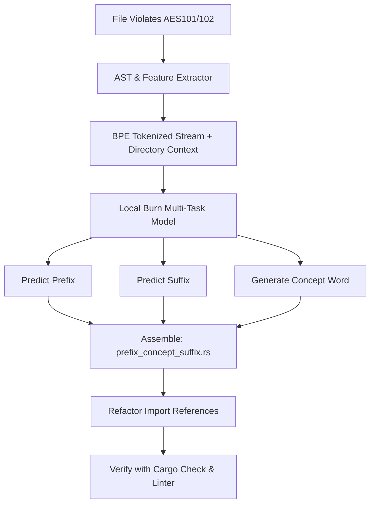

# Research & Implementation Plan: AI-Powered AES Auto-Naming (AES101 & AES102) using Rust Burn

This document outlines the research and implementation plan for building a small, fast, local AI model using the **Burn** framework in Rust to automate and repair **AES101** (Naming Conventions) and **AES102** (Suffix/Prefix Rules).

---

## 1. Rationale: Why Focus on AES101 & AES102 First?

In the **Agentic Engineering System (AES)** architecture:
- **Foundational Dependency**: The file prefix (e.g., `taxonomy_`, `contract_`, `capabilities_`) and suffix (e.g., `_vo`, `_port`, `_checker`) are the *primary mechanism* by which the linter detects a component's architectural layer and applies rules.
- **Cascade Effect**: If a file is incorrectly named (e.g., violating AES101/102), all other checkers (like **AES201 Forbidden Imports**, **AES40x Role Rules**, and **AES50x Orphan Code**) will fail or misinterpret the boundaries.
- **Cognitive Load**: Designing a general-purpose code repair model is extremely complex. By isolating the task to **semantic naming**, we can train a highly accurate, small-footprint model (<20MB) that understands the *meaning* of the code to derive its correct architectural position and concept name.

---

## 2. Core AI Task: Semantic Naming Extraction

Rather than treating file naming as a simple regex check, the model must read the code and understand its **architectural role** and **business concept**. 

Given a source code file (Rust, Python, or TypeScript) with an arbitrary name (e.g., `temp_file.rs` or `my_check_stuff.rs`), the model will output a structured tuple:

$$\text{Model}(\text{Code AST + Context}) \rightarrow (\text{Prefix}, \text{Concept}, \text{Suffix})$$

### Defining the Components:
1. **Prefix (Architectural Layer)**: One of `root`, `taxonomy`, `contract`, `capabilities`, `infrastructure`, `surfaces`, `agent`.
2. **Concept (Domain Noun)**: The core business entity or logic (e.g., `user`, `db`, `rules_config`, `schema_checker`). The model needs to extract this by summarizing the dominant identifiers in the code.
3. **Suffix (Layer Role)**: The role identifier matching the prefix rules (e.g., `_entry`, `_vo`, `_port`, `_checker`, `_adapter`, `_orchestrator`).

---

## 3. System Architecture & Information Flow



---

## 4. Step-by-Step Implementation Details

### Phase 1: Feature Extraction & Tokenization
To keep the model small (<20MB) and fast (<50ms execution), we do not feed the entire file as raw text. Instead, we extract structural features:
1. **Header Extractor**: Extract imports, top-level item declarations (struct names, enum names, trait definitions), public function signatures, and docstrings.
2. **Vocabulary Training**: Train a BPE tokenizer using Hugging Face's **`tokenizers`** crate on code bases, limiting the vocabulary to **12,000 tokens** to save memory.
3. **Directory Context Embedding**: Feed the directory name (e.g., `crates/import-rules`) as a special prepended token. This acts as a strong prior for predicting the prefix.

### Phase 2: Model Architecture (Multi-Task Transformer in Burn)

```rust
// Proposed architecture layout using Rust Burn
use burn::nn::{transformer::TransformerEncoder, Embedding, Linear};
use burn::module::Module;
use burn::tensor::backend::Backend;

#[derive(Module, Debug)]
pub struct AESNamingModel<B: Backend> {
    encoder: TransformerEncoder<B>,
    token_embed: Embedding<B>,
    
    // Multi-task Heads
    prefix_classifier: Linear<B>,  // Classifies layer: root, taxonomy, etc.
    suffix_classifier: Linear<B>,  // Classifies role: vo, port, checker, etc.
    
    // Concept Decoder / Head
    concept_projection: Linear<B>, // Decodes concept tokens autoregressively
}
```

* **Encoder**: A lightweight 4-layer Transformer Encoder (`d_model = 128`, `n_heads = 4`).
* **Heads**:
  - **Prefix Head**: A simple linear classifier with a Softmax layer outputting 7 classes.
  - **Suffix Head**: A linear classifier mapping to the vocabulary of valid suffixes (~60 allowed suffixes across layers).
  - **Concept Head**: A small autoregressive decoder or token projection layer that outputs 1-3 concept words from the core concept vocabulary.

### Phase 3: Synthetic Data Engineering (Dataset Synthesis)
We can generate thousands of training samples from compliant Rust and Python projects:
1. **Harvester**: Extract correct files that satisfy `lint-arwaky`.
2. **Label Generation**: Split the filename into `prefix`, `concept`, and `suffix` (e.g., `infrastructure_db_adapter.rs` $\rightarrow$ Prefix: `infrastructure`, Concept: `db`, Suffix: `_adapter`).
3. **Training Samples**:
   - **Input**: The code contents, imports, class names + directory context.
   - **Targets**: `[Prefix Label, Suffix Label, Concept String]`.
4. **Data Augmentation**: Obfuscate/change class names and function names during training to force the model to learn the structural rules (e.g. implementing a trait ending in `_port` points to `_adapter`).

### Phase 4: Training with Burn
- Write the training pipeline in a dedicated package `crates/ai-training`.
- Use `burn-ndarray` for CPU or `burn-wgpu` for fast GPU training.
- Save model checkpoints to `.safetensors`.
- Implement **8-bit Post-Training Quantization (PTQ)** to shrink the weight file down to **~10MB**.

### Phase 5: The Refactoring & Import Update Engine
Renaming a file is only 10% of the job. The remaining 90% is updating all other files that reference it.
When `lint-arwaky-cli fix --ai` runs:
1. **Inference**: The model predicts the new name `new_name.rs`.
2. **Rename**: Rename the file on the filesystem using `git mv` (if in a Git repo) or std FS methods.
3. **Reference Propagation**:
   - Scan the workspace AST for imports matching the old name.
   - Update `use crates::old_name::...` to `use crates::new_name::...`.
   - Update `mod old_name;` declarations in `lib.rs` / `main.rs` / `mod.rs`.

---

## 5. Verification Plan

### Automated Verification
- Run `cargo check` to ensure the renamed file and its updated references do not break compilation.
- Run `cargo run --bin lint-arwaky-cli -- check` to verify the renamed file now scores 100% on AES101 and AES102.
- Unit test the AI inference with a suite of 50 intentionally misnamed test files.

---

## 6. Open Design Questions & Decision Log
- **Should we support multi-language concept extraction?** 
  *Yes.* By relying on BPE tokenization of identifiers (which look similar in Rust, Python, and TS), the same model can perform language-agnostic suffix/prefix classification.
- **What happens on a naming tie?**
  *Fallback:* If the model's confidence is <85%, output the top-3 suggestions to the user on the CLI or TUI launcher, allowing them to choose, rather than making a wrong rename.
